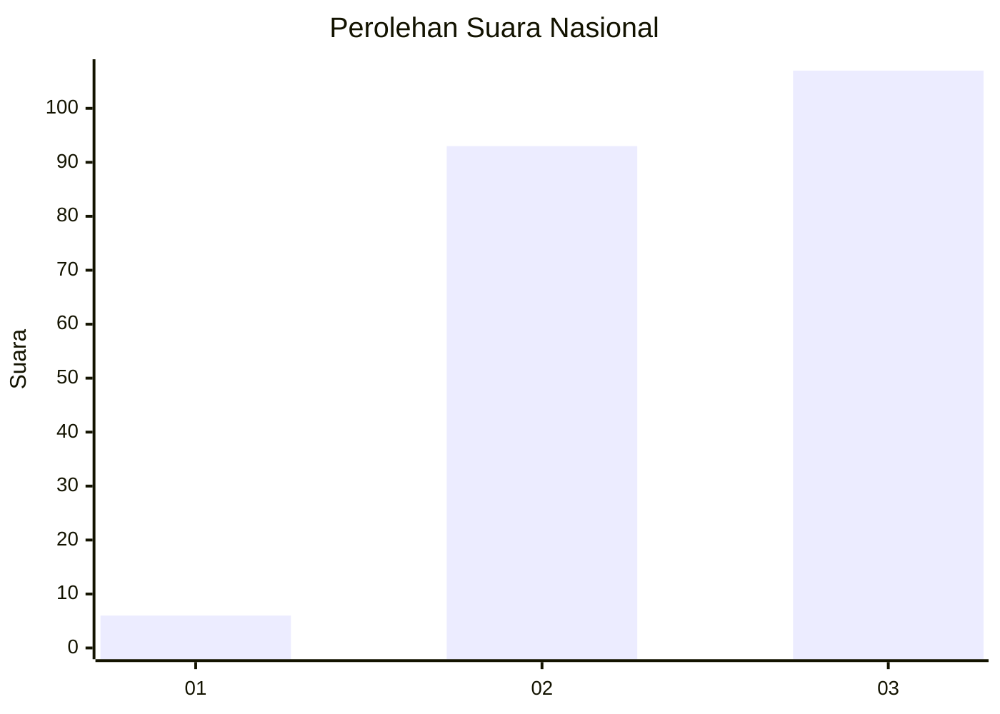
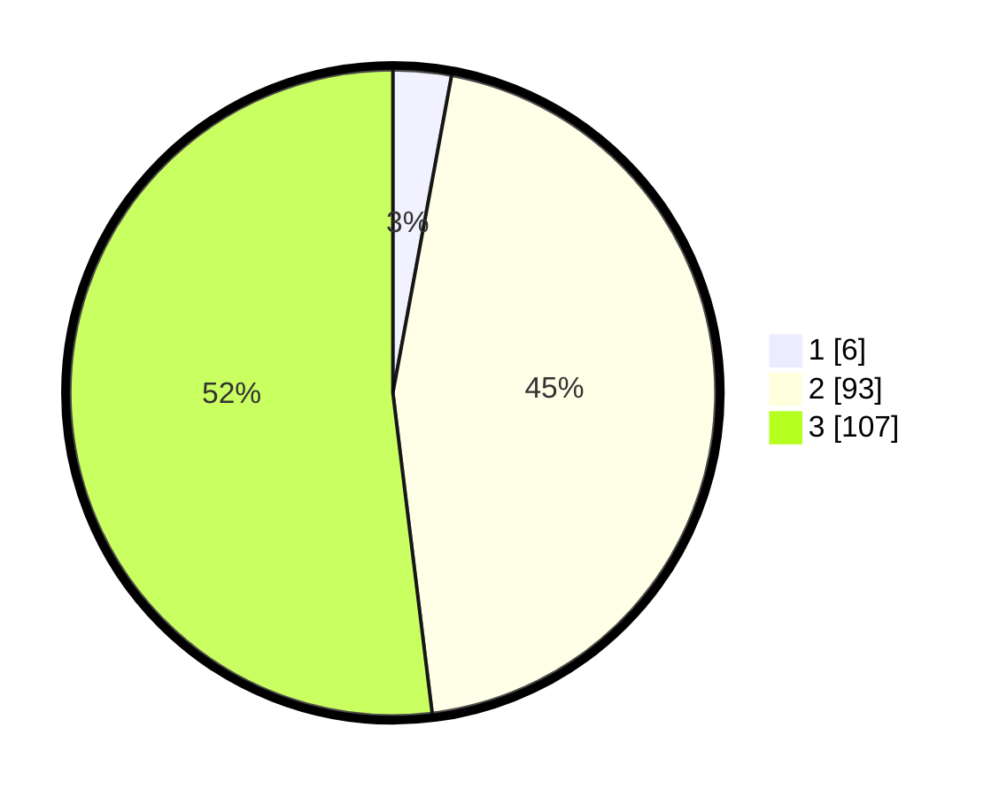

# Hasil

## Grafik

## Tabel

| No.    | Nama Paslon    | Suara | Suara (raw) | Persentase |
|:------ |:-------------- | -----:| -----------:| ----------:|
| 100025 | ANIES MUHAIMIN | 6     | [6][p-1]    | 2,91       |
| 100026 | PRABOWO GIBRAN | 93    | [93][p-2]   | 45,15      |
| 100027 | GANJAR MAHFUD  | 107   | [107][p-3]  | 51,94      |

[p-1]: https://github.com/gigit-pemilu/pemilu-2024/blob/main/pilpres/hitung-suara/sub/31-dki-jakarta/sub/72-jakarta-utara/sub/01-penjaringan/sub/1005-pluit/sub/128-tps/sub/paslon-1.txt
[p-2]: https://github.com/gigit-pemilu/pemilu-2024/blob/main/pilpres/hitung-suara/sub/31-dki-jakarta/sub/72-jakarta-utara/sub/01-penjaringan/sub/1005-pluit/sub/128-tps/sub/paslon-2.txt
[p-3]: https://github.com/gigit-pemilu/pemilu-2024/blob/main/pilpres/hitung-suara/sub/31-dki-jakarta/sub/72-jakarta-utara/sub/01-penjaringan/sub/1005-pluit/sub/128-tps/sub/paslon-3.txt

## Foto C Plano

https://sirekap-obj-formc.kpu.go.id/a259/pemilu/ppwp/31/72/01/10/05/3172011005128-20240227-194705--50bee08c-696b-4e56-a7a4-47806e178f31.jpg

https://sirekap-obj-formc.kpu.go.id/a259/pemilu/ppwp/31/72/01/10/05/3172011005128-20240227-194718--27b5c3c5-dd22-4638-9609-721d20e2a4eb.jpg

https://sirekap-obj-formc.kpu.go.id/a259/pemilu/ppwp/31/72/01/10/05/3172011005128-20240227-194735--c54cec98-8034-4fc1-b245-671aff5b5811.jpg

## Metadata

| Key        | Value               |
| ---------- | ------------------- |
| Time Stamp | 2024-02-27 22:00:00 |

