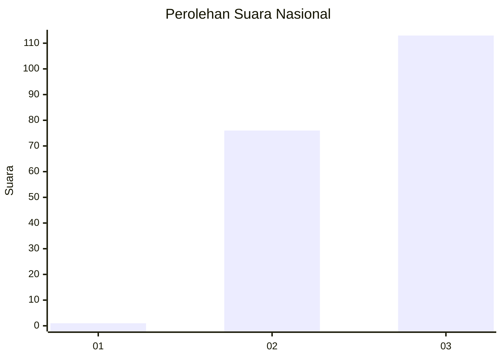
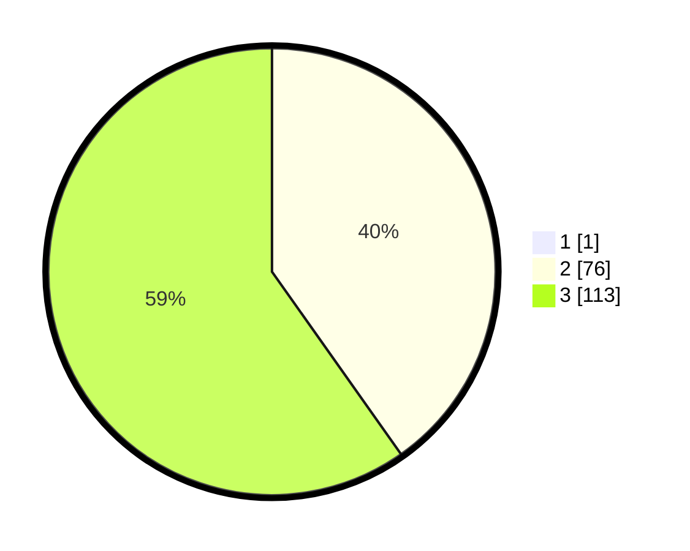

# Hasil

## Grafik

## Tabel

| No.    | Nama Paslon    | Suara | Suara (raw) | Persentase |
|:------ |:-------------- | -----:| -----------:| ----------:|
| 100025 | ANIES MUHAIMIN | 1     | [1][p-1]    | 0,53       |
| 100026 | PRABOWO GIBRAN | 76    | [76][p-2]   | 40,00      |
| 100027 | GANJAR MAHFUD  | 113   | [113][p-3]  | 59,47      |

[p-1]: https://github.com/gigit-pemilu/pemilu-2024/blob/main/pilpres/hitung-suara/sub/31-dki-jakarta/sub/72-jakarta-utara/sub/01-penjaringan/sub/1005-pluit/sub/132-tps/sub/paslon-1.txt
[p-2]: https://github.com/gigit-pemilu/pemilu-2024/blob/main/pilpres/hitung-suara/sub/31-dki-jakarta/sub/72-jakarta-utara/sub/01-penjaringan/sub/1005-pluit/sub/132-tps/sub/paslon-2.txt
[p-3]: https://github.com/gigit-pemilu/pemilu-2024/blob/main/pilpres/hitung-suara/sub/31-dki-jakarta/sub/72-jakarta-utara/sub/01-penjaringan/sub/1005-pluit/sub/132-tps/sub/paslon-3.txt

## Foto C Plano

https://sirekap-obj-formc.kpu.go.id/a137/pemilu/ppwp/31/72/01/10/05/3172011005132-20240214-201419--0236463b-9ff8-438c-a213-429a605a2769.jpg

https://sirekap-obj-formc.kpu.go.id/a137/pemilu/ppwp/31/72/01/10/05/3172011005132-20240214-201457--2eccc214-967e-4502-a6ee-c085d6e0ddcf.jpg

https://sirekap-obj-formc.kpu.go.id/a137/pemilu/ppwp/31/72/01/10/05/3172011005132-20240214-201548--d12b9b06-95da-4696-bf56-1e5d231ea9ab.jpg

## Metadata

| Key        | Value               |
| ---------- | ------------------- |
| Time Stamp | 2024-02-21 18:00:00 |

