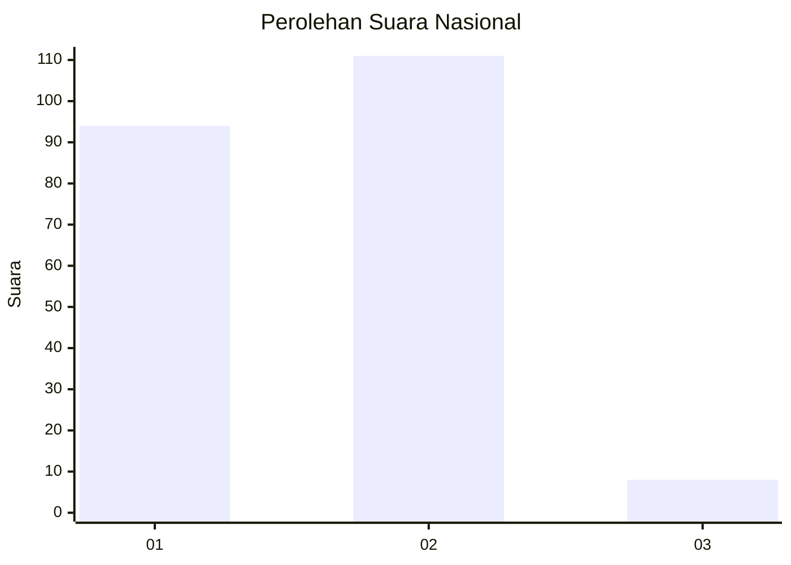
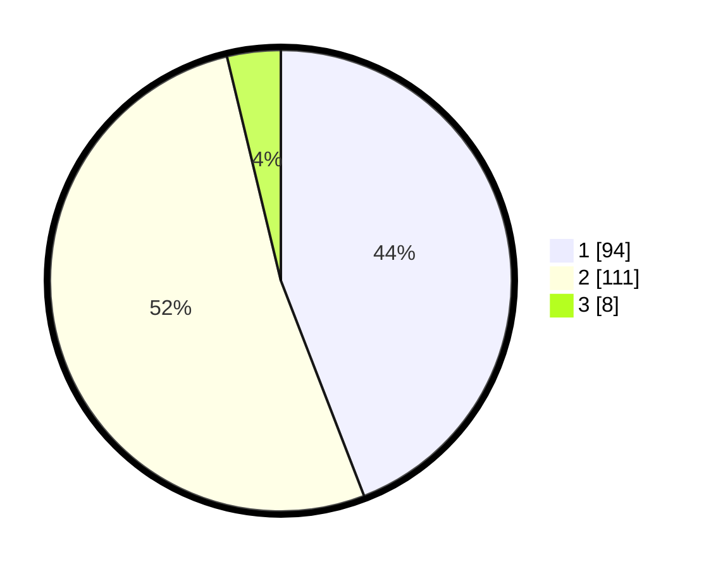

# Hasil

## Grafik

## Tabel

| No.    | Nama Paslon    | Suara | Suara (raw) | Persentase |
|:------ |:-------------- | -----:| -----------:| ----------:|
| 100025 | ANIES MUHAIMIN | 94    | [94][p-1]   | 44,13      |
| 100026 | PRABOWO GIBRAN | 111   | [111][p-2]  | 52,11      |
| 100027 | GANJAR MAHFUD  | 8     | [8][p-3]    | 3,76       |

[p-1]: https://github.com/gigit-pemilu/pemilu-2024/blob/main/pilpres/hitung-suara/sub/31-dki-jakarta/sub/72-jakarta-utara/sub/01-penjaringan/sub/1005-pluit/sub/137-tps/sub/paslon-1.txt
[p-2]: https://github.com/gigit-pemilu/pemilu-2024/blob/main/pilpres/hitung-suara/sub/31-dki-jakarta/sub/72-jakarta-utara/sub/01-penjaringan/sub/1005-pluit/sub/137-tps/sub/paslon-2.txt
[p-3]: https://github.com/gigit-pemilu/pemilu-2024/blob/main/pilpres/hitung-suara/sub/31-dki-jakarta/sub/72-jakarta-utara/sub/01-penjaringan/sub/1005-pluit/sub/137-tps/sub/paslon-3.txt

## Foto C Plano

https://sirekap-obj-formc.kpu.go.id/72e1/pemilu/ppwp/31/72/01/10/05/3172011005137-20240215-190946--ad15024f-3351-4508-8964-519ca4cdd29d.jpg

https://sirekap-obj-formc.kpu.go.id/72e1/pemilu/ppwp/31/72/01/10/05/3172011005137-20240215-191310--c3a5f9ab-4419-4299-8426-695e0760e9e0.jpg

https://sirekap-obj-formc.kpu.go.id/72e1/pemilu/ppwp/31/72/01/10/05/3172011005137-20240215-191718--f76f9574-a6cd-4c7f-a22c-8add79ba59da.jpg

## Metadata

| Key        | Value               |
| ---------- | ------------------- |
| Time Stamp | 2024-02-21 15:00:00 |

