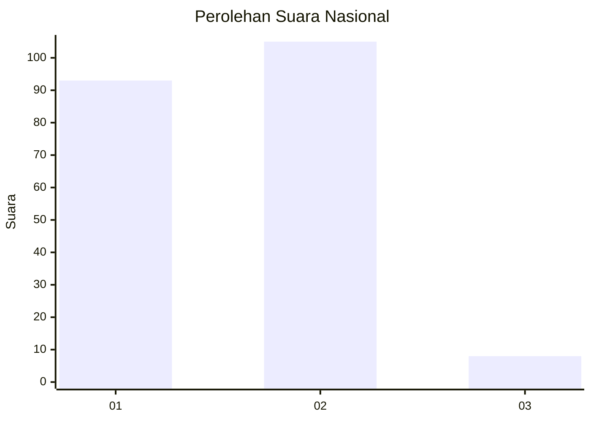
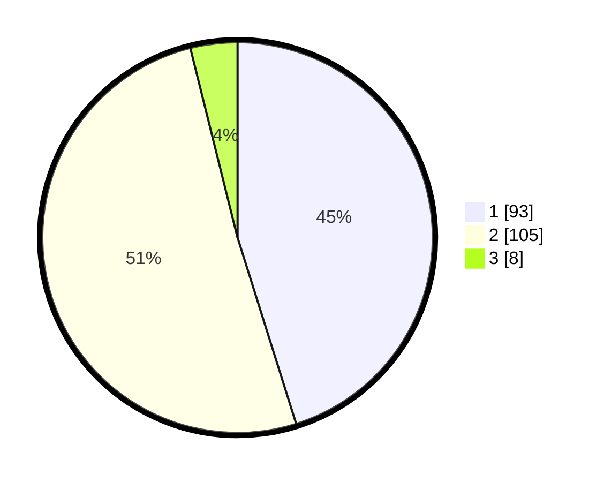

# Hasil

## Grafik

## Tabel

| No.    | Nama Paslon    | Suara | Suara (raw) | Persentase |
|:------ |:-------------- | -----:| -----------:| ----------:|
| 100025 | ANIES MUHAIMIN | 93    | [93][p-1]   | 45,15      |
| 100026 | PRABOWO GIBRAN | 105   | [105][p-2]  | 50,97      |
| 100027 | GANJAR MAHFUD  | 8     | [8][p-3]    | 3,88       |

[p-1]: https://github.com/gigit-pemilu/pemilu-2024/blob/main/pilpres/hitung-suara/sub/31-dki-jakarta/sub/72-jakarta-utara/sub/01-penjaringan/sub/1005-pluit/sub/148-tps/sub/paslon-1.txt
[p-2]: https://github.com/gigit-pemilu/pemilu-2024/blob/main/pilpres/hitung-suara/sub/31-dki-jakarta/sub/72-jakarta-utara/sub/01-penjaringan/sub/1005-pluit/sub/148-tps/sub/paslon-2.txt
[p-3]: https://github.com/gigit-pemilu/pemilu-2024/blob/main/pilpres/hitung-suara/sub/31-dki-jakarta/sub/72-jakarta-utara/sub/01-penjaringan/sub/1005-pluit/sub/148-tps/sub/paslon-3.txt

## Foto C Plano

https://sirekap-obj-formc.kpu.go.id/f81f/pemilu/ppwp/31/72/01/10/05/3172011005148-20240214-234123--80aa9eff-d939-4b68-a6bf-7a870534e540.jpg

https://sirekap-obj-formc.kpu.go.id/f81f/pemilu/ppwp/31/72/01/10/05/3172011005148-20240214-234248--4a53f0b7-771d-4b76-92ff-88135b479498.jpg

https://sirekap-obj-formc.kpu.go.id/f81f/pemilu/ppwp/31/72/01/10/05/3172011005148-20240214-234429--28876a92-5cda-462f-b28f-b4310ae6c421.jpg

## Metadata

| Key        | Value               |
| ---------- | ------------------- |
| Time Stamp | 2024-02-21 15:00:00 |

