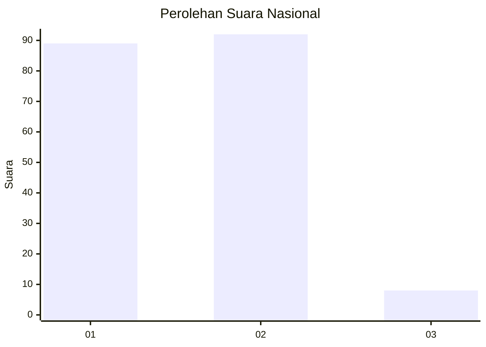
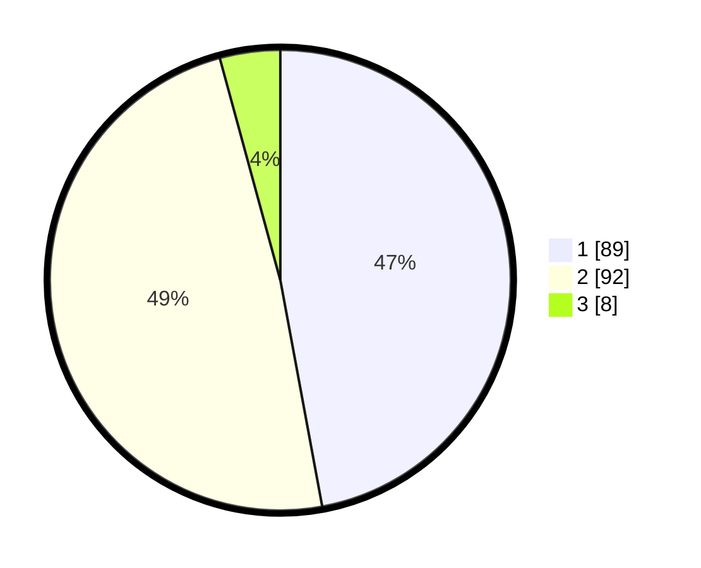

# Hasil

## Grafik

## Tabel

| No.    | Nama Paslon    | Suara | Suara (raw) | Persentase |
|:------ |:-------------- | -----:| -----------:| ----------:|
| 100025 | ANIES MUHAIMIN | 89    | [89][p-1]   | 47,09      |
| 100026 | PRABOWO GIBRAN | 92    | [92][p-2]   | 48,68      |
| 100027 | GANJAR MAHFUD  | 8     | [8][p-3]    | 4,23       |

[p-1]: https://github.com/gigit-pemilu/pemilu-2024/blob/main/pilpres/hitung-suara/sub/31-dki-jakarta/sub/72-jakarta-utara/sub/01-penjaringan/sub/1005-pluit/sub/149-tps/sub/paslon-1.txt
[p-2]: https://github.com/gigit-pemilu/pemilu-2024/blob/main/pilpres/hitung-suara/sub/31-dki-jakarta/sub/72-jakarta-utara/sub/01-penjaringan/sub/1005-pluit/sub/149-tps/sub/paslon-2.txt
[p-3]: https://github.com/gigit-pemilu/pemilu-2024/blob/main/pilpres/hitung-suara/sub/31-dki-jakarta/sub/72-jakarta-utara/sub/01-penjaringan/sub/1005-pluit/sub/149-tps/sub/paslon-3.txt

## Foto C Plano

https://sirekap-obj-formc.kpu.go.id/c956/pemilu/ppwp/31/72/01/10/05/3172011005149-20240215-023341--3860113f-9f8f-42a9-b8ea-7aaef1c23318.jpg

https://sirekap-obj-formc.kpu.go.id/c956/pemilu/ppwp/31/72/01/10/05/3172011005149-20240215-031738--9d14dc94-9030-46e7-819e-51f440b881d0.jpg

https://sirekap-obj-formc.kpu.go.id/c956/pemilu/ppwp/31/72/01/10/05/3172011005149-20240215-023525--cae95fe3-6465-47af-a0f0-aaa93b47141f.jpg

## Metadata

| Key        | Value               |
| ---------- | ------------------- |
| Time Stamp | 2024-02-21 18:00:00 |

