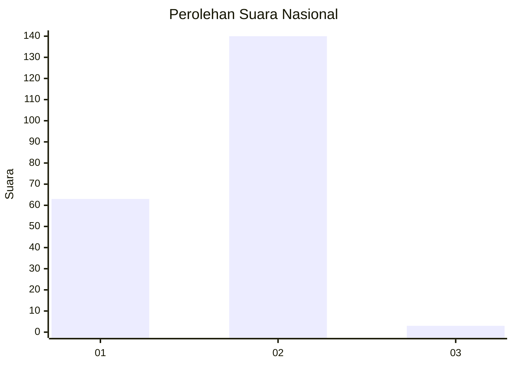
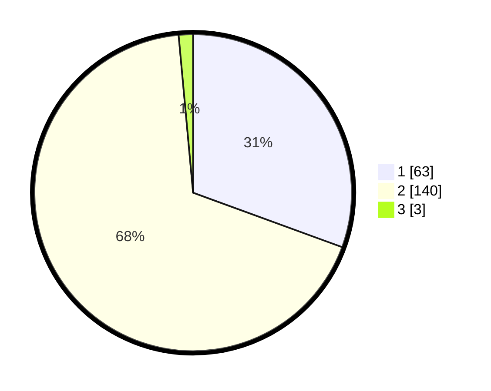

# Hasil

## Grafik

## Tabel

| No.    | Nama Paslon    | Suara | Suara (raw) | Persentase |
|:------ |:-------------- | -----:| -----------:| ----------:|
| 100025 | ANIES MUHAIMIN | 63    | [63][p-1]   | 30,58      |
| 100026 | PRABOWO GIBRAN | 140   | [140][p-2]  | 67,96      |
| 100027 | GANJAR MAHFUD  | 3     | [3][p-3]    | 1,46       |

[p-1]: https://github.com/gigit-pemilu/pemilu-2024/blob/main/pilpres/hitung-suara/sub/31-dki-jakarta/sub/72-jakarta-utara/sub/01-penjaringan/sub/1005-pluit/sub/150-tps/sub/paslon-1.txt
[p-2]: https://github.com/gigit-pemilu/pemilu-2024/blob/main/pilpres/hitung-suara/sub/31-dki-jakarta/sub/72-jakarta-utara/sub/01-penjaringan/sub/1005-pluit/sub/150-tps/sub/paslon-2.txt
[p-3]: https://github.com/gigit-pemilu/pemilu-2024/blob/main/pilpres/hitung-suara/sub/31-dki-jakarta/sub/72-jakarta-utara/sub/01-penjaringan/sub/1005-pluit/sub/150-tps/sub/paslon-3.txt

## Foto C Plano

https://sirekap-obj-formc.kpu.go.id/d2df/pemilu/ppwp/31/72/01/10/05/3172011005150-20240214-233652--20319c55-d97c-4e71-8558-f5a3080f9cbd.jpg

https://sirekap-obj-formc.kpu.go.id/d2df/pemilu/ppwp/31/72/01/10/05/3172011005150-20240214-233726--e8138196-7176-4361-99d6-b074932cab70.jpg

https://sirekap-obj-formc.kpu.go.id/d2df/pemilu/ppwp/31/72/01/10/05/3172011005150-20240215-002519--7e4dcace-007a-4ef1-ab99-e2ee22cf0124.jpg

## Metadata

| Key        | Value               |
| ---------- | ------------------- |
| Time Stamp | 2024-02-21 15:00:00 |

