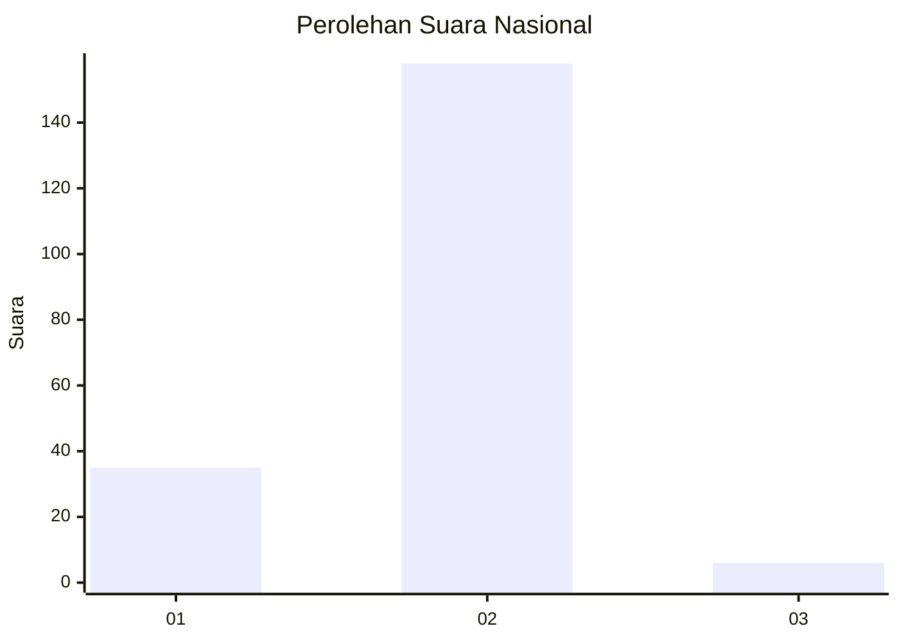
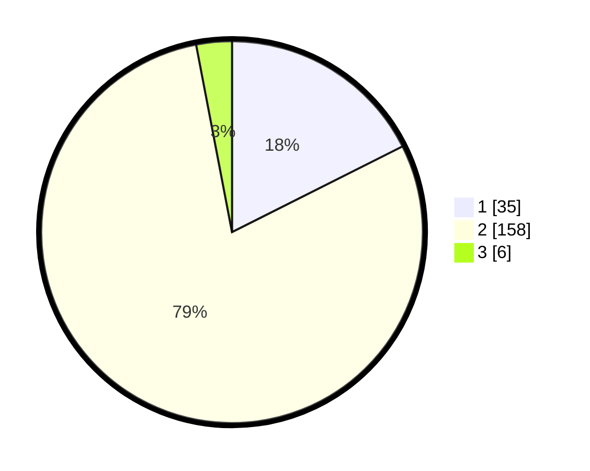

# Hasil

## Grafik

## Tabel

| No.    | Nama Paslon    | Suara | Suara (raw) | Persentase |
|:------ |:-------------- | -----:| -----------:| ----------:|
| 100025 | ANIES MUHAIMIN | 35    | [35][p-1]   | 17,59      |
| 100026 | PRABOWO GIBRAN | 158   | [158][p-2]  | 79,40      |
| 100027 | GANJAR MAHFUD  | 6     | [6][p-3]    | 3,02       |

[p-1]: https://github.com/gigit-pemilu/pemilu-2024/blob/main/pilpres/hitung-suara/sub/31-dki-jakarta/sub/72-jakarta-utara/sub/01-penjaringan/sub/1005-pluit/sub/153-tps/sub/paslon-1.txt
[p-2]: https://github.com/gigit-pemilu/pemilu-2024/blob/main/pilpres/hitung-suara/sub/31-dki-jakarta/sub/72-jakarta-utara/sub/01-penjaringan/sub/1005-pluit/sub/153-tps/sub/paslon-2.txt
[p-3]: https://github.com/gigit-pemilu/pemilu-2024/blob/main/pilpres/hitung-suara/sub/31-dki-jakarta/sub/72-jakarta-utara/sub/01-penjaringan/sub/1005-pluit/sub/153-tps/sub/paslon-3.txt

## Foto C Plano

https://sirekap-obj-formc.kpu.go.id/084b/pemilu/ppwp/31/72/01/10/05/3172011005153-20240215-015621--07365589-61d1-4948-bd0b-a394d7007a3a.jpg

https://sirekap-obj-formc.kpu.go.id/084b/pemilu/ppwp/31/72/01/10/05/3172011005153-20240215-020408--bd724463-4e0f-4eea-a2c5-699672dba41c.jpg

https://sirekap-obj-formc.kpu.go.id/084b/pemilu/ppwp/31/72/01/10/05/3172011005153-20240215-020617--a04c37f5-8923-40b7-abfe-8a875ece56f4.jpg

## Metadata

| Key        | Value               |
| ---------- | ------------------- |
| Time Stamp | 2024-02-21 18:00:00 |

