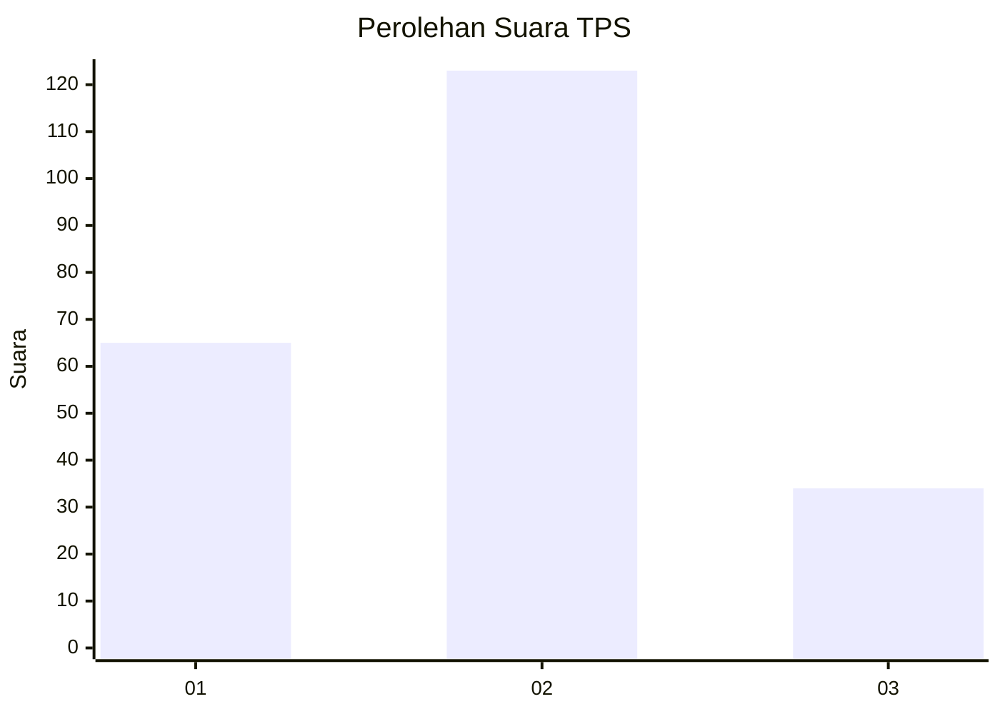
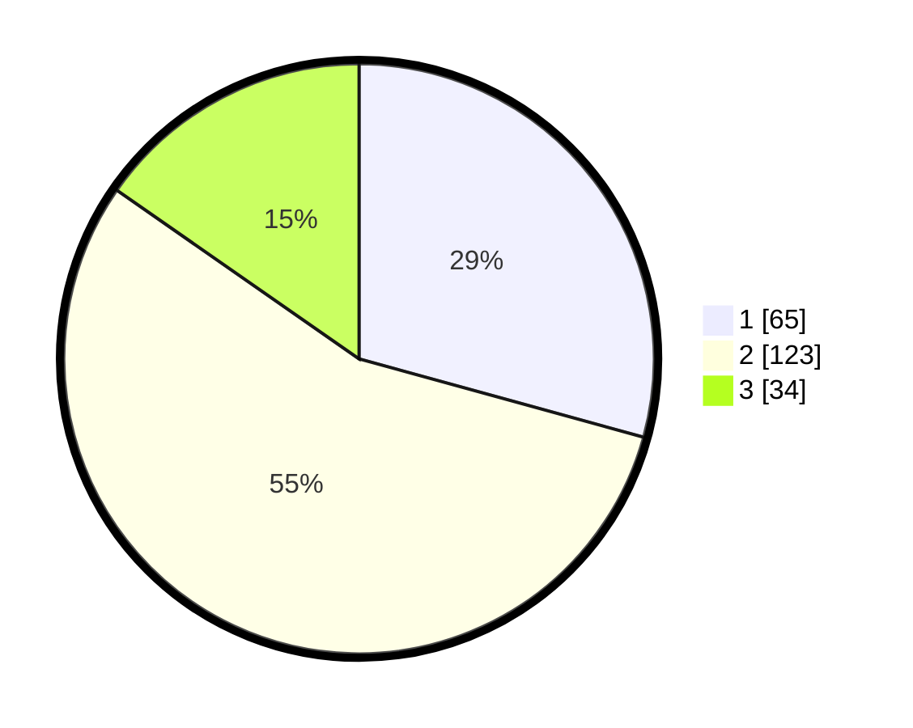

# Hasil

## Grafik

## Tabel

| No. | Nama Paslon    | Suara | Suara (raw) | Persentase |
|:--- |:-------------- | -----:| -----------:| ----------:|
| 1   | ANIES MUHAIMIN | 65    | [65][p-1]   | 29,28      |
| 2   | PRABOWO GIBRAN | 123   | [123][p-2]  | 55,41      |
| 3   | GANJAR MAHFUD  | 34    | [34][p-3]   | 15,32      |

[p-1]: https://github.com/gigit-pemilu/pemilu-2024-31-dki-jakarta/blob/main/pilpres/hitung-suara/sub/31-dki-jakarta/sub/72-jakarta-utara/sub/02-tanjung-priok/sub/1001-tanjung-priok/sub/003-tps/sub/paslon-1.txt
[p-2]: https://github.com/gigit-pemilu/pemilu-2024-31-dki-jakarta/blob/main/pilpres/hitung-suara/sub/31-dki-jakarta/sub/72-jakarta-utara/sub/02-tanjung-priok/sub/1001-tanjung-priok/sub/003-tps/sub/paslon-2.txt
[p-3]: https://github.com/gigit-pemilu/pemilu-2024-31-dki-jakarta/blob/main/pilpres/hitung-suara/sub/31-dki-jakarta/sub/72-jakarta-utara/sub/02-tanjung-priok/sub/1001-tanjung-priok/sub/003-tps/sub/paslon-3.txt

## Foto C Plano

https://sirekap-obj-formc.kpu.go.id/a570/pemilu/ppwp/31/72/02/10/01/3172021001003-20240216-153136--7f85351f-0039-45da-ad1f-93e22bf5e677.jpg

https://sirekap-obj-formc.kpu.go.id/a570/pemilu/ppwp/31/72/02/10/01/3172021001003-20240216-153248--f9057956-ac0d-4a10-a3ce-bb3fe46e6b6b.jpg

https://sirekap-obj-formc.kpu.go.id/a570/pemilu/ppwp/31/72/02/10/01/3172021001003-20240216-153331--e99bdc7d-9d48-4f9a-af4e-fbaf6f84a4e7.jpg

## Metadata

| Key        | Value               |
| ---------- | ------------------- |
| Time Stamp | 2024-02-20 15:00:00 |

