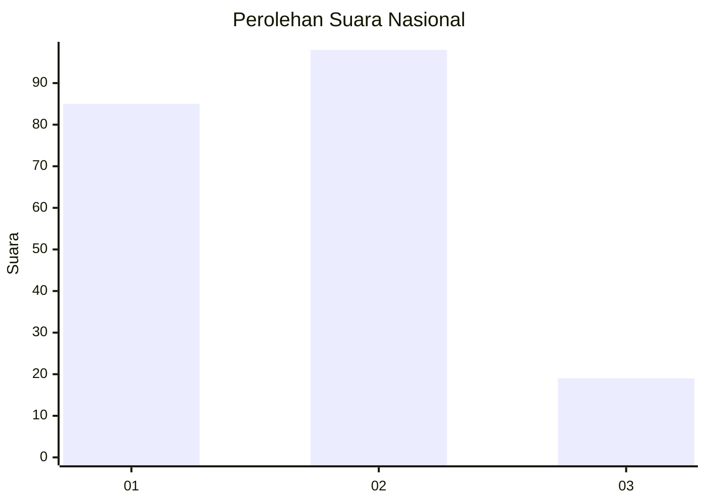
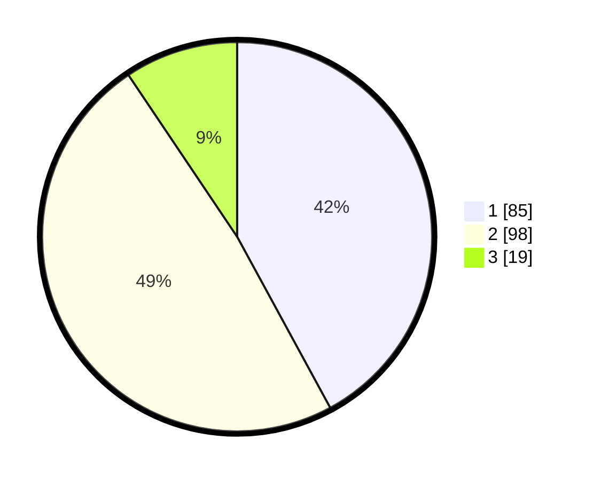

# Hasil

## Grafik

## Tabel

| No.    | Nama Paslon    | Suara | Suara (raw) | Persentase |
|:------ |:-------------- | -----:| -----------:| ----------:|
| 100025 | ANIES MUHAIMIN | 85    | [85][p-1]   | 42,08      |
| 100026 | PRABOWO GIBRAN | 98    | [98][p-2]   | 48,51      |
| 100027 | GANJAR MAHFUD  | 19    | [19][p-3]   | 9,41       |

[p-1]: https://github.com/gigit-pemilu/pemilu-2024/blob/main/pilpres/hitung-suara/sub/31-dki-jakarta/sub/72-jakarta-utara/sub/02-tanjung-priok/sub/1001-tanjung-priok/sub/004-tps/sub/paslon-1.txt
[p-2]: https://github.com/gigit-pemilu/pemilu-2024/blob/main/pilpres/hitung-suara/sub/31-dki-jakarta/sub/72-jakarta-utara/sub/02-tanjung-priok/sub/1001-tanjung-priok/sub/004-tps/sub/paslon-2.txt
[p-3]: https://github.com/gigit-pemilu/pemilu-2024/blob/main/pilpres/hitung-suara/sub/31-dki-jakarta/sub/72-jakarta-utara/sub/02-tanjung-priok/sub/1001-tanjung-priok/sub/004-tps/sub/paslon-3.txt

## Foto C Plano

https://sirekap-obj-formc.kpu.go.id/1aa3/pemilu/ppwp/31/72/02/10/01/3172021001004-20240214-234604--d498fbc7-65c5-48c0-8c96-11e687ef399b.jpg

https://sirekap-obj-formc.kpu.go.id/1aa3/pemilu/ppwp/31/72/02/10/01/3172021001004-20240214-214528--757c0c60-873b-4de8-b0f1-37f4a2b90ff0.jpg

https://sirekap-obj-formc.kpu.go.id/1aa3/pemilu/ppwp/31/72/02/10/01/3172021001004-20240214-234726--bf610683-0cd7-4f15-8c73-43260f0e9c3b.jpg

## Metadata

| Key        | Value               |
| ---------- | ------------------- |
| Time Stamp | 2024-02-15 17:00:25 |

