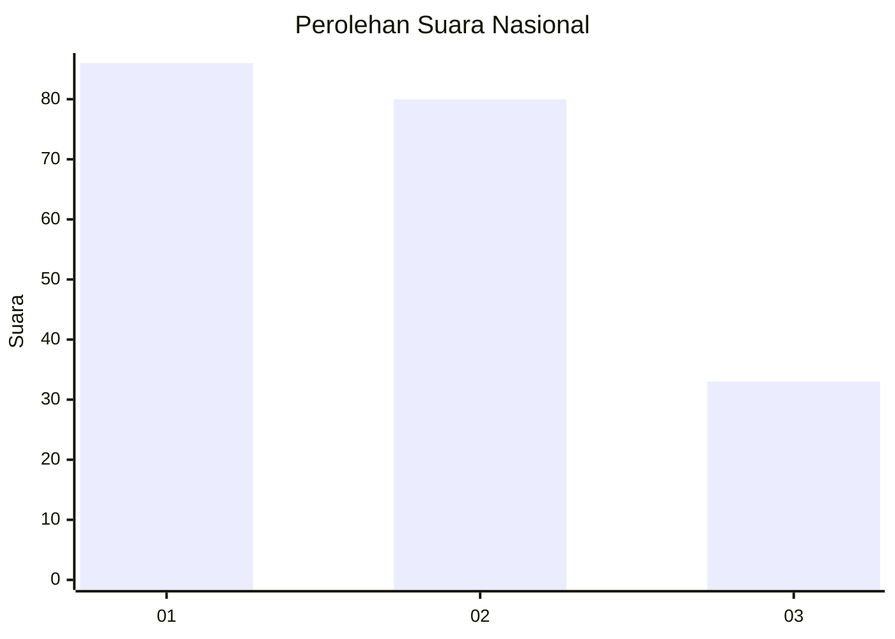
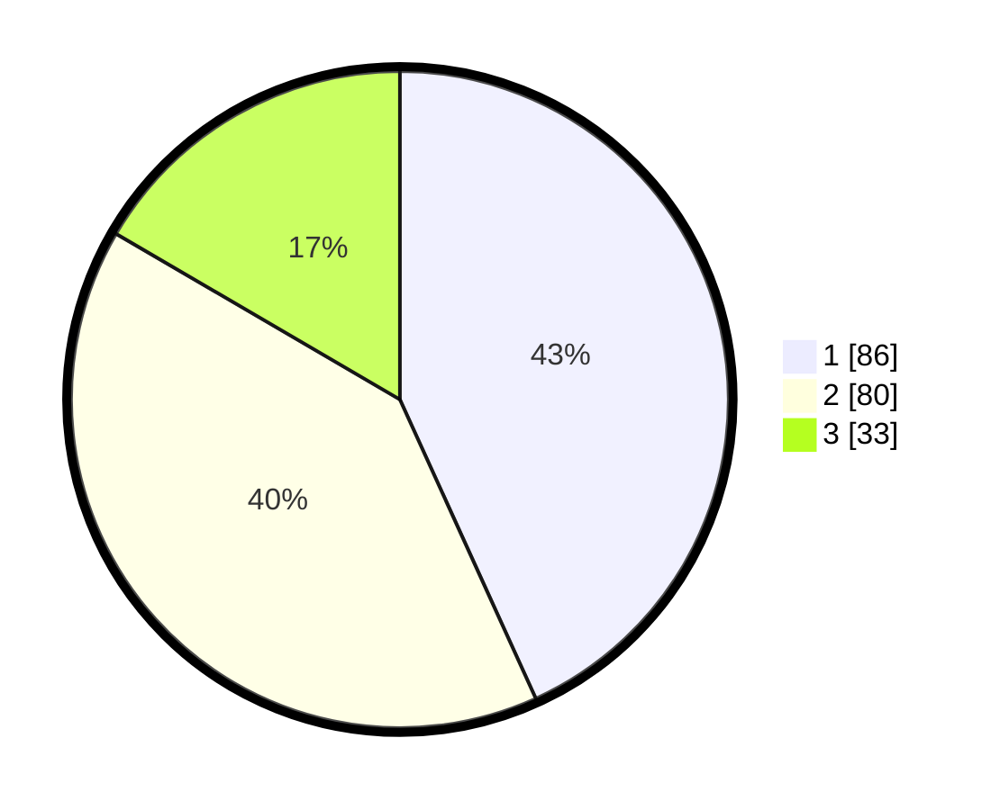

# Hasil

## Grafik

## Tabel

| No.    | Nama Paslon    | Suara | Suara (raw) | Persentase |
|:------ |:-------------- | -----:| -----------:| ----------:|
| 100025 | ANIES MUHAIMIN | 86    | [86][p-1]   | 43,22      |
| 100026 | PRABOWO GIBRAN | 80    | [80][p-2]   | 40,20      |
| 100027 | GANJAR MAHFUD  | 33    | [33][p-3]   | 16,58      |

[p-1]: https://github.com/gigit-pemilu/pemilu-2024/blob/main/pilpres/hitung-suara/sub/31-dki-jakarta/sub/72-jakarta-utara/sub/02-tanjung-priok/sub/1001-tanjung-priok/sub/005-tps/sub/paslon-1.txt
[p-2]: https://github.com/gigit-pemilu/pemilu-2024/blob/main/pilpres/hitung-suara/sub/31-dki-jakarta/sub/72-jakarta-utara/sub/02-tanjung-priok/sub/1001-tanjung-priok/sub/005-tps/sub/paslon-2.txt
[p-3]: https://github.com/gigit-pemilu/pemilu-2024/blob/main/pilpres/hitung-suara/sub/31-dki-jakarta/sub/72-jakarta-utara/sub/02-tanjung-priok/sub/1001-tanjung-priok/sub/005-tps/sub/paslon-3.txt

## Foto C Plano

https://sirekap-obj-formc.kpu.go.id/01b6/pemilu/ppwp/31/72/02/10/01/3172021001005-20240215-044558--74a54a32-72fe-4b10-8779-0f5038f0490f.jpg

https://sirekap-obj-formc.kpu.go.id/01b6/pemilu/ppwp/31/72/02/10/01/3172021001005-20240215-033917--9f6e7a2e-01cb-4e9b-adfb-7cf38acb779b.jpg

https://sirekap-obj-formc.kpu.go.id/01b6/pemilu/ppwp/31/72/02/10/01/3172021001005-20240215-023933--54af0e76-98d4-4b3e-9c6c-4d273efd6c11.jpg

## Metadata

| Key        | Value               |
| ---------- | ------------------- |
| Time Stamp | 2024-02-15 18:30:25 |

