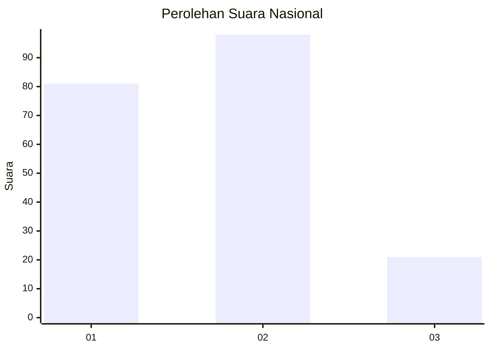
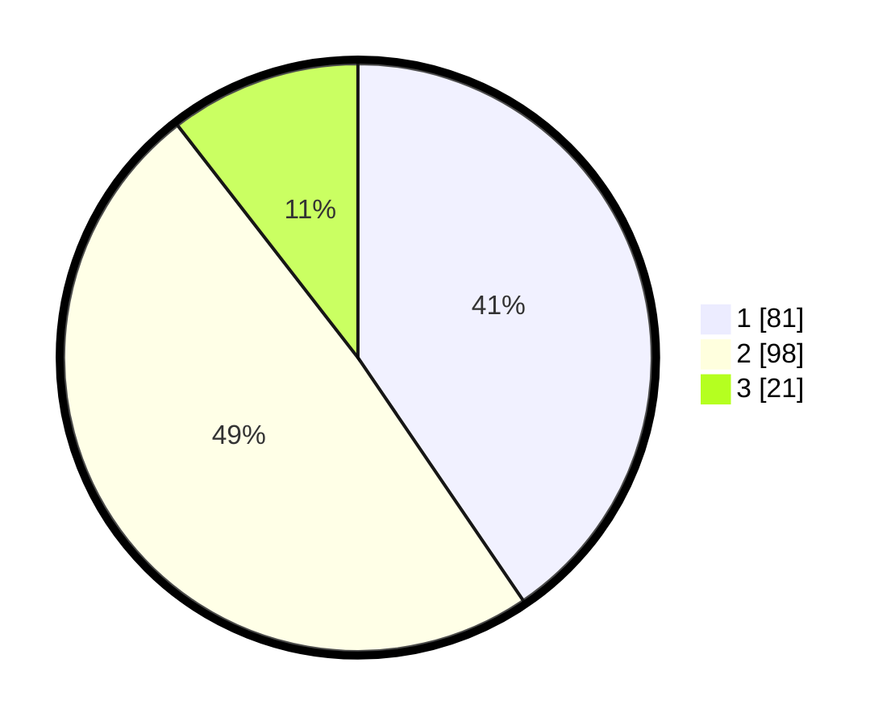

# Hasil

## Grafik

## Tabel

| No.    | Nama Paslon    | Suara | Suara (raw) | Persentase |
|:------ |:-------------- | -----:| -----------:| ----------:|
| 100025 | ANIES MUHAIMIN | 81    | [81][p-1]   | 40,50      |
| 100026 | PRABOWO GIBRAN | 98    | [98][p-2]   | 49,00      |
| 100027 | GANJAR MAHFUD  | 21    | [21][p-3]   | 10,50      |

[p-1]: https://github.com/gigit-pemilu/pemilu-2024/blob/main/pilpres/hitung-suara/sub/31-dki-jakarta/sub/72-jakarta-utara/sub/02-tanjung-priok/sub/1001-tanjung-priok/sub/006-tps/sub/paslon-1.txt
[p-2]: https://github.com/gigit-pemilu/pemilu-2024/blob/main/pilpres/hitung-suara/sub/31-dki-jakarta/sub/72-jakarta-utara/sub/02-tanjung-priok/sub/1001-tanjung-priok/sub/006-tps/sub/paslon-2.txt
[p-3]: https://github.com/gigit-pemilu/pemilu-2024/blob/main/pilpres/hitung-suara/sub/31-dki-jakarta/sub/72-jakarta-utara/sub/02-tanjung-priok/sub/1001-tanjung-priok/sub/006-tps/sub/paslon-3.txt

## Foto C Plano

https://sirekap-obj-formc.kpu.go.id/7aef/pemilu/ppwp/31/72/02/10/01/3172021001006-20240215-023513--61709167-c4e1-4fb3-83e0-44276a8a3f80.jpg

https://sirekap-obj-formc.kpu.go.id/7aef/pemilu/ppwp/31/72/02/10/01/3172021001006-20240215-023637--87aea969-aa4e-45db-9d10-2a92c770158e.jpg

https://sirekap-obj-formc.kpu.go.id/7aef/pemilu/ppwp/31/72/02/10/01/3172021001006-20240215-023801--673990b3-a4eb-4c2b-bce1-0c10b1b71252.jpg

## Metadata

| Key        | Value               |
| ---------- | ------------------- |
| Time Stamp | 2024-02-17 13:37:34 |

