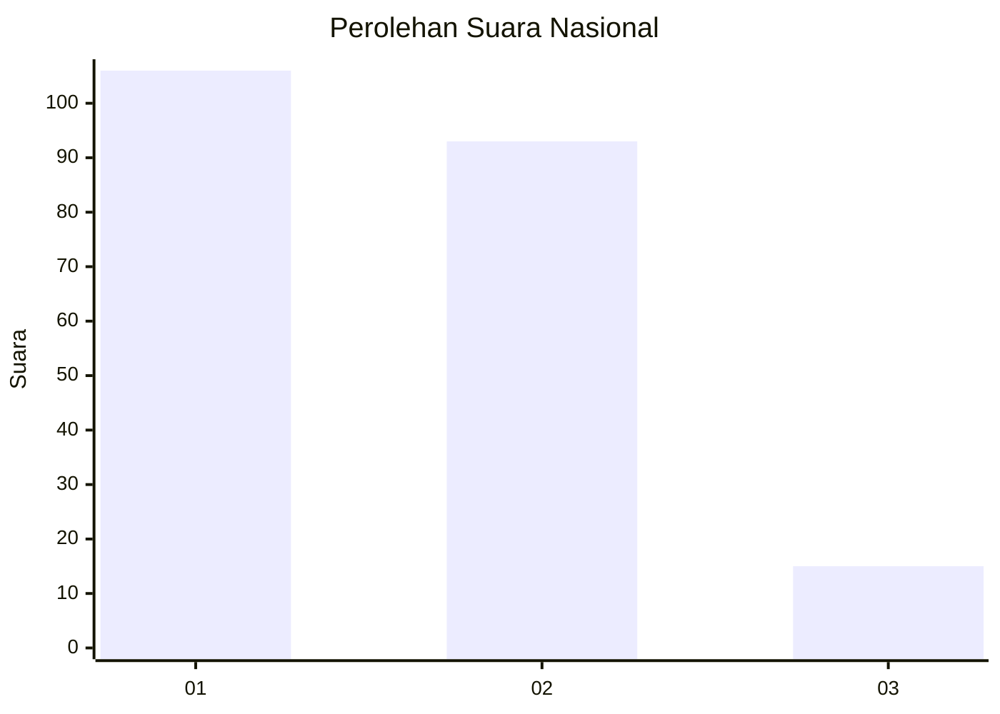
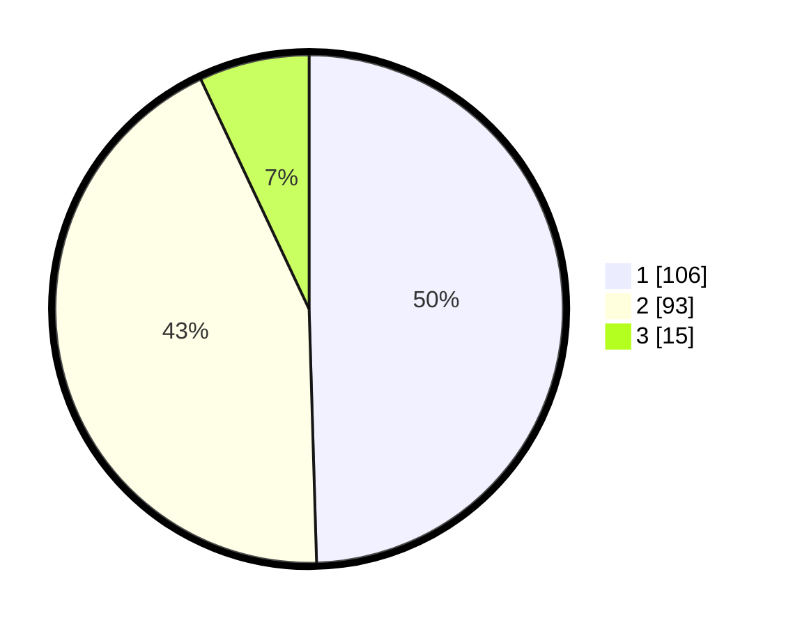

# Hasil

## Grafik

## Tabel

| No.    | Nama Paslon    | Suara | Suara (raw) | Persentase |
|:------ |:-------------- | -----:| -----------:| ----------:|
| 100025 | ANIES MUHAIMIN | 106   | [106][p-1]  | 49,53      |
| 100026 | PRABOWO GIBRAN | 93    | [93][p-2]   | 43,46      |
| 100027 | GANJAR MAHFUD  | 15    | [15][p-3]   | 7,01       |

[p-1]: https://github.com/gigit-pemilu/pemilu-2024/blob/main/pilpres/hitung-suara/sub/31-dki-jakarta/sub/72-jakarta-utara/sub/02-tanjung-priok/sub/1001-tanjung-priok/sub/009-tps/sub/paslon-1.txt
[p-2]: https://github.com/gigit-pemilu/pemilu-2024/blob/main/pilpres/hitung-suara/sub/31-dki-jakarta/sub/72-jakarta-utara/sub/02-tanjung-priok/sub/1001-tanjung-priok/sub/009-tps/sub/paslon-2.txt
[p-3]: https://github.com/gigit-pemilu/pemilu-2024/blob/main/pilpres/hitung-suara/sub/31-dki-jakarta/sub/72-jakarta-utara/sub/02-tanjung-priok/sub/1001-tanjung-priok/sub/009-tps/sub/paslon-3.txt

## Foto C Plano

https://sirekap-obj-formc.kpu.go.id/20ef/pemilu/ppwp/31/72/02/10/01/3172021001009-20240215-030400--db6da540-f200-4fc5-8612-30052b069e2d.jpg

https://sirekap-obj-formc.kpu.go.id/20ef/pemilu/ppwp/31/72/02/10/01/3172021001009-20240215-030633--8e194cda-8453-4f71-b5bc-4a0d9b1df1e6.jpg

https://sirekap-obj-formc.kpu.go.id/20ef/pemilu/ppwp/31/72/02/10/01/3172021001009-20240215-031119--1f0029e4-6d4d-470b-ace5-6705cb39242c.jpg

## Metadata

| Key        | Value               |
| ---------- | ------------------- |
| Time Stamp | 2024-02-15 12:00:28 |

