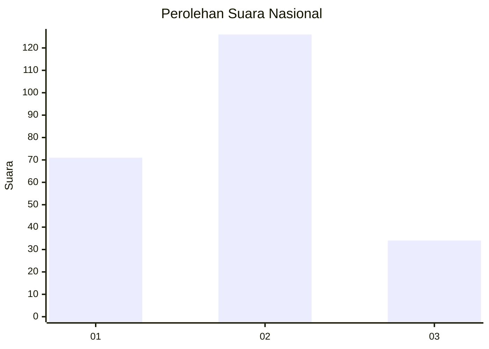
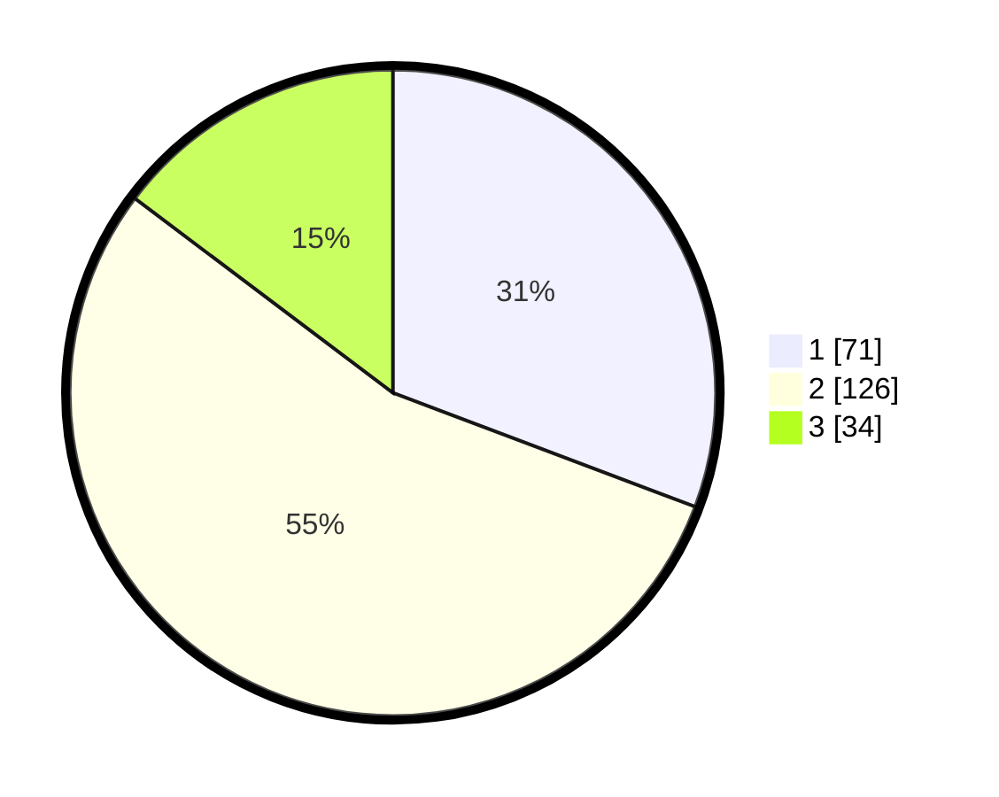

# Hasil

## Grafik

## Tabel

| No.    | Nama Paslon    | Suara | Suara (raw) | Persentase |
|:------ |:-------------- | -----:| -----------:| ----------:|
| 100025 | ANIES MUHAIMIN | 71    | [71][p-1]   | 30,74      |
| 100026 | PRABOWO GIBRAN | 126   | [126][p-2]  | 54,55      |
| 100027 | GANJAR MAHFUD  | 34    | [34][p-3]   | 14,72      |

[p-1]: https://github.com/gigit-pemilu/pemilu-2024/blob/main/pilpres/hitung-suara/sub/31-dki-jakarta/sub/72-jakarta-utara/sub/02-tanjung-priok/sub/1001-tanjung-priok/sub/034-tps/sub/paslon-1.txt
[p-2]: https://github.com/gigit-pemilu/pemilu-2024/blob/main/pilpres/hitung-suara/sub/31-dki-jakarta/sub/72-jakarta-utara/sub/02-tanjung-priok/sub/1001-tanjung-priok/sub/034-tps/sub/paslon-2.txt
[p-3]: https://github.com/gigit-pemilu/pemilu-2024/blob/main/pilpres/hitung-suara/sub/31-dki-jakarta/sub/72-jakarta-utara/sub/02-tanjung-priok/sub/1001-tanjung-priok/sub/034-tps/sub/paslon-3.txt

## Foto C Plano

https://sirekap-obj-formc.kpu.go.id/4fe1/pemilu/ppwp/31/72/02/10/01/3172021001034-20240217-193307--d1b6716f-c60a-4c61-a0f6-98c3ce7e1b98.jpg

https://sirekap-obj-formc.kpu.go.id/4fe1/pemilu/ppwp/31/72/02/10/01/3172021001034-20240217-192954--f871191c-0859-427e-a04b-e64a1442d527.jpg

https://sirekap-obj-formc.kpu.go.id/4fe1/pemilu/ppwp/31/72/02/10/01/3172021001034-20240217-192929--d5414d50-10f3-4497-a0ba-c45a24bb0163.jpg

## Metadata

| Key        | Value               |
| ---------- | ------------------- |
| Time Stamp | 2024-02-20 15:00:00 |

