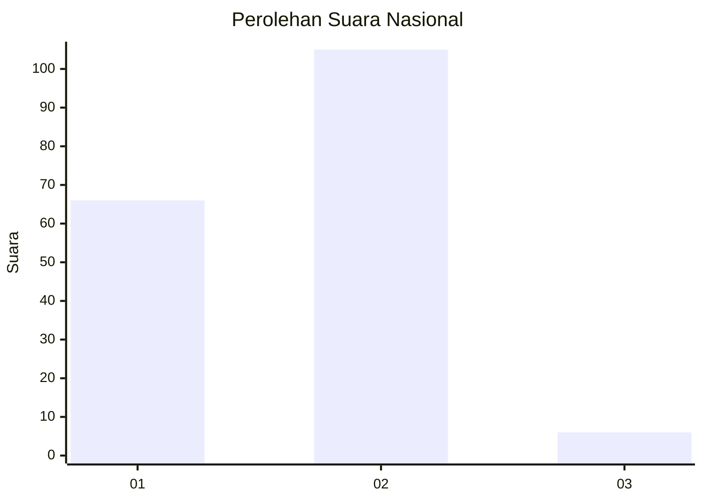
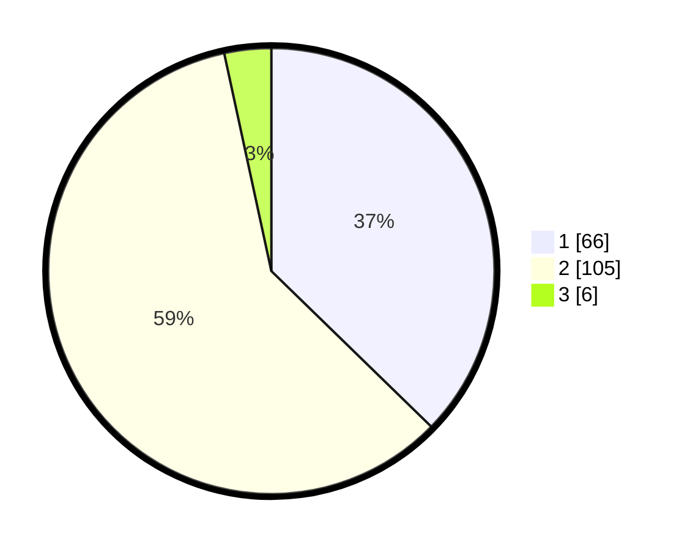

# Hasil

## Grafik

## Tabel

| No.    | Nama Paslon    | Suara | Suara (raw) | Persentase |
|:------ |:-------------- | -----:| -----------:| ----------:|
| 100025 | ANIES MUHAIMIN | 66    | [66][p-1]   | 37,29      |
| 100026 | PRABOWO GIBRAN | 105   | [105][p-2]  | 59,32      |
| 100027 | GANJAR MAHFUD  | 6     | [6][p-3]    | 3,39       |

[p-1]: https://github.com/gigit-pemilu/pemilu-2024/blob/main/pilpres/hitung-suara/sub/31-dki-jakarta/sub/72-jakarta-utara/sub/02-tanjung-priok/sub/1001-tanjung-priok/sub/048-tps/sub/paslon-1.txt
[p-2]: https://github.com/gigit-pemilu/pemilu-2024/blob/main/pilpres/hitung-suara/sub/31-dki-jakarta/sub/72-jakarta-utara/sub/02-tanjung-priok/sub/1001-tanjung-priok/sub/048-tps/sub/paslon-2.txt
[p-3]: https://github.com/gigit-pemilu/pemilu-2024/blob/main/pilpres/hitung-suara/sub/31-dki-jakarta/sub/72-jakarta-utara/sub/02-tanjung-priok/sub/1001-tanjung-priok/sub/048-tps/sub/paslon-3.txt

## Foto C Plano

https://sirekap-obj-formc.kpu.go.id/fbe7/pemilu/ppwp/31/72/02/10/01/3172021001048-20240215-010202--f3561899-cca6-4ff8-9dc8-08e55b3d6070.jpg

https://sirekap-obj-formc.kpu.go.id/fbe7/pemilu/ppwp/31/72/02/10/01/3172021001048-20240215-011032--d38899fc-f19d-41fb-b627-8729a478587f.jpg

https://sirekap-obj-formc.kpu.go.id/fbe7/pemilu/ppwp/31/72/02/10/01/3172021001048-20240215-010531--f16ac04c-62ec-4f48-8816-662d9ed5ce2b.jpg

## Metadata

| Key        | Value               |
| ---------- | ------------------- |
| Time Stamp | 2024-02-21 13:00:00 |

