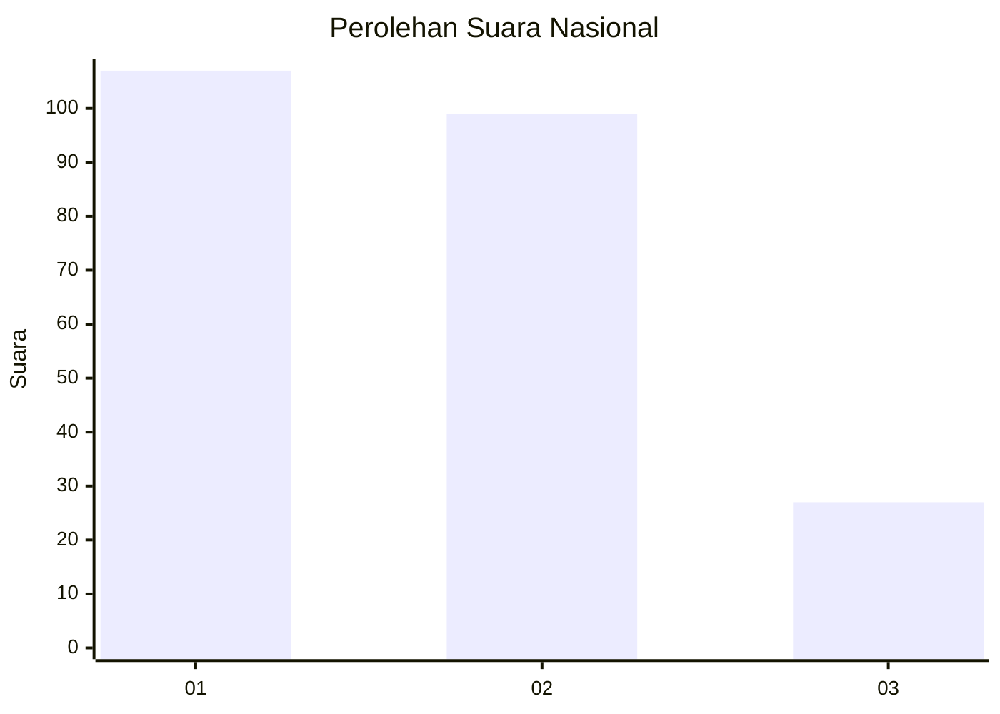
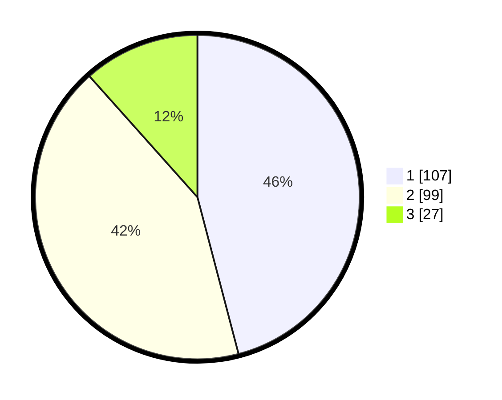

# Hasil

## Grafik

## Tabel

| No.    | Nama Paslon    | Suara | Suara (raw) | Persentase |
|:------ |:-------------- | -----:| -----------:| ----------:|
| 100025 | ANIES MUHAIMIN | 107   | [107][p-1]  | 45,92      |
| 100026 | PRABOWO GIBRAN | 99    | [99][p-2]   | 42,49      |
| 100027 | GANJAR MAHFUD  | 27    | [27][p-3]   | 11,59      |

[p-1]: https://github.com/gigit-pemilu/pemilu-2024/blob/main/pilpres/hitung-suara/sub/31-dki-jakarta/sub/72-jakarta-utara/sub/02-tanjung-priok/sub/1001-tanjung-priok/sub/102-tps/sub/paslon-1.txt
[p-2]: https://github.com/gigit-pemilu/pemilu-2024/blob/main/pilpres/hitung-suara/sub/31-dki-jakarta/sub/72-jakarta-utara/sub/02-tanjung-priok/sub/1001-tanjung-priok/sub/102-tps/sub/paslon-2.txt
[p-3]: https://github.com/gigit-pemilu/pemilu-2024/blob/main/pilpres/hitung-suara/sub/31-dki-jakarta/sub/72-jakarta-utara/sub/02-tanjung-priok/sub/1001-tanjung-priok/sub/102-tps/sub/paslon-3.txt

## Foto C Plano

https://sirekap-obj-formc.kpu.go.id/b420/pemilu/ppwp/31/72/02/10/01/3172021001102-20240214-192946--8264b510-91e9-4a1d-822d-73edfe1d4049.jpg

https://sirekap-obj-formc.kpu.go.id/b420/pemilu/ppwp/31/72/02/10/01/3172021001102-20240214-193015--917d73e3-4507-4056-88b5-b59a437d8996.jpg

https://sirekap-obj-formc.kpu.go.id/b420/pemilu/ppwp/31/72/02/10/01/3172021001102-20240214-193022--b3a1b91a-549f-4fda-a7ca-22a32591c2ea.jpg

## Metadata

| Key        | Value               |
| ---------- | ------------------- |
| Time Stamp | 2024-02-21 12:00:00 |

