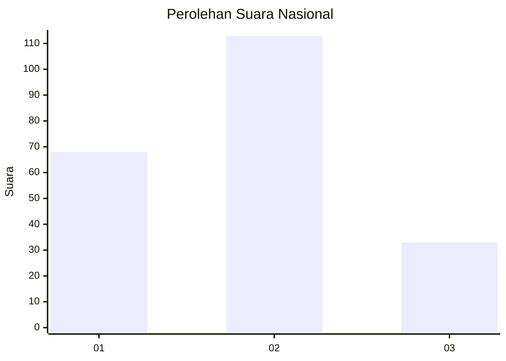
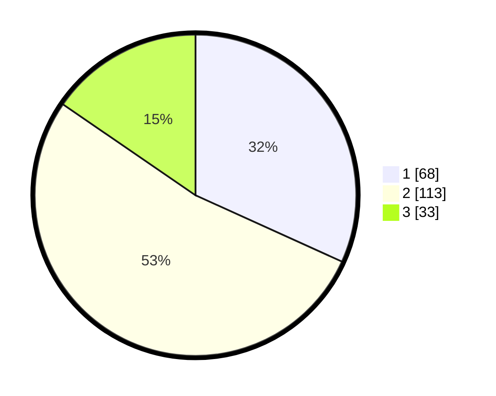

# Hasil

## Grafik

## Tabel

| No.    | Nama Paslon    | Suara | Suara (raw) | Persentase |
|:------ |:-------------- | -----:| -----------:| ----------:|
| 100025 | ANIES MUHAIMIN | 68    | [68][p-1]   | 31,78      |
| 100026 | PRABOWO GIBRAN | 113   | [113][p-2]  | 52,80      |
| 100027 | GANJAR MAHFUD  | 33    | [33][p-3]   | 15,42      |

[p-1]: https://github.com/gigit-pemilu/pemilu-2024/blob/main/pilpres/hitung-suara/sub/31-dki-jakarta/sub/72-jakarta-utara/sub/02-tanjung-priok/sub/1002-sunter-jaya/sub/063-tps/sub/paslon-1.txt
[p-2]: https://github.com/gigit-pemilu/pemilu-2024/blob/main/pilpres/hitung-suara/sub/31-dki-jakarta/sub/72-jakarta-utara/sub/02-tanjung-priok/sub/1002-sunter-jaya/sub/063-tps/sub/paslon-2.txt
[p-3]: https://github.com/gigit-pemilu/pemilu-2024/blob/main/pilpres/hitung-suara/sub/31-dki-jakarta/sub/72-jakarta-utara/sub/02-tanjung-priok/sub/1002-sunter-jaya/sub/063-tps/sub/paslon-3.txt

## Foto C Plano

https://sirekap-obj-formc.kpu.go.id/3f78/pemilu/ppwp/31/72/02/10/02/3172021002063-20240217-211311--2cc52ad9-ef2c-4e27-bbf6-a4e4c2938f2b.jpg

https://sirekap-obj-formc.kpu.go.id/3f78/pemilu/ppwp/31/72/02/10/02/3172021002063-20240217-211545--8f5cb135-b374-421e-bbce-92e3a0b8f6a7.jpg

https://sirekap-obj-formc.kpu.go.id/3f78/pemilu/ppwp/31/72/02/10/02/3172021002063-20240217-211352--805ba02a-21cb-417f-b483-5729b761440b.jpg

## Metadata

| Key        | Value               |
| ---------- | ------------------- |
| Time Stamp | 2024-02-21 14:00:00 |

