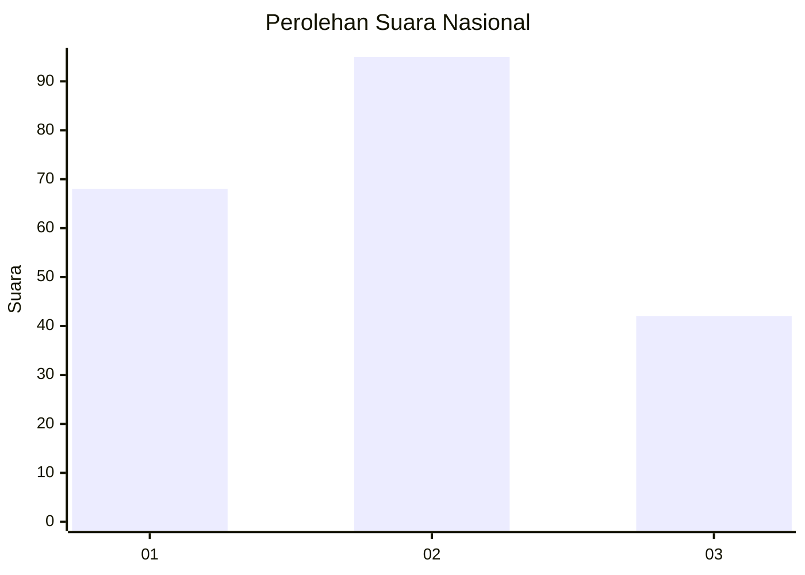
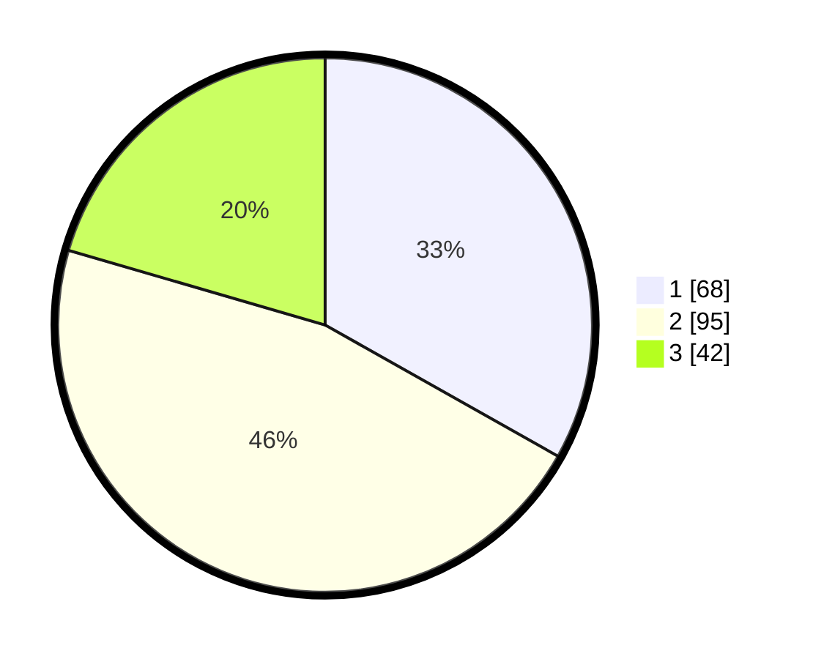

# Hasil

## Grafik

## Tabel

| No.    | Nama Paslon    | Suara | Suara (raw) | Persentase |
|:------ |:-------------- | -----:| -----------:| ----------:|
| 100025 | ANIES MUHAIMIN | 68    | [68][p-1]   | 33,17      |
| 100026 | PRABOWO GIBRAN | 95    | [95][p-2]   | 46,34      |
| 100027 | GANJAR MAHFUD  | 42    | [42][p-3]   | 20,49      |

[p-1]: https://github.com/gigit-pemilu/pemilu-2024/blob/main/pilpres/hitung-suara/sub/31-dki-jakarta/sub/72-jakarta-utara/sub/02-tanjung-priok/sub/1002-sunter-jaya/sub/064-tps/sub/paslon-1.txt
[p-2]: https://github.com/gigit-pemilu/pemilu-2024/blob/main/pilpres/hitung-suara/sub/31-dki-jakarta/sub/72-jakarta-utara/sub/02-tanjung-priok/sub/1002-sunter-jaya/sub/064-tps/sub/paslon-2.txt
[p-3]: https://github.com/gigit-pemilu/pemilu-2024/blob/main/pilpres/hitung-suara/sub/31-dki-jakarta/sub/72-jakarta-utara/sub/02-tanjung-priok/sub/1002-sunter-jaya/sub/064-tps/sub/paslon-3.txt

## Foto C Plano

https://sirekap-obj-formc.kpu.go.id/a605/pemilu/ppwp/31/72/02/10/02/3172021002064-20240217-211820--343504b6-4b66-40f5-b77f-75c049e290c6.jpg

https://sirekap-obj-formc.kpu.go.id/a605/pemilu/ppwp/31/72/02/10/02/3172021002064-20240217-211845--b154c436-e3fd-4306-b7a7-9a5be48f9f96.jpg

https://sirekap-obj-formc.kpu.go.id/a605/pemilu/ppwp/31/72/02/10/02/3172021002064-20240217-211906--f3ef511d-2a5c-40a3-843d-f89c592f9d21.jpg

## Metadata

| Key        | Value               |
| ---------- | ------------------- |
| Time Stamp | 2024-02-21 14:00:00 |

