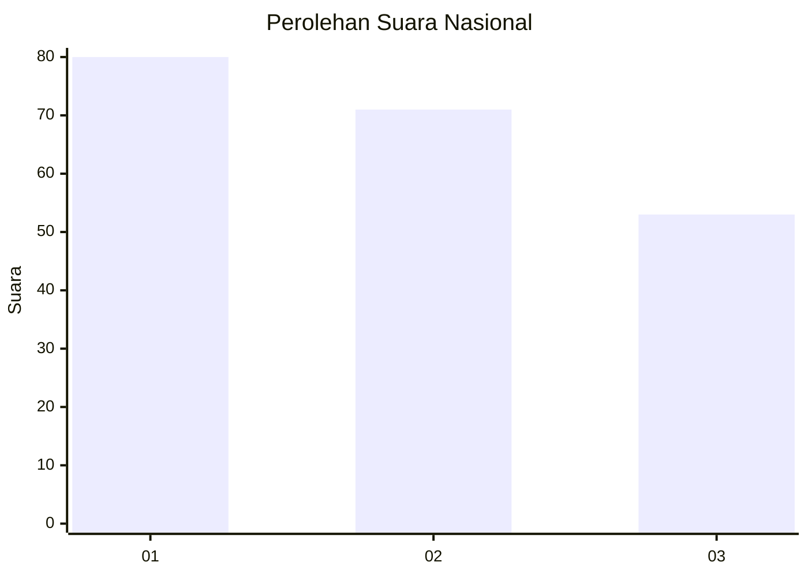
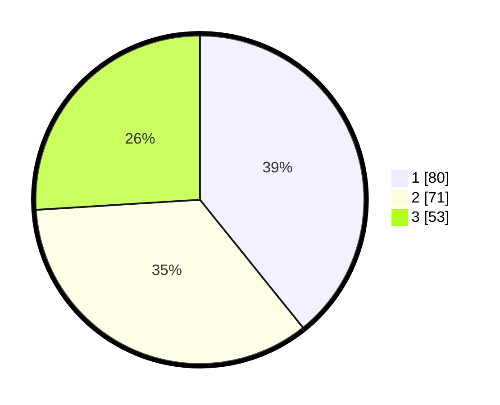

# Hasil

## Grafik

## Tabel

| No.    | Nama Paslon    | Suara | Suara (raw) | Persentase |
|:------ |:-------------- | -----:| -----------:| ----------:|
| 100025 | ANIES MUHAIMIN | 80    | [80][p-1]   | 39,22      |
| 100026 | PRABOWO GIBRAN | 71    | [71][p-2]   | 34,80      |
| 100027 | GANJAR MAHFUD  | 53    | [53][p-3]   | 25,98      |

[p-1]: https://github.com/gigit-pemilu/pemilu-2024/blob/main/pilpres/hitung-suara/sub/31-dki-jakarta/sub/72-jakarta-utara/sub/02-tanjung-priok/sub/1002-sunter-jaya/sub/069-tps/sub/paslon-1.txt
[p-2]: https://github.com/gigit-pemilu/pemilu-2024/blob/main/pilpres/hitung-suara/sub/31-dki-jakarta/sub/72-jakarta-utara/sub/02-tanjung-priok/sub/1002-sunter-jaya/sub/069-tps/sub/paslon-2.txt
[p-3]: https://github.com/gigit-pemilu/pemilu-2024/blob/main/pilpres/hitung-suara/sub/31-dki-jakarta/sub/72-jakarta-utara/sub/02-tanjung-priok/sub/1002-sunter-jaya/sub/069-tps/sub/paslon-3.txt

## Foto C Plano

https://sirekap-obj-formc.kpu.go.id/519d/pemilu/ppwp/31/72/02/10/02/3172021002069-20240216-200905--88749a19-703a-4450-8ee8-77ec5b21e685.jpg

https://sirekap-obj-formc.kpu.go.id/519d/pemilu/ppwp/31/72/02/10/02/3172021002069-20240216-200945--246d1794-ed7c-4601-86af-a4d96b26188d.jpg

https://sirekap-obj-formc.kpu.go.id/519d/pemilu/ppwp/31/72/02/10/02/3172021002069-20240216-201022--04da1a46-1599-4726-b5c3-2929e62dfb31.jpg

## Metadata

| Key        | Value               |
| ---------- | ------------------- |
| Time Stamp | 2024-02-21 14:00:00 |

