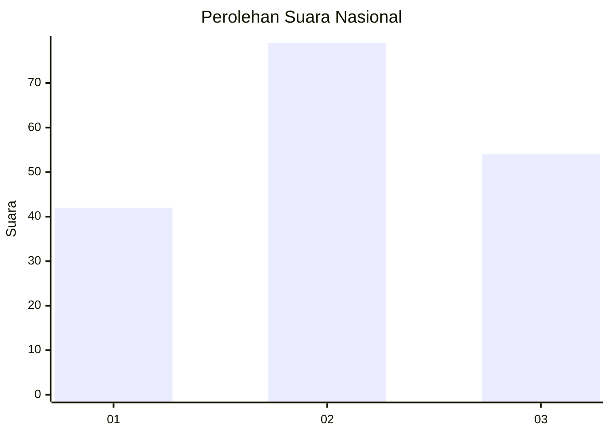
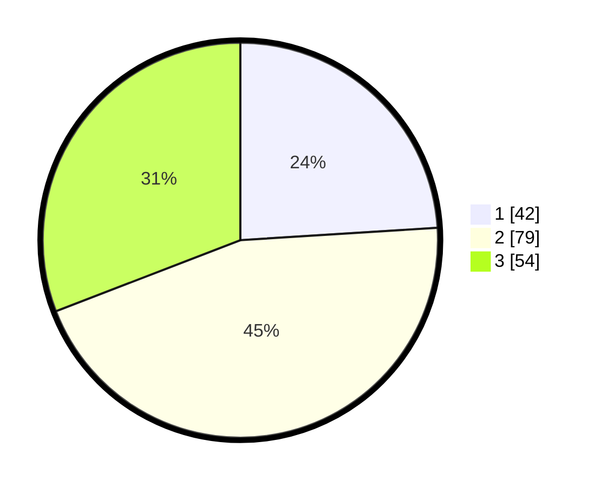

# Hasil

## Grafik

## Tabel

| No.    | Nama Paslon    | Suara | Suara (raw) | Persentase |
|:------ |:-------------- | -----:| -----------:| ----------:|
| 100025 | ANIES MUHAIMIN | 42    | [42][p-1]   | 24,00      |
| 100026 | PRABOWO GIBRAN | 79    | [79][p-2]   | 45,14      |
| 100027 | GANJAR MAHFUD  | 54    | [54][p-3]   | 30,86      |

[p-1]: https://github.com/gigit-pemilu/pemilu-2024/blob/main/pilpres/hitung-suara/sub/31-dki-jakarta/sub/72-jakarta-utara/sub/02-tanjung-priok/sub/1002-sunter-jaya/sub/071-tps/sub/paslon-1.txt
[p-2]: https://github.com/gigit-pemilu/pemilu-2024/blob/main/pilpres/hitung-suara/sub/31-dki-jakarta/sub/72-jakarta-utara/sub/02-tanjung-priok/sub/1002-sunter-jaya/sub/071-tps/sub/paslon-2.txt
[p-3]: https://github.com/gigit-pemilu/pemilu-2024/blob/main/pilpres/hitung-suara/sub/31-dki-jakarta/sub/72-jakarta-utara/sub/02-tanjung-priok/sub/1002-sunter-jaya/sub/071-tps/sub/paslon-3.txt

## Foto C Plano

https://sirekap-obj-formc.kpu.go.id/282b/pemilu/ppwp/31/72/02/10/02/3172021002071-20240214-155301--8fdff7f7-7b95-45d7-ba18-abadb9d5d65c.jpg

https://sirekap-obj-formc.kpu.go.id/282b/pemilu/ppwp/31/72/02/10/02/3172021002071-20240214-155458--e5f42dc9-21f5-4132-baf1-92be6894813f.jpg

https://sirekap-obj-formc.kpu.go.id/282b/pemilu/ppwp/31/72/02/10/02/3172021002071-20240214-155507--b9a9fd5d-ba6d-4191-a563-f23467ecb7db.jpg

## Metadata

| Key        | Value               |
| ---------- | ------------------- |
| Time Stamp | 2024-02-14 21:46:01 |

