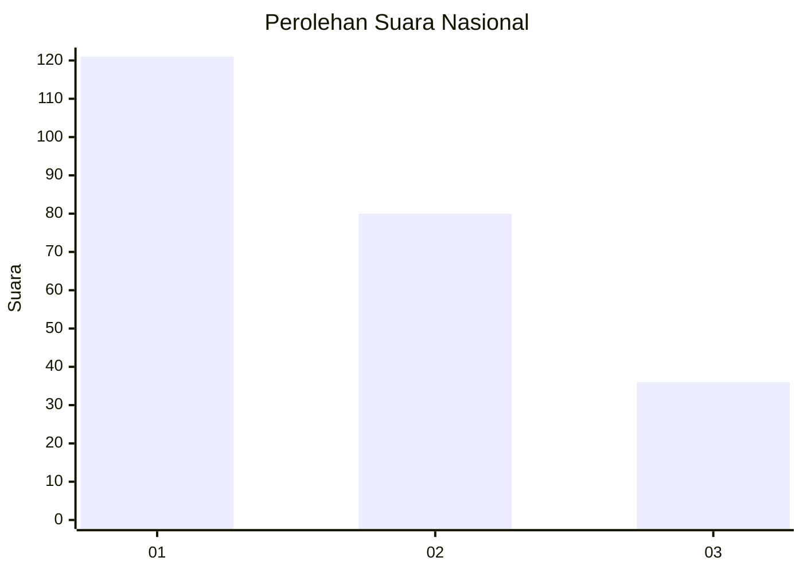
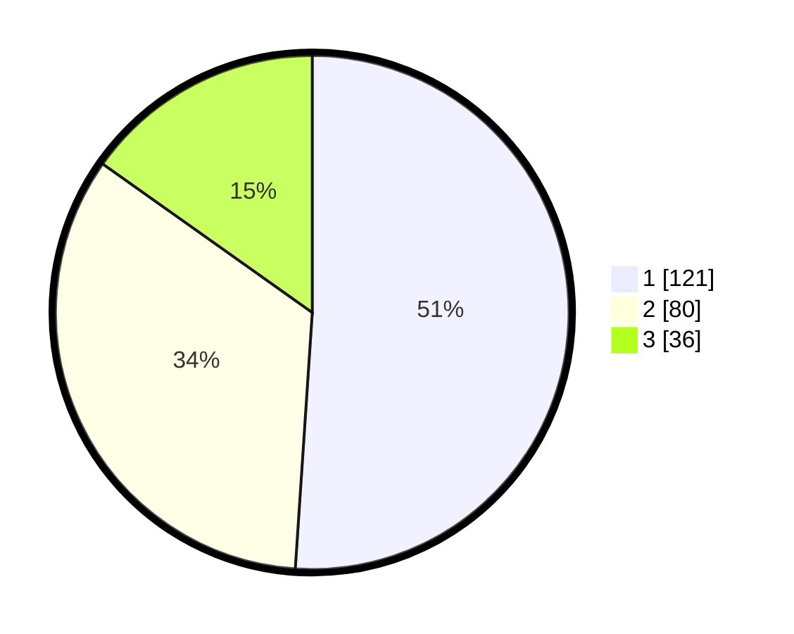

# Hasil

## Grafik

## Tabel

| No.    | Nama Paslon    | Suara | Suara (raw) | Persentase |
|:------ |:-------------- | -----:| -----------:| ----------:|
| 100025 | ANIES MUHAIMIN | 121   | [121][p-1]  | 51,05      |
| 100026 | PRABOWO GIBRAN | 80    | [80][p-2]   | 33,76      |
| 100027 | GANJAR MAHFUD  | 36    | [36][p-3]   | 15,19      |

[p-1]: https://github.com/gigit-pemilu/pemilu-2024/blob/main/pilpres/hitung-suara/sub/31-dki-jakarta/sub/72-jakarta-utara/sub/02-tanjung-priok/sub/1002-sunter-jaya/sub/121-tps/sub/paslon-1.txt
[p-2]: https://github.com/gigit-pemilu/pemilu-2024/blob/main/pilpres/hitung-suara/sub/31-dki-jakarta/sub/72-jakarta-utara/sub/02-tanjung-priok/sub/1002-sunter-jaya/sub/121-tps/sub/paslon-2.txt
[p-3]: https://github.com/gigit-pemilu/pemilu-2024/blob/main/pilpres/hitung-suara/sub/31-dki-jakarta/sub/72-jakarta-utara/sub/02-tanjung-priok/sub/1002-sunter-jaya/sub/121-tps/sub/paslon-3.txt

## Foto C Plano

https://sirekap-obj-formc.kpu.go.id/4f26/pemilu/ppwp/31/72/02/10/02/3172021002121-20240215-220001--ec0f9f37-db80-4adc-b4e3-b28d9e066fca.jpg

https://sirekap-obj-formc.kpu.go.id/4f26/pemilu/ppwp/31/72/02/10/02/3172021002121-20240215-015731--ef305f89-9980-4a7e-a5be-663ef2f86590.jpg

https://sirekap-obj-formc.kpu.go.id/4f26/pemilu/ppwp/31/72/02/10/02/3172021002121-20240215-015505--acda8336-9c15-4840-ba42-60e2ad993e9d.jpg

## Metadata

| Key        | Value               |
| ---------- | ------------------- |
| Time Stamp | 2024-02-21 17:00:00 |

