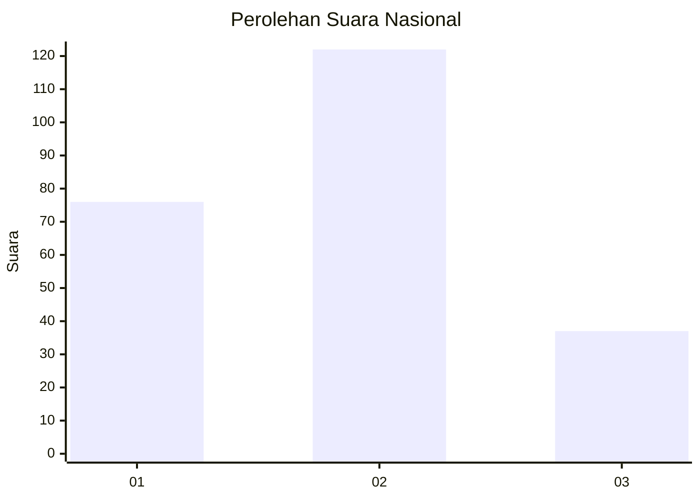
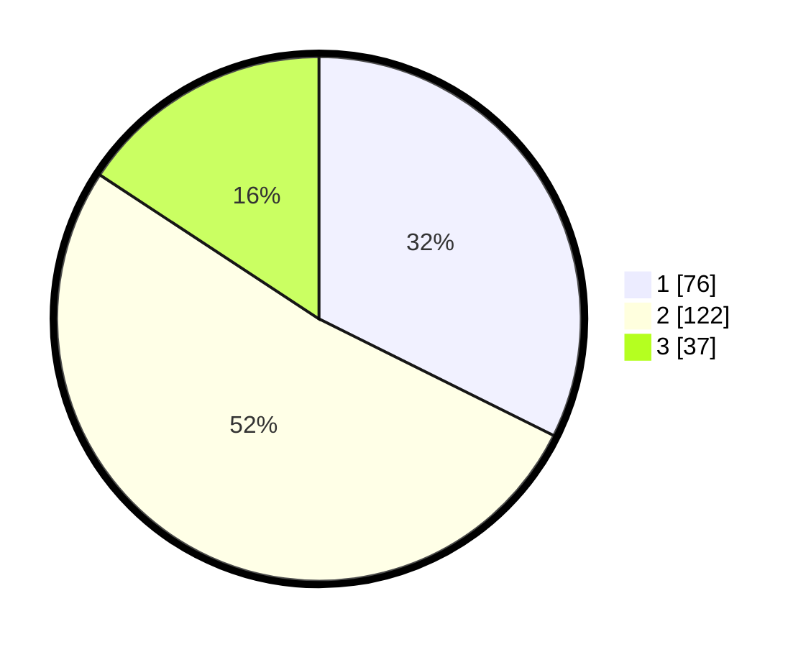

# Hasil

## Grafik

## Tabel

| No.    | Nama Paslon    | Suara | Suara (raw) | Persentase |
|:------ |:-------------- | -----:| -----------:| ----------:|
| 100025 | ANIES MUHAIMIN | 76    | [76][p-1]   | 32,34      |
| 100026 | PRABOWO GIBRAN | 122   | [122][p-2]  | 51,91      |
| 100027 | GANJAR MAHFUD  | 37    | [37][p-3]   | 15,74      |

[p-1]: https://github.com/gigit-pemilu/pemilu-2024/blob/main/pilpres/hitung-suara/sub/31-dki-jakarta/sub/72-jakarta-utara/sub/02-tanjung-priok/sub/1002-sunter-jaya/sub/134-tps/sub/paslon-1.txt
[p-2]: https://github.com/gigit-pemilu/pemilu-2024/blob/main/pilpres/hitung-suara/sub/31-dki-jakarta/sub/72-jakarta-utara/sub/02-tanjung-priok/sub/1002-sunter-jaya/sub/134-tps/sub/paslon-2.txt
[p-3]: https://github.com/gigit-pemilu/pemilu-2024/blob/main/pilpres/hitung-suara/sub/31-dki-jakarta/sub/72-jakarta-utara/sub/02-tanjung-priok/sub/1002-sunter-jaya/sub/134-tps/sub/paslon-3.txt

## Foto C Plano

https://sirekap-obj-formc.kpu.go.id/a30f/pemilu/ppwp/31/72/02/10/02/3172021002134-20240215-012532--36d5a367-4963-4705-a03f-ccefdb44fab5.jpg

https://sirekap-obj-formc.kpu.go.id/a30f/pemilu/ppwp/31/72/02/10/02/3172021002134-20240215-012619--ba55bfdb-84e7-4696-9a91-c729d8216b0e.jpg

https://sirekap-obj-formc.kpu.go.id/a30f/pemilu/ppwp/31/72/02/10/02/3172021002134-20240215-021311--f29044d9-30ce-4b4c-bc6d-536a14c98430.jpg

## Metadata

| Key        | Value               |
| ---------- | ------------------- |
| Time Stamp | 2024-02-22 10:00:00 |

