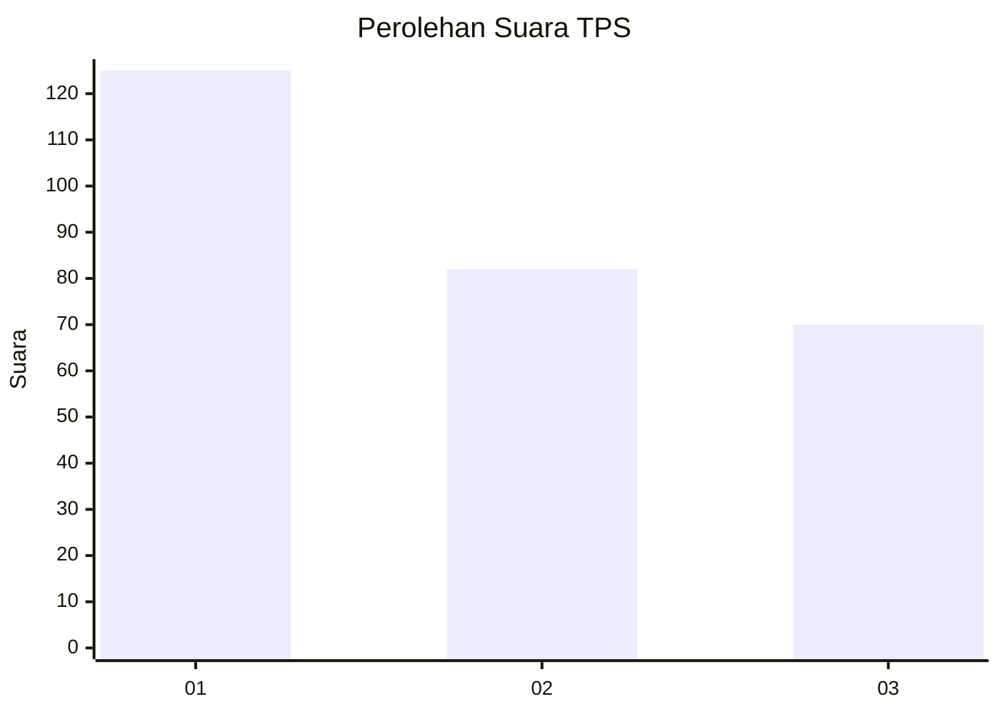
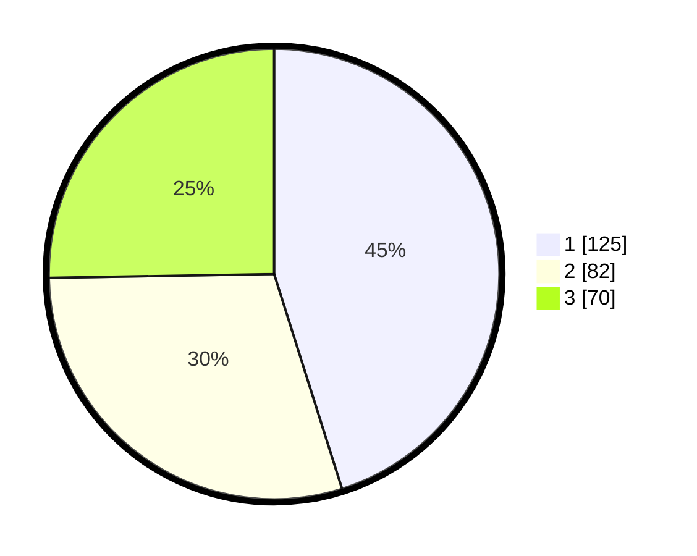

# Hasil

## Grafik

## Tabel

| No. | Nama Paslon    | Suara | Suara (raw) | Persentase |
|:--- |:-------------- | -----:| -----------:| ----------:|
| 1   | ANIES MUHAIMIN | 125   | [125][p-1]  | 45,13      |
| 2   | PRABOWO GIBRAN | 82    | [82][p-2]   | 29,60      |
| 3   | GANJAR MAHFUD  | 70    | [70][p-3]   | 25,27      |

[p-1]: https://github.com/gigit-pemilu/pemilu-2024-31-dki-jakarta/blob/main/pilpres/hitung-suara/sub/31-dki-jakarta/sub/72-jakarta-utara/sub/02-tanjung-priok/sub/1002-sunter-jaya/sub/162-tps/sub/paslon-1.txt
[p-2]: https://github.com/gigit-pemilu/pemilu-2024-31-dki-jakarta/blob/main/pilpres/hitung-suara/sub/31-dki-jakarta/sub/72-jakarta-utara/sub/02-tanjung-priok/sub/1002-sunter-jaya/sub/162-tps/sub/paslon-2.txt
[p-3]: https://github.com/gigit-pemilu/pemilu-2024-31-dki-jakarta/blob/main/pilpres/hitung-suara/sub/31-dki-jakarta/sub/72-jakarta-utara/sub/02-tanjung-priok/sub/1002-sunter-jaya/sub/162-tps/sub/paslon-3.txt

## Foto C Plano

https://sirekap-obj-formc.kpu.go.id/28d9/pemilu/ppwp/31/72/02/10/02/3172021002162-20240216-170232--ef51c352-fefc-4443-b6bc-22c268045962.jpg

https://sirekap-obj-formc.kpu.go.id/28d9/pemilu/ppwp/31/72/02/10/02/3172021002162-20240216-170425--d3086ed2-74dc-44a7-a1ad-bd466c195656.jpg

https://sirekap-obj-formc.kpu.go.id/28d9/pemilu/ppwp/31/72/02/10/02/3172021002162-20240216-170554--0adf535a-3050-4684-bf9d-8edbd5bc057f.jpg

## Metadata

| Key        | Value               |
| ---------- | ------------------- |
| Time Stamp | 2024-02-21 12:00:00 |

