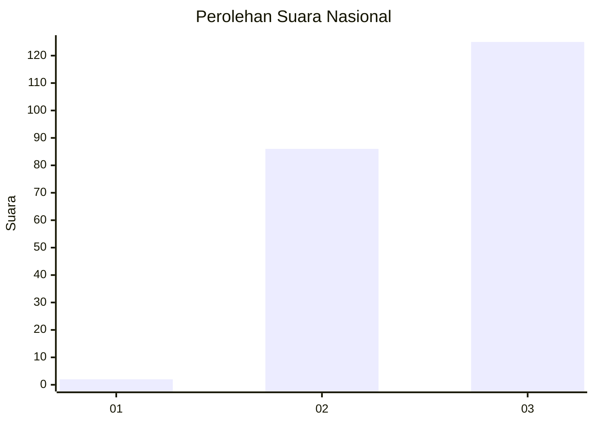
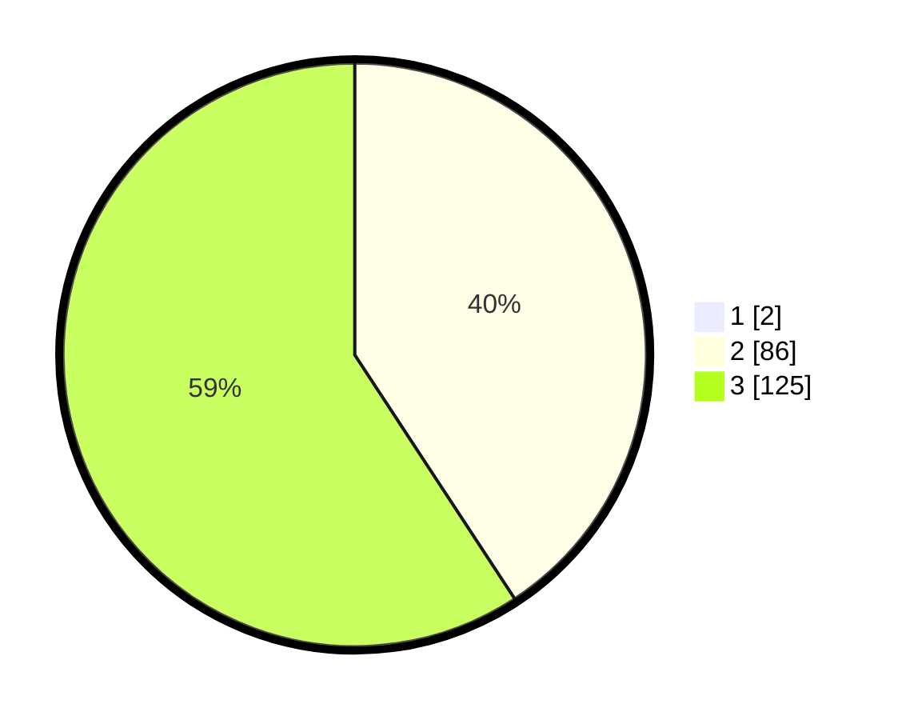

# Hasil

## Grafik

## Tabel

| No.    | Nama Paslon    | Suara | Suara (raw) | Persentase |
|:------ |:-------------- | -----:| -----------:| ----------:|
| 100025 | ANIES MUHAIMIN | 2     | [2][p-1]    | 0,94       |
| 100026 | PRABOWO GIBRAN | 86    | [86][p-2]   | 40,38      |
| 100027 | GANJAR MAHFUD  | 125   | [125][p-3]  | 58,69      |

[p-1]: https://github.com/gigit-pemilu/pemilu-2024/blob/main/pilpres/hitung-suara/sub/31-dki-jakarta/sub/72-jakarta-utara/sub/02-tanjung-priok/sub/1002-sunter-jaya/sub/176-tps/sub/paslon-1.txt
[p-2]: https://github.com/gigit-pemilu/pemilu-2024/blob/main/pilpres/hitung-suara/sub/31-dki-jakarta/sub/72-jakarta-utara/sub/02-tanjung-priok/sub/1002-sunter-jaya/sub/176-tps/sub/paslon-2.txt
[p-3]: https://github.com/gigit-pemilu/pemilu-2024/blob/main/pilpres/hitung-suara/sub/31-dki-jakarta/sub/72-jakarta-utara/sub/02-tanjung-priok/sub/1002-sunter-jaya/sub/176-tps/sub/paslon-3.txt

## Foto C Plano

https://sirekap-obj-formc.kpu.go.id/3cdd/pemilu/ppwp/31/72/02/10/02/3172021002176-20240215-114259--0302cd0a-6c9b-4d84-ac9f-7f7aac7c096e.jpg

https://sirekap-obj-formc.kpu.go.id/3cdd/pemilu/ppwp/31/72/02/10/02/3172021002176-20240215-114323--77059134-d442-4c6e-a8e7-e6fdb09c7578.jpg

https://sirekap-obj-formc.kpu.go.id/3cdd/pemilu/ppwp/31/72/02/10/02/3172021002176-20240215-114347--88ae7674-ab10-46b4-8019-0381689908c4.jpg

## Metadata

| Key        | Value               |
| ---------- | ------------------- |
| Time Stamp | 2024-02-21 12:00:00 |

