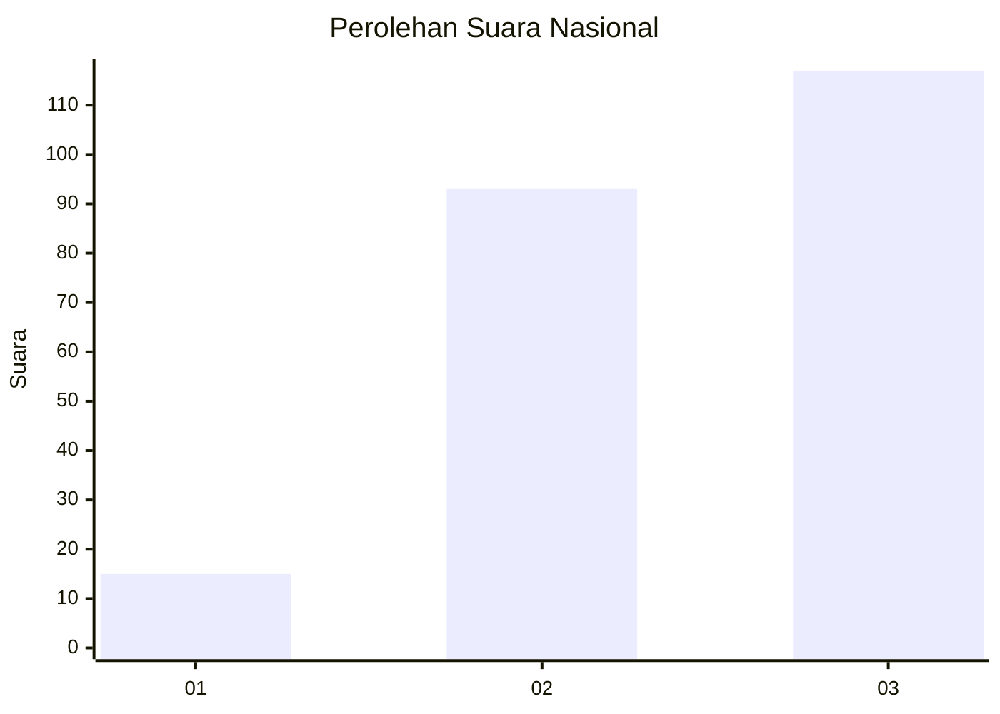
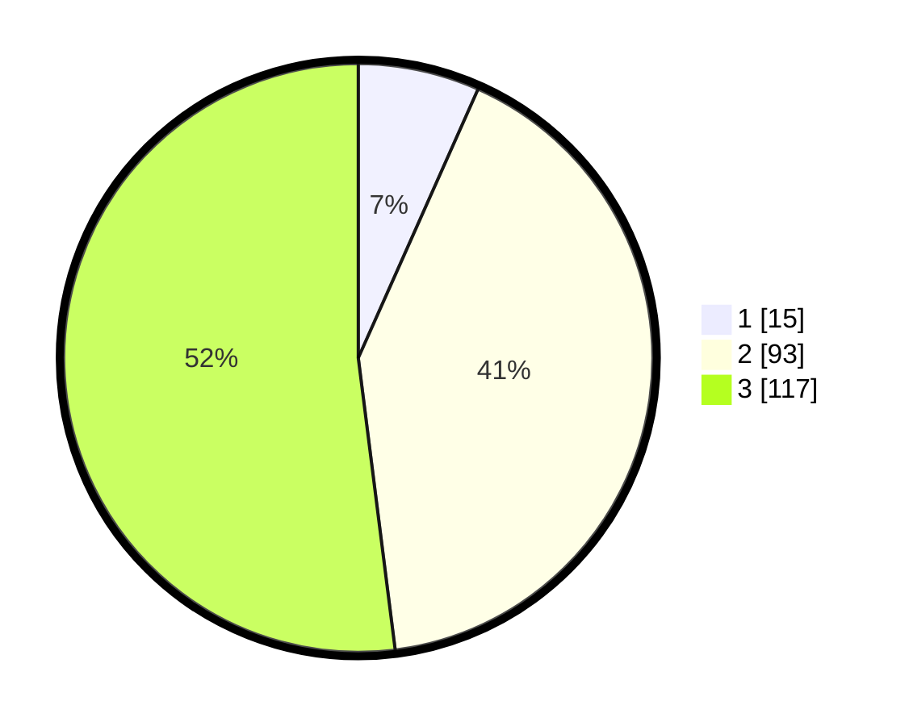

# Hasil

## Grafik

## Tabel

| No.    | Nama Paslon    | Suara | Suara (raw) | Persentase |
|:------ |:-------------- | -----:| -----------:| ----------:|
| 100025 | ANIES MUHAIMIN | 15    | [15][p-1]   | 6,67       |
| 100026 | PRABOWO GIBRAN | 93    | [93][p-2]   | 41,33      |
| 100027 | GANJAR MAHFUD  | 117   | [117][p-3]  | 52,00      |

[p-1]: https://github.com/gigit-pemilu/pemilu-2024/blob/main/pilpres/hitung-suara/sub/31-dki-jakarta/sub/72-jakarta-utara/sub/02-tanjung-priok/sub/1002-sunter-jaya/sub/193-tps/sub/paslon-1.txt
[p-2]: https://github.com/gigit-pemilu/pemilu-2024/blob/main/pilpres/hitung-suara/sub/31-dki-jakarta/sub/72-jakarta-utara/sub/02-tanjung-priok/sub/1002-sunter-jaya/sub/193-tps/sub/paslon-2.txt
[p-3]: https://github.com/gigit-pemilu/pemilu-2024/blob/main/pilpres/hitung-suara/sub/31-dki-jakarta/sub/72-jakarta-utara/sub/02-tanjung-priok/sub/1002-sunter-jaya/sub/193-tps/sub/paslon-3.txt

## Foto C Plano

https://sirekap-obj-formc.kpu.go.id/9a4c/pemilu/ppwp/31/72/02/10/02/3172021002193-20240214-195108--0b8f3449-de45-4b79-992c-65f0131907d0.jpg

https://sirekap-obj-formc.kpu.go.id/9a4c/pemilu/ppwp/31/72/02/10/02/3172021002193-20240214-195123--481242f0-ef9b-4de4-9fe4-a637a85eeacd.jpg

https://sirekap-obj-formc.kpu.go.id/9a4c/pemilu/ppwp/31/72/02/10/02/3172021002193-20240214-195137--56df83fd-6fcf-482d-a866-8d06f91cf29e.jpg

## Metadata

| Key        | Value               |
| ---------- | ------------------- |
| Time Stamp | 2024-02-21 17:00:00 |

