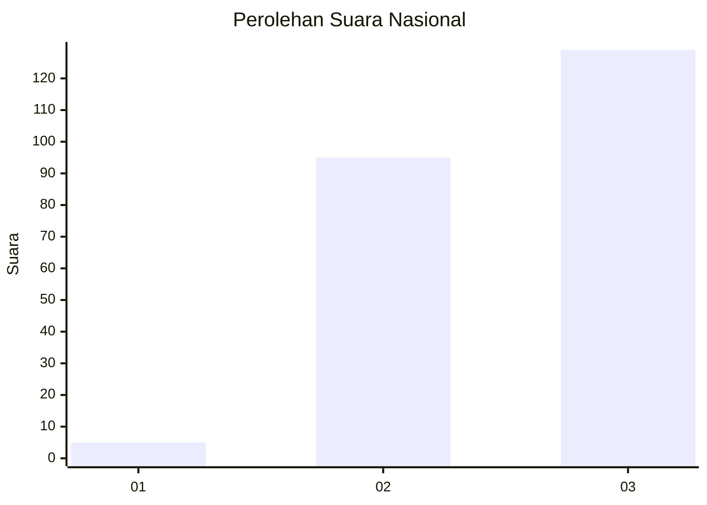
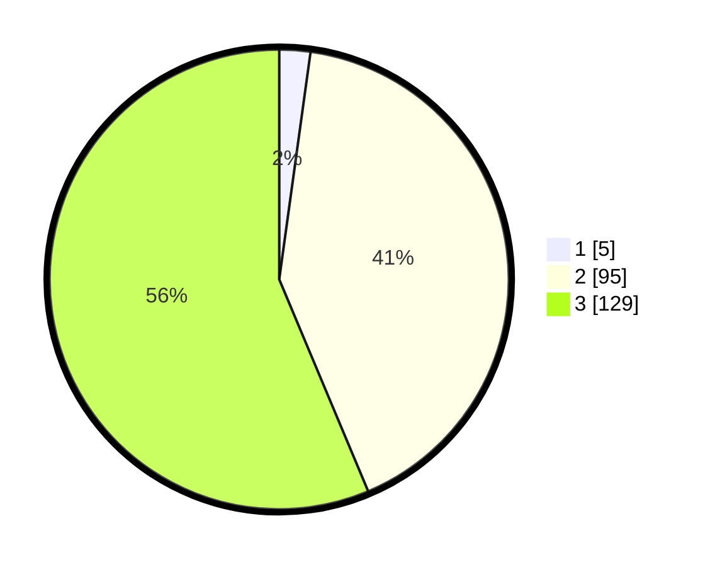

# Hasil

## Grafik

## Tabel

| No.    | Nama Paslon    | Suara | Suara (raw) | Persentase |
|:------ |:-------------- | -----:| -----------:| ----------:|
| 100025 | ANIES MUHAIMIN | 5     | [5][p-1]    | 2,18       |
| 100026 | PRABOWO GIBRAN | 95    | [95][p-2]   | 41,48      |
| 100027 | GANJAR MAHFUD  | 129   | [129][p-3]  | 56,33      |

[p-1]: https://github.com/gigit-pemilu/pemilu-2024/blob/main/pilpres/hitung-suara/sub/31-dki-jakarta/sub/72-jakarta-utara/sub/02-tanjung-priok/sub/1002-sunter-jaya/sub/197-tps/sub/paslon-1.txt
[p-2]: https://github.com/gigit-pemilu/pemilu-2024/blob/main/pilpres/hitung-suara/sub/31-dki-jakarta/sub/72-jakarta-utara/sub/02-tanjung-priok/sub/1002-sunter-jaya/sub/197-tps/sub/paslon-2.txt
[p-3]: https://github.com/gigit-pemilu/pemilu-2024/blob/main/pilpres/hitung-suara/sub/31-dki-jakarta/sub/72-jakarta-utara/sub/02-tanjung-priok/sub/1002-sunter-jaya/sub/197-tps/sub/paslon-3.txt

## Foto C Plano

https://sirekap-obj-formc.kpu.go.id/8f6d/pemilu/ppwp/31/72/02/10/02/3172021002197-20240214-231956--663159aa-b254-47e5-b757-ff663c726af5.jpg

https://sirekap-obj-formc.kpu.go.id/8f6d/pemilu/ppwp/31/72/02/10/02/3172021002197-20240214-232012--10c6e5bd-c3a9-429d-86ca-4b066caa48dc.jpg

https://sirekap-obj-formc.kpu.go.id/8f6d/pemilu/ppwp/31/72/02/10/02/3172021002197-20240214-232044--3efabc45-21c8-46fc-a534-85a9ff0f800a.jpg

## Metadata

| Key        | Value               |
| ---------- | ------------------- |
| Time Stamp | 2024-02-21 12:00:00 |

