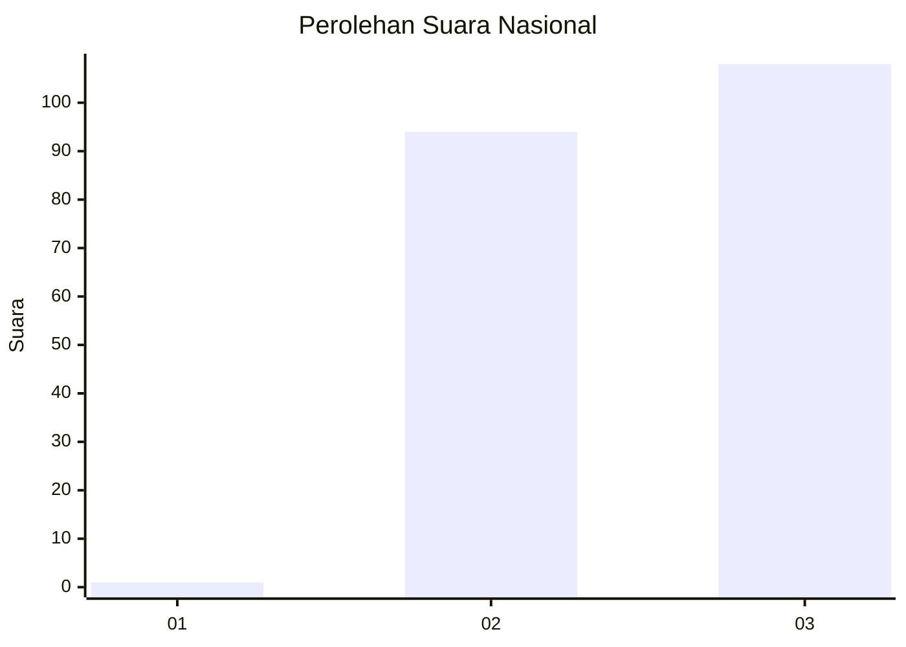
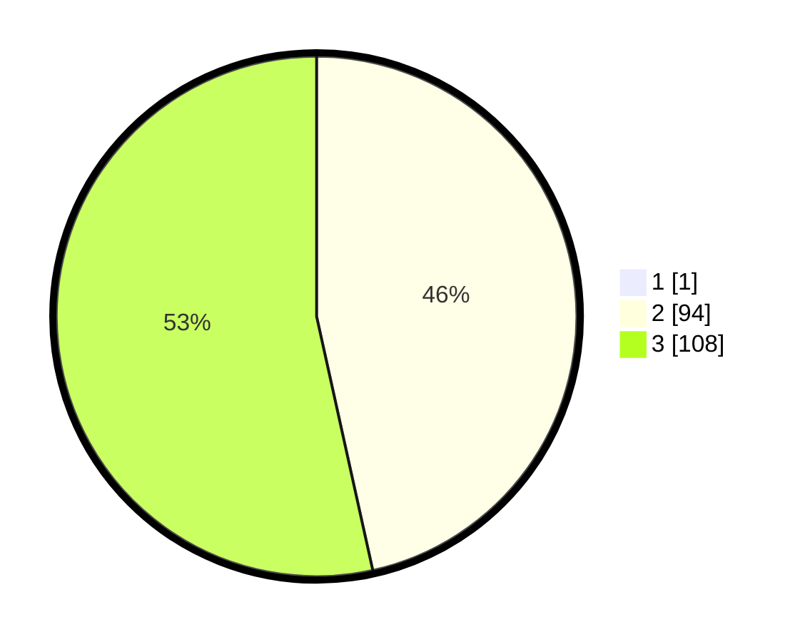

# Hasil

## Grafik

## Tabel

| No.    | Nama Paslon    | Suara | Suara (raw) | Persentase |
|:------ |:-------------- | -----:| -----------:| ----------:|
| 100025 | ANIES MUHAIMIN | 1     | [1][p-1]    | 0,49       |
| 100026 | PRABOWO GIBRAN | 94    | [94][p-2]   | 46,31      |
| 100027 | GANJAR MAHFUD  | 108   | [108][p-3]  | 53,20      |

[p-1]: https://github.com/gigit-pemilu/pemilu-2024/blob/main/pilpres/hitung-suara/sub/31-dki-jakarta/sub/72-jakarta-utara/sub/02-tanjung-priok/sub/1002-sunter-jaya/sub/203-tps/sub/paslon-1.txt
[p-2]: https://github.com/gigit-pemilu/pemilu-2024/blob/main/pilpres/hitung-suara/sub/31-dki-jakarta/sub/72-jakarta-utara/sub/02-tanjung-priok/sub/1002-sunter-jaya/sub/203-tps/sub/paslon-2.txt
[p-3]: https://github.com/gigit-pemilu/pemilu-2024/blob/main/pilpres/hitung-suara/sub/31-dki-jakarta/sub/72-jakarta-utara/sub/02-tanjung-priok/sub/1002-sunter-jaya/sub/203-tps/sub/paslon-3.txt

## Foto C Plano

https://sirekap-obj-formc.kpu.go.id/6f5f/pemilu/ppwp/31/72/02/10/02/3172021002203-20240214-212235--7646472d-dee7-4719-a9d5-264395e1f4b9.jpg

https://sirekap-obj-formc.kpu.go.id/6f5f/pemilu/ppwp/31/72/02/10/02/3172021002203-20240214-220609--04dfe704-a761-4630-b0ba-aa17fe0e0de8.jpg

https://sirekap-obj-formc.kpu.go.id/6f5f/pemilu/ppwp/31/72/02/10/02/3172021002203-20240214-202130--e809cb3f-8ea0-42ab-bddc-8f95eb03fbf3.jpg

## Metadata

| Key        | Value               |
| ---------- | ------------------- |
| Time Stamp | 2024-02-21 17:00:00 |

