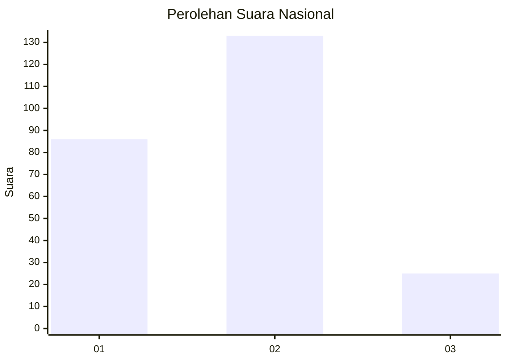
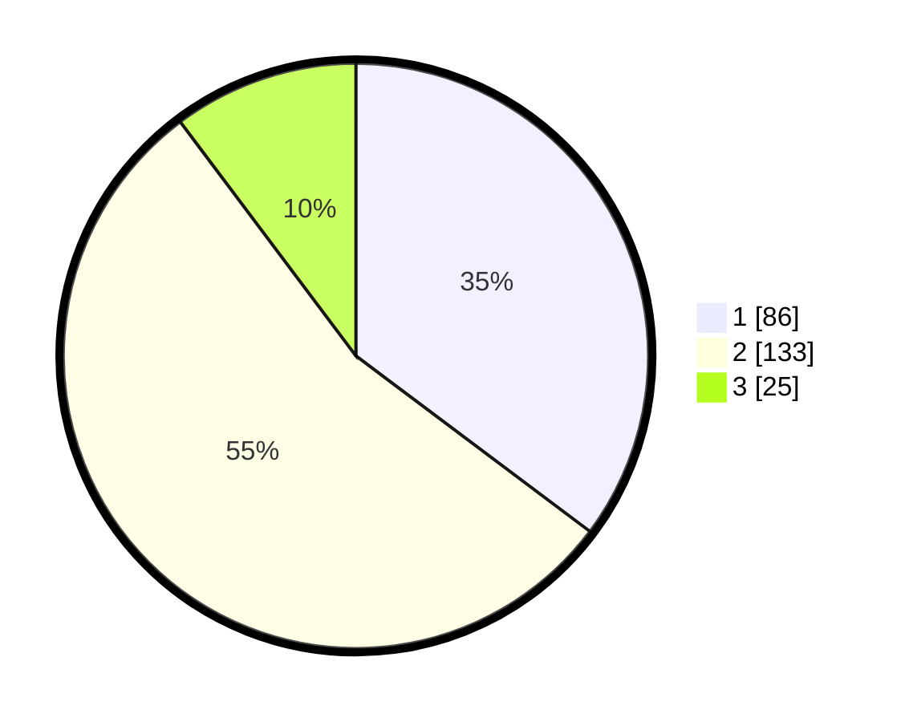

# Hasil

## Grafik

## Tabel

| No.    | Nama Paslon    | Suara | Suara (raw) | Persentase |
|:------ |:-------------- | -----:| -----------:| ----------:|
| 100025 | ANIES MUHAIMIN | 86    | [86][p-1]   | 35,25      |
| 100026 | PRABOWO GIBRAN | 133   | [133][p-2]  | 54,51      |
| 100027 | GANJAR MAHFUD  | 25    | [25][p-3]   | 10,25      |

[p-1]: https://github.com/gigit-pemilu/pemilu-2024/blob/main/pilpres/hitung-suara/sub/31-dki-jakarta/sub/72-jakarta-utara/sub/02-tanjung-priok/sub/1003-papanggo/sub/029-tps/sub/paslon-1.txt
[p-2]: https://github.com/gigit-pemilu/pemilu-2024/blob/main/pilpres/hitung-suara/sub/31-dki-jakarta/sub/72-jakarta-utara/sub/02-tanjung-priok/sub/1003-papanggo/sub/029-tps/sub/paslon-2.txt
[p-3]: https://github.com/gigit-pemilu/pemilu-2024/blob/main/pilpres/hitung-suara/sub/31-dki-jakarta/sub/72-jakarta-utara/sub/02-tanjung-priok/sub/1003-papanggo/sub/029-tps/sub/paslon-3.txt

## Foto C Plano

https://sirekap-obj-formc.kpu.go.id/980f/pemilu/ppwp/31/72/02/10/03/3172021003029-20240215-012952--2e8bd972-d3a7-49a7-b5eb-d504a6ba0b64.jpg

https://sirekap-obj-formc.kpu.go.id/980f/pemilu/ppwp/31/72/02/10/03/3172021003029-20240215-013100--cb0c7136-13cc-4ecd-abe3-c36573a8e068.jpg

https://sirekap-obj-formc.kpu.go.id/980f/pemilu/ppwp/31/72/02/10/03/3172021003029-20240215-013155--ef0619d8-166c-4004-9a67-a41485bc0922.jpg

## Metadata

| Key        | Value               |
| ---------- | ------------------- |
| Time Stamp | 2024-02-22 10:00:00 |

