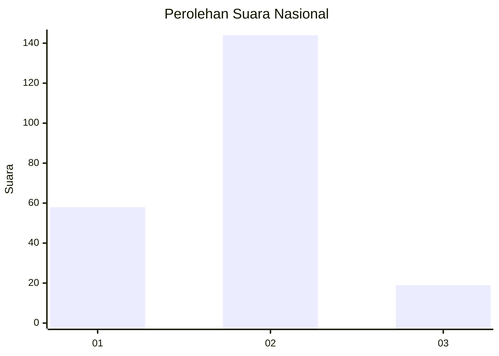
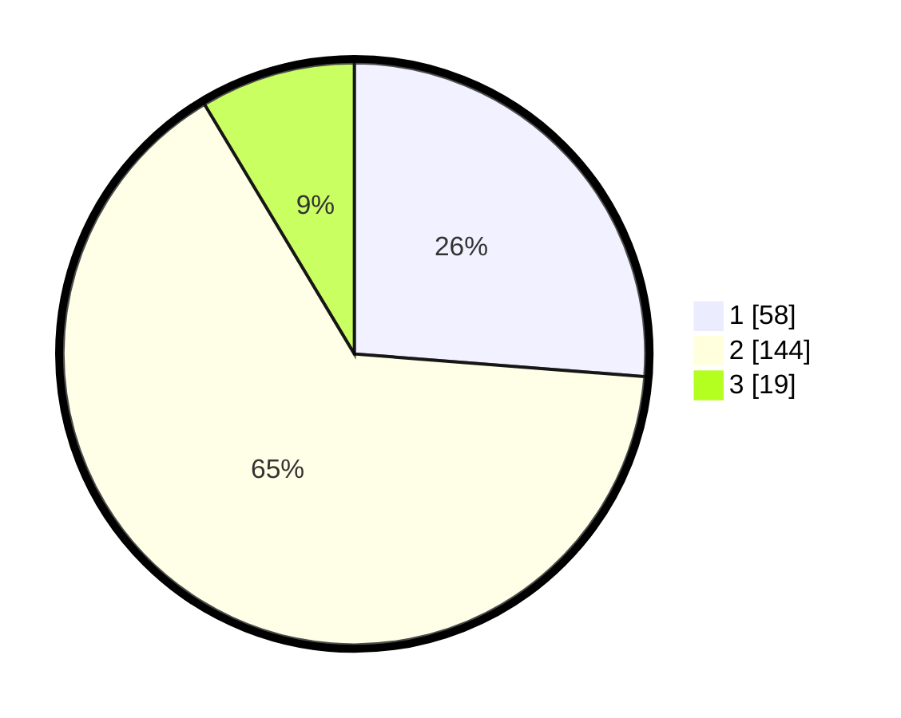

# Hasil

## Grafik

## Tabel

| No.    | Nama Paslon    | Suara | Suara (raw) | Persentase |
|:------ |:-------------- | -----:| -----------:| ----------:|
| 100025 | ANIES MUHAIMIN | 58    | [58][p-1]   | 26,24      |
| 100026 | PRABOWO GIBRAN | 144   | [144][p-2]  | 65,16      |
| 100027 | GANJAR MAHFUD  | 19    | [19][p-3]   | 8,60       |

[p-1]: https://github.com/gigit-pemilu/pemilu-2024/blob/main/pilpres/hitung-suara/sub/31-dki-jakarta/sub/72-jakarta-utara/sub/02-tanjung-priok/sub/1003-papanggo/sub/031-tps/sub/paslon-1.txt
[p-2]: https://github.com/gigit-pemilu/pemilu-2024/blob/main/pilpres/hitung-suara/sub/31-dki-jakarta/sub/72-jakarta-utara/sub/02-tanjung-priok/sub/1003-papanggo/sub/031-tps/sub/paslon-2.txt
[p-3]: https://github.com/gigit-pemilu/pemilu-2024/blob/main/pilpres/hitung-suara/sub/31-dki-jakarta/sub/72-jakarta-utara/sub/02-tanjung-priok/sub/1003-papanggo/sub/031-tps/sub/paslon-3.txt

## Foto C Plano

https://sirekap-obj-formc.kpu.go.id/96f8/pemilu/ppwp/31/72/02/10/03/3172021003031-20240214-225925--387aab3b-e8f1-45dd-a169-d804415d7ec9.jpg

https://sirekap-obj-formc.kpu.go.id/96f8/pemilu/ppwp/31/72/02/10/03/3172021003031-20240214-230045--df0f83cc-c1d3-41b1-afb5-578622d03d14.jpg

https://sirekap-obj-formc.kpu.go.id/96f8/pemilu/ppwp/31/72/02/10/03/3172021003031-20240214-230241--3203bd3d-84f9-4222-adab-1857e4950a7f.jpg

## Metadata

| Key        | Value               |
| ---------- | ------------------- |
| Time Stamp | 2024-02-21 17:00:00 |

