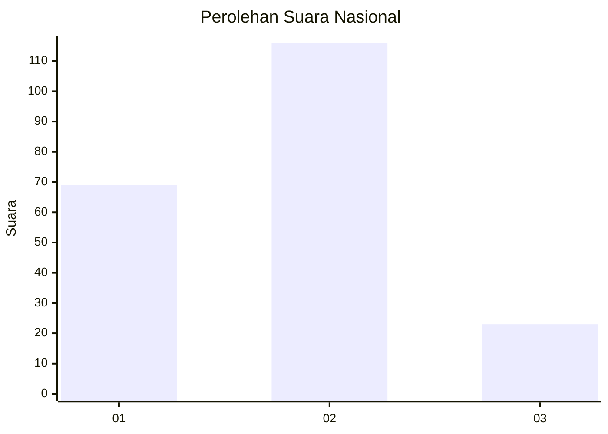
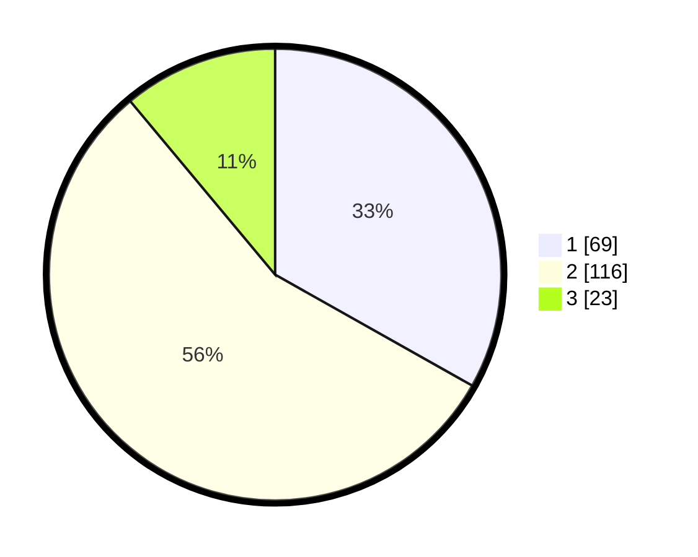

# Hasil

## Grafik

## Tabel

| No.    | Nama Paslon    | Suara | Suara (raw) | Persentase |
|:------ |:-------------- | -----:| -----------:| ----------:|
| 100025 | ANIES MUHAIMIN | 69    | [69][p-1]   | 33,17      |
| 100026 | PRABOWO GIBRAN | 116   | [116][p-2]  | 55,77      |
| 100027 | GANJAR MAHFUD  | 23    | [23][p-3]   | 11,06      |

[p-1]: https://github.com/gigit-pemilu/pemilu-2024/blob/main/pilpres/hitung-suara/sub/31-dki-jakarta/sub/72-jakarta-utara/sub/02-tanjung-priok/sub/1003-papanggo/sub/038-tps/sub/paslon-1.txt
[p-2]: https://github.com/gigit-pemilu/pemilu-2024/blob/main/pilpres/hitung-suara/sub/31-dki-jakarta/sub/72-jakarta-utara/sub/02-tanjung-priok/sub/1003-papanggo/sub/038-tps/sub/paslon-2.txt
[p-3]: https://github.com/gigit-pemilu/pemilu-2024/blob/main/pilpres/hitung-suara/sub/31-dki-jakarta/sub/72-jakarta-utara/sub/02-tanjung-priok/sub/1003-papanggo/sub/038-tps/sub/paslon-3.txt

## Foto C Plano

https://sirekap-obj-formc.kpu.go.id/f417/pemilu/ppwp/31/72/02/10/03/3172021003038-20240214-215841--9586489c-1ee9-4ee3-a7e0-3ced5871041c.jpg

https://sirekap-obj-formc.kpu.go.id/f417/pemilu/ppwp/31/72/02/10/03/3172021003038-20240214-220148--82f69c11-9c9e-4c7b-9fa0-fe9b82507fb9.jpg

https://sirekap-obj-formc.kpu.go.id/f417/pemilu/ppwp/31/72/02/10/03/3172021003038-20240214-220921--7e7a3386-374e-4ca9-9974-c5e34b495bdc.jpg

## Metadata

| Key        | Value               |
| ---------- | ------------------- |
| Time Stamp | 2024-02-21 16:00:00 |

