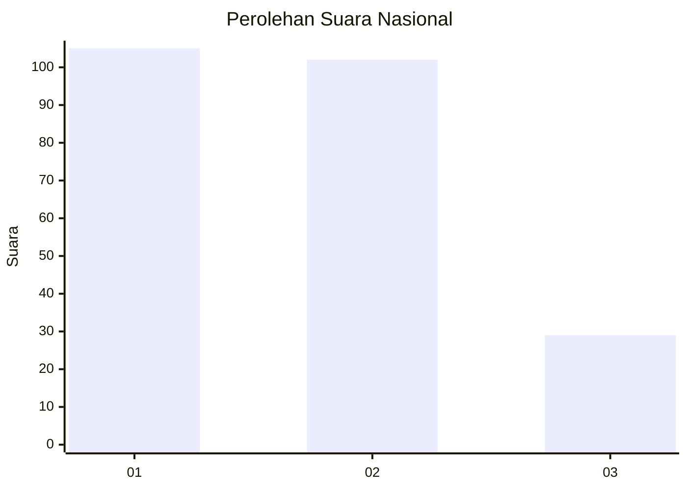
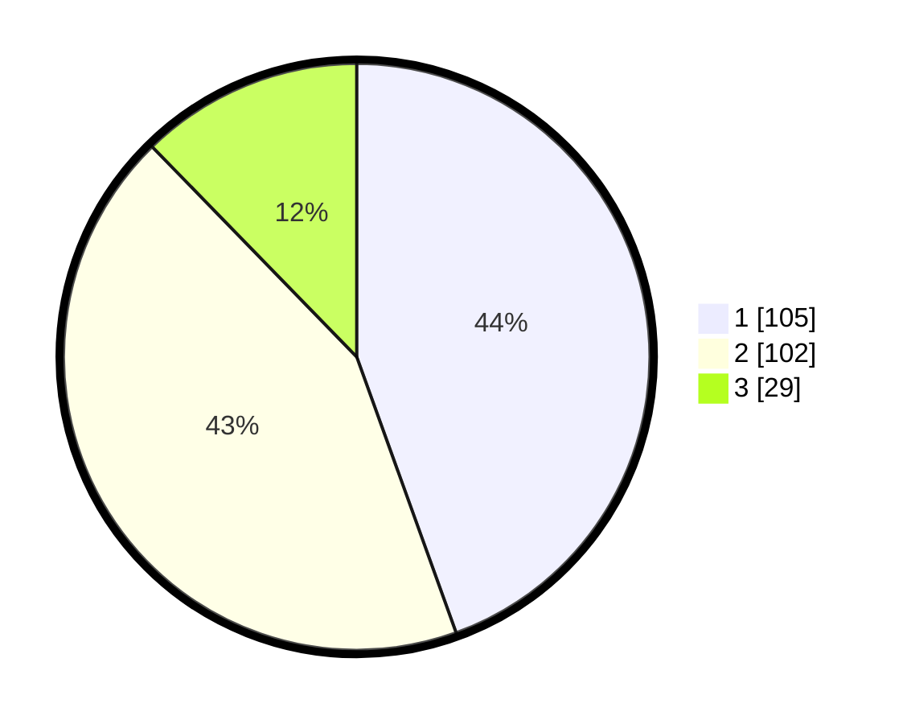

# Hasil

## Grafik

## Tabel

| No.    | Nama Paslon    | Suara | Suara (raw) | Persentase |
|:------ |:-------------- | -----:| -----------:| ----------:|
| 100025 | ANIES MUHAIMIN | 105   | [105][p-1]  | 44,49      |
| 100026 | PRABOWO GIBRAN | 102   | [102][p-2]  | 43,22      |
| 100027 | GANJAR MAHFUD  | 29    | [29][p-3]   | 12,29      |

[p-1]: https://github.com/gigit-pemilu/pemilu-2024/blob/main/pilpres/hitung-suara/sub/31-dki-jakarta/sub/72-jakarta-utara/sub/02-tanjung-priok/sub/1003-papanggo/sub/039-tps/sub/paslon-1.txt
[p-2]: https://github.com/gigit-pemilu/pemilu-2024/blob/main/pilpres/hitung-suara/sub/31-dki-jakarta/sub/72-jakarta-utara/sub/02-tanjung-priok/sub/1003-papanggo/sub/039-tps/sub/paslon-2.txt
[p-3]: https://github.com/gigit-pemilu/pemilu-2024/blob/main/pilpres/hitung-suara/sub/31-dki-jakarta/sub/72-jakarta-utara/sub/02-tanjung-priok/sub/1003-papanggo/sub/039-tps/sub/paslon-3.txt

## Foto C Plano

https://sirekap-obj-formc.kpu.go.id/37d3/pemilu/ppwp/31/72/02/10/03/3172021003039-20240214-223738--03801dc6-6eb1-48ac-b3dd-309e705da94f.jpg

https://sirekap-obj-formc.kpu.go.id/37d3/pemilu/ppwp/31/72/02/10/03/3172021003039-20240214-223409--8a49d6d2-3ab5-4430-ad55-b3e44f17632d.jpg

https://sirekap-obj-formc.kpu.go.id/37d3/pemilu/ppwp/31/72/02/10/03/3172021003039-20240214-223852--6119ca8b-0e8f-4079-b736-f4886cb1add2.jpg

## Metadata

| Key        | Value               |
| ---------- | ------------------- |
| Time Stamp | 2024-02-21 16:00:00 |

