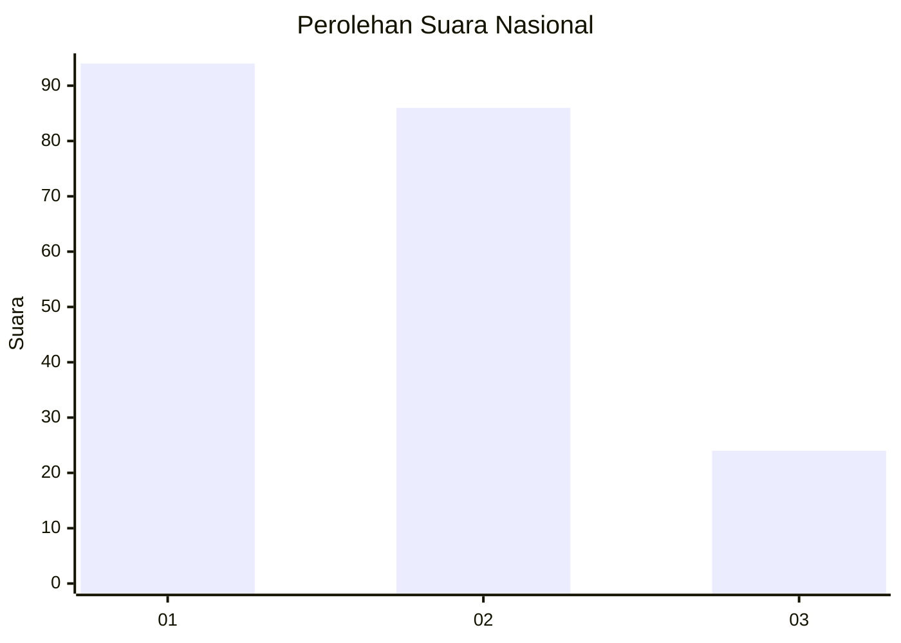
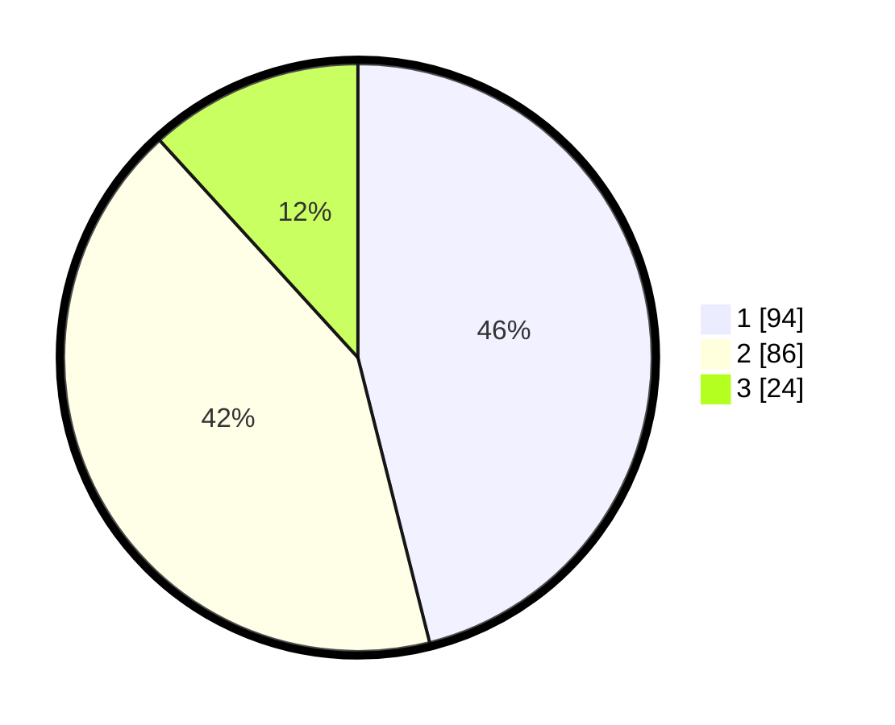

# Hasil

## Grafik

## Tabel

| No.    | Nama Paslon    | Suara | Suara (raw) | Persentase |
|:------ |:-------------- | -----:| -----------:| ----------:|
| 100025 | ANIES MUHAIMIN | 94    | [94][p-1]   | 46,08      |
| 100026 | PRABOWO GIBRAN | 86    | [86][p-2]   | 42,16      |
| 100027 | GANJAR MAHFUD  | 24    | [24][p-3]   | 11,76      |

[p-1]: https://github.com/gigit-pemilu/pemilu-2024/blob/main/pilpres/hitung-suara/sub/31-dki-jakarta/sub/72-jakarta-utara/sub/02-tanjung-priok/sub/1003-papanggo/sub/044-tps/sub/paslon-1.txt
[p-2]: https://github.com/gigit-pemilu/pemilu-2024/blob/main/pilpres/hitung-suara/sub/31-dki-jakarta/sub/72-jakarta-utara/sub/02-tanjung-priok/sub/1003-papanggo/sub/044-tps/sub/paslon-2.txt
[p-3]: https://github.com/gigit-pemilu/pemilu-2024/blob/main/pilpres/hitung-suara/sub/31-dki-jakarta/sub/72-jakarta-utara/sub/02-tanjung-priok/sub/1003-papanggo/sub/044-tps/sub/paslon-3.txt

## Foto C Plano

https://sirekap-obj-formc.kpu.go.id/7cbf/pemilu/ppwp/31/72/02/10/03/3172021003044-20240214-155901--4e9c6213-7cec-46a5-861b-36aa9cc95cc8.jpg

https://sirekap-obj-formc.kpu.go.id/7cbf/pemilu/ppwp/31/72/02/10/03/3172021003044-20240214-160100--cd2e08c3-4447-4e8c-9f2c-38450865185a.jpg

https://sirekap-obj-formc.kpu.go.id/7cbf/pemilu/ppwp/31/72/02/10/03/3172021003044-20240214-191853--b6202f62-8c5e-4943-8a1d-6de649d6a3e3.jpg

## Metadata

| Key        | Value               |
| ---------- | ------------------- |
| Time Stamp | 2024-02-21 17:00:00 |

