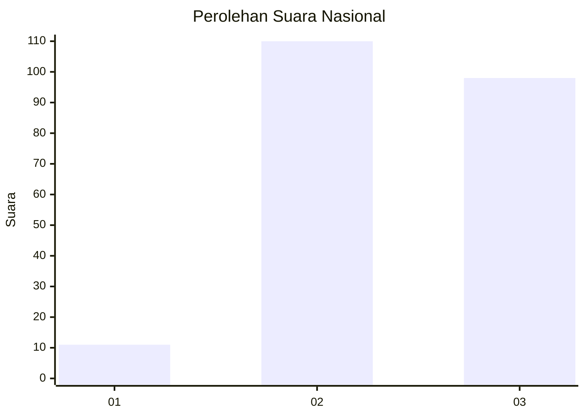
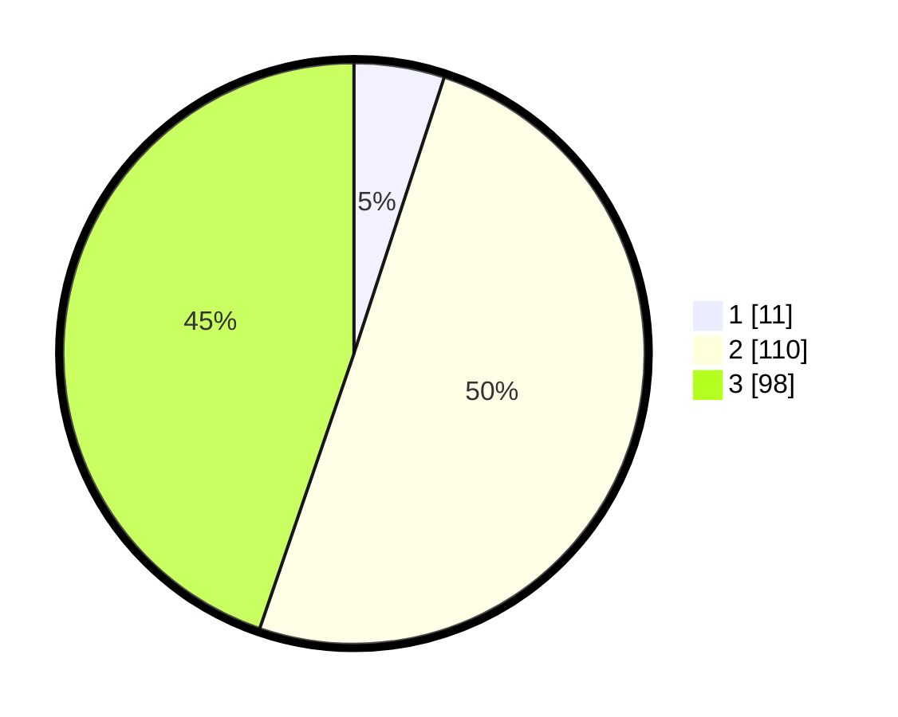

# Hasil

## Grafik

## Tabel

| No.    | Nama Paslon    | Suara | Suara (raw) | Persentase |
|:------ |:-------------- | -----:| -----------:| ----------:|
| 100025 | ANIES MUHAIMIN | 11    | [11][p-1]   | 5,02       |
| 100026 | PRABOWO GIBRAN | 110   | [110][p-2]  | 50,23      |
| 100027 | GANJAR MAHFUD  | 98    | [98][p-3]   | 44,75      |

[p-1]: https://github.com/gigit-pemilu/pemilu-2024/blob/main/pilpres/hitung-suara/sub/31-dki-jakarta/sub/72-jakarta-utara/sub/02-tanjung-priok/sub/1003-papanggo/sub/049-tps/sub/paslon-1.txt
[p-2]: https://github.com/gigit-pemilu/pemilu-2024/blob/main/pilpres/hitung-suara/sub/31-dki-jakarta/sub/72-jakarta-utara/sub/02-tanjung-priok/sub/1003-papanggo/sub/049-tps/sub/paslon-2.txt
[p-3]: https://github.com/gigit-pemilu/pemilu-2024/blob/main/pilpres/hitung-suara/sub/31-dki-jakarta/sub/72-jakarta-utara/sub/02-tanjung-priok/sub/1003-papanggo/sub/049-tps/sub/paslon-3.txt

## Foto C Plano

https://sirekap-obj-formc.kpu.go.id/2332/pemilu/ppwp/31/72/02/10/03/3172021003049-20240215-002555--8e4746ad-d891-4f72-bb58-612289966740.jpg

https://sirekap-obj-formc.kpu.go.id/2332/pemilu/ppwp/31/72/02/10/03/3172021003049-20240215-002634--0f7e1f7f-c7d6-4e29-bfa9-4ef004c99123.jpg

https://sirekap-obj-formc.kpu.go.id/2332/pemilu/ppwp/31/72/02/10/03/3172021003049-20240215-002822--ea704dd4-b45f-4035-a932-593ac20967cb.jpg

## Metadata

| Key        | Value               |
| ---------- | ------------------- |
| Time Stamp | 2024-02-21 12:00:00 |

