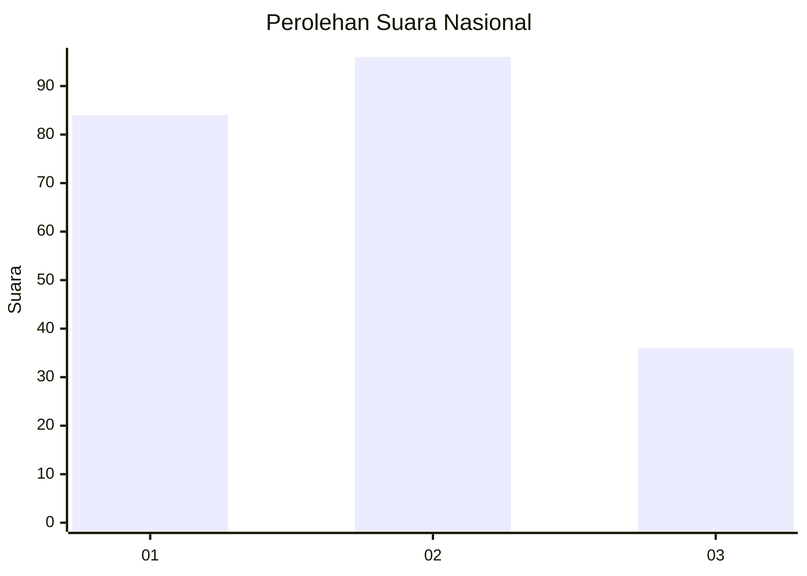
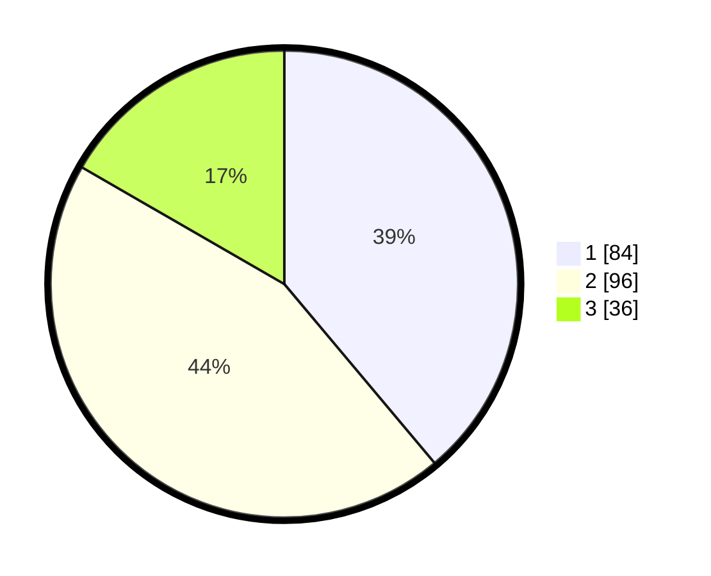

# Hasil

## Grafik

## Tabel

| No.    | Nama Paslon    | Suara | Suara (raw) | Persentase |
|:------ |:-------------- | -----:| -----------:| ----------:|
| 100025 | ANIES MUHAIMIN | 84    | [84][p-1]   | 38,89      |
| 100026 | PRABOWO GIBRAN | 96    | [96][p-2]   | 44,44      |
| 100027 | GANJAR MAHFUD  | 36    | [36][p-3]   | 16,67      |

[p-1]: https://github.com/gigit-pemilu/pemilu-2024/blob/main/pilpres/hitung-suara/sub/31-dki-jakarta/sub/72-jakarta-utara/sub/02-tanjung-priok/sub/1003-papanggo/sub/058-tps/sub/paslon-1.txt
[p-2]: https://github.com/gigit-pemilu/pemilu-2024/blob/main/pilpres/hitung-suara/sub/31-dki-jakarta/sub/72-jakarta-utara/sub/02-tanjung-priok/sub/1003-papanggo/sub/058-tps/sub/paslon-2.txt
[p-3]: https://github.com/gigit-pemilu/pemilu-2024/blob/main/pilpres/hitung-suara/sub/31-dki-jakarta/sub/72-jakarta-utara/sub/02-tanjung-priok/sub/1003-papanggo/sub/058-tps/sub/paslon-3.txt

## Foto C Plano

https://sirekap-obj-formc.kpu.go.id/657c/pemilu/ppwp/31/72/02/10/03/3172021003058-20240215-000138--c4275c53-2b46-44a8-9843-9c3fcdbd86ea.jpg

https://sirekap-obj-formc.kpu.go.id/657c/pemilu/ppwp/31/72/02/10/03/3172021003058-20240215-000241--3dba9d99-a5bd-4ed4-b9b0-353e42e3d23b.jpg

https://sirekap-obj-formc.kpu.go.id/657c/pemilu/ppwp/31/72/02/10/03/3172021003058-20240215-000446--c5212d82-5f1d-4510-8894-51f5b1fbba60.jpg

## Metadata

| Key        | Value               |
| ---------- | ------------------- |
| Time Stamp | 2024-02-21 17:00:00 |

