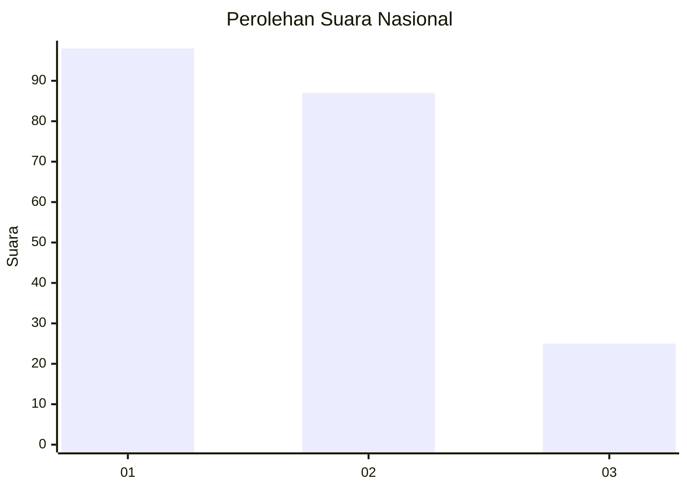
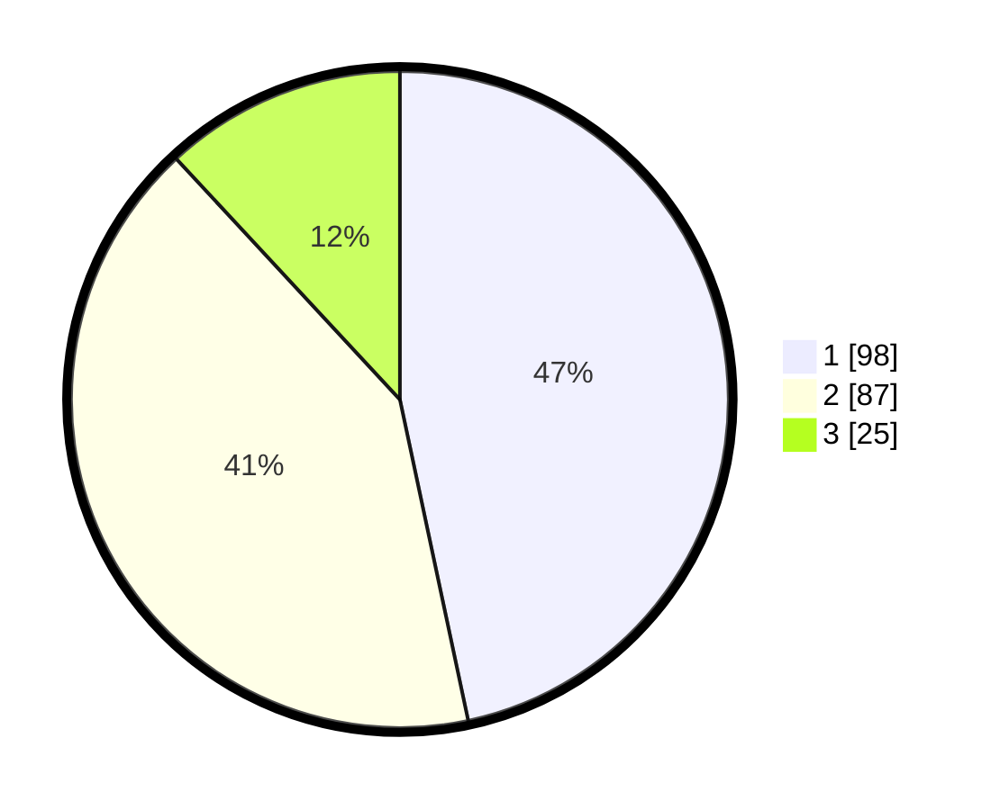

# Hasil

## Grafik

## Tabel

| No.    | Nama Paslon    | Suara | Suara (raw) | Persentase |
|:------ |:-------------- | -----:| -----------:| ----------:|
| 100025 | ANIES MUHAIMIN | 98    | [98][p-1]   | 46,67      |
| 100026 | PRABOWO GIBRAN | 87    | [87][p-2]   | 41,43      |
| 100027 | GANJAR MAHFUD  | 25    | [25][p-3]   | 11,90      |

[p-1]: https://github.com/gigit-pemilu/pemilu-2024/blob/main/pilpres/hitung-suara/sub/31-dki-jakarta/sub/72-jakarta-utara/sub/02-tanjung-priok/sub/1003-papanggo/sub/063-tps/sub/paslon-1.txt
[p-2]: https://github.com/gigit-pemilu/pemilu-2024/blob/main/pilpres/hitung-suara/sub/31-dki-jakarta/sub/72-jakarta-utara/sub/02-tanjung-priok/sub/1003-papanggo/sub/063-tps/sub/paslon-2.txt
[p-3]: https://github.com/gigit-pemilu/pemilu-2024/blob/main/pilpres/hitung-suara/sub/31-dki-jakarta/sub/72-jakarta-utara/sub/02-tanjung-priok/sub/1003-papanggo/sub/063-tps/sub/paslon-3.txt

## Foto C Plano

https://sirekap-obj-formc.kpu.go.id/5815/pemilu/ppwp/31/72/02/10/03/3172021003063-20240214-214140--6b460af0-b652-4a9a-a4c9-8ba19d121457.jpg

https://sirekap-obj-formc.kpu.go.id/5815/pemilu/ppwp/31/72/02/10/03/3172021003063-20240214-214227--9e8ffa30-e99d-414f-976c-55832946025d.jpg

https://sirekap-obj-formc.kpu.go.id/5815/pemilu/ppwp/31/72/02/10/03/3172021003063-20240214-214307--2fa80e64-97ff-4d05-a2a7-3c322f87a369.jpg

## Metadata

| Key        | Value               |
| ---------- | ------------------- |
| Time Stamp | 2024-02-21 17:00:00 |

