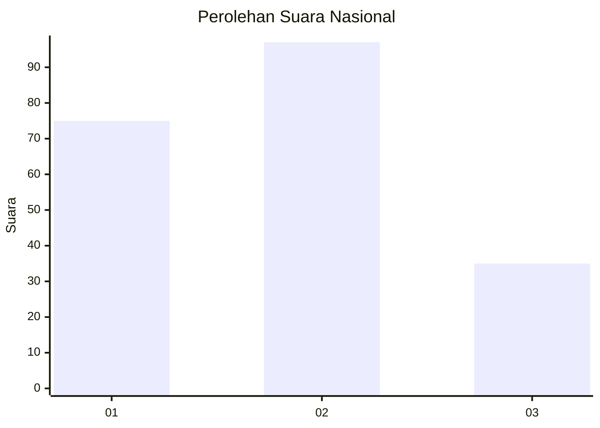
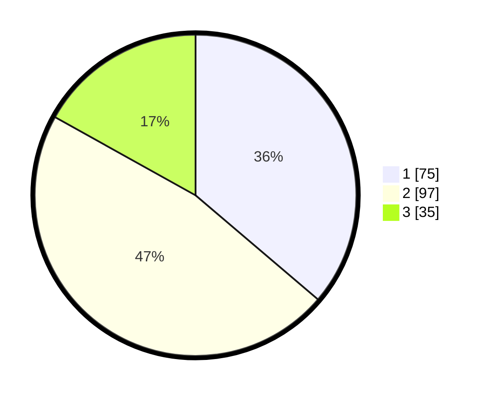

# Hasil

## Grafik

## Tabel

| No.    | Nama Paslon    | Suara | Suara (raw) | Persentase |
|:------ |:-------------- | -----:| -----------:| ----------:|
| 100025 | ANIES MUHAIMIN | 75    | [75][p-1]   | 36,23      |
| 100026 | PRABOWO GIBRAN | 97    | [97][p-2]   | 46,86      |
| 100027 | GANJAR MAHFUD  | 35    | [35][p-3]   | 16,91      |

[p-1]: https://github.com/gigit-pemilu/pemilu-2024/blob/main/pilpres/hitung-suara/sub/31-dki-jakarta/sub/72-jakarta-utara/sub/02-tanjung-priok/sub/1003-papanggo/sub/065-tps/sub/paslon-1.txt
[p-2]: https://github.com/gigit-pemilu/pemilu-2024/blob/main/pilpres/hitung-suara/sub/31-dki-jakarta/sub/72-jakarta-utara/sub/02-tanjung-priok/sub/1003-papanggo/sub/065-tps/sub/paslon-2.txt
[p-3]: https://github.com/gigit-pemilu/pemilu-2024/blob/main/pilpres/hitung-suara/sub/31-dki-jakarta/sub/72-jakarta-utara/sub/02-tanjung-priok/sub/1003-papanggo/sub/065-tps/sub/paslon-3.txt

## Foto C Plano

https://sirekap-obj-formc.kpu.go.id/54aa/pemilu/ppwp/31/72/02/10/03/3172021003065-20240214-225229--9daee1cd-0d23-4a54-8f9f-ab3b843c9378.jpg

https://sirekap-obj-formc.kpu.go.id/54aa/pemilu/ppwp/31/72/02/10/03/3172021003065-20240214-225429--9ba6b877-a656-47e7-9219-2bf598061176.jpg

https://sirekap-obj-formc.kpu.go.id/54aa/pemilu/ppwp/31/72/02/10/03/3172021003065-20240214-225607--7dc00c17-567b-4fb7-9b5a-ff5a181278d9.jpg

## Metadata

| Key        | Value               |
| ---------- | ------------------- |
| Time Stamp | 2024-02-21 12:00:00 |

