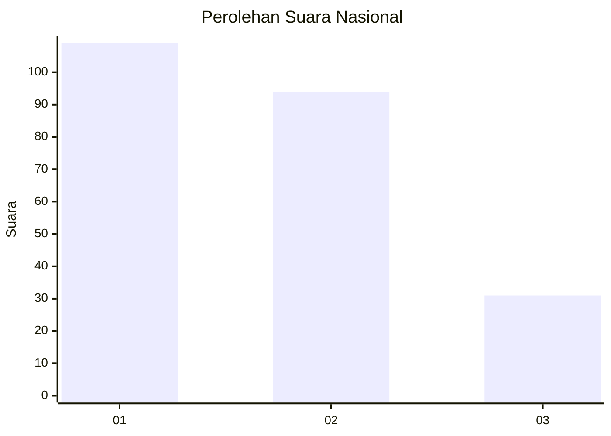
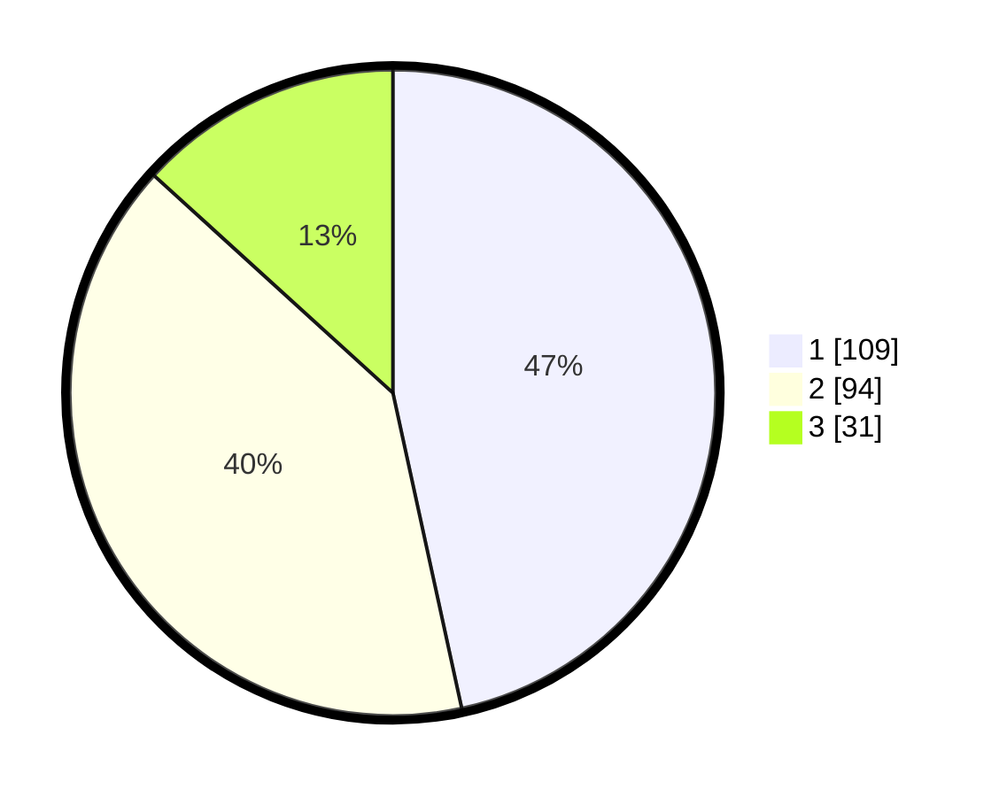

# Hasil

## Grafik

## Tabel

| No.    | Nama Paslon    | Suara | Suara (raw) | Persentase |
|:------ |:-------------- | -----:| -----------:| ----------:|
| 100025 | ANIES MUHAIMIN | 109   | [109][p-1]  | 46,58      |
| 100026 | PRABOWO GIBRAN | 94    | [94][p-2]   | 40,17      |
| 100027 | GANJAR MAHFUD  | 31    | [31][p-3]   | 13,25      |

[p-1]: https://github.com/gigit-pemilu/pemilu-2024/blob/main/pilpres/hitung-suara/sub/31-dki-jakarta/sub/72-jakarta-utara/sub/02-tanjung-priok/sub/1003-papanggo/sub/068-tps/sub/paslon-1.txt
[p-2]: https://github.com/gigit-pemilu/pemilu-2024/blob/main/pilpres/hitung-suara/sub/31-dki-jakarta/sub/72-jakarta-utara/sub/02-tanjung-priok/sub/1003-papanggo/sub/068-tps/sub/paslon-2.txt
[p-3]: https://github.com/gigit-pemilu/pemilu-2024/blob/main/pilpres/hitung-suara/sub/31-dki-jakarta/sub/72-jakarta-utara/sub/02-tanjung-priok/sub/1003-papanggo/sub/068-tps/sub/paslon-3.txt

## Foto C Plano

https://sirekap-obj-formc.kpu.go.id/76e2/pemilu/ppwp/31/72/02/10/03/3172021003068-20240214-162223--b2507603-1534-4b83-9b34-245ce5d0967e.jpg

https://sirekap-obj-formc.kpu.go.id/76e2/pemilu/ppwp/31/72/02/10/03/3172021003068-20240214-155727--f06a6593-64ab-4fec-b0e8-27e401620e2b.jpg

https://sirekap-obj-formc.kpu.go.id/76e2/pemilu/ppwp/31/72/02/10/03/3172021003068-20240214-155606--5b016dd3-1cb0-4a87-b338-f9e5612f90b1.jpg

## Metadata

| Key        | Value               |
| ---------- | ------------------- |
| Time Stamp | 2024-02-14 21:46:01 |

