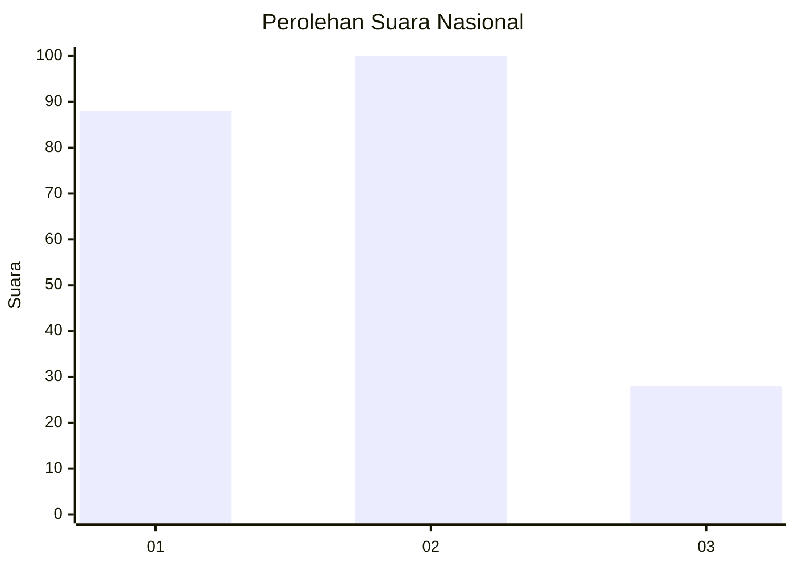
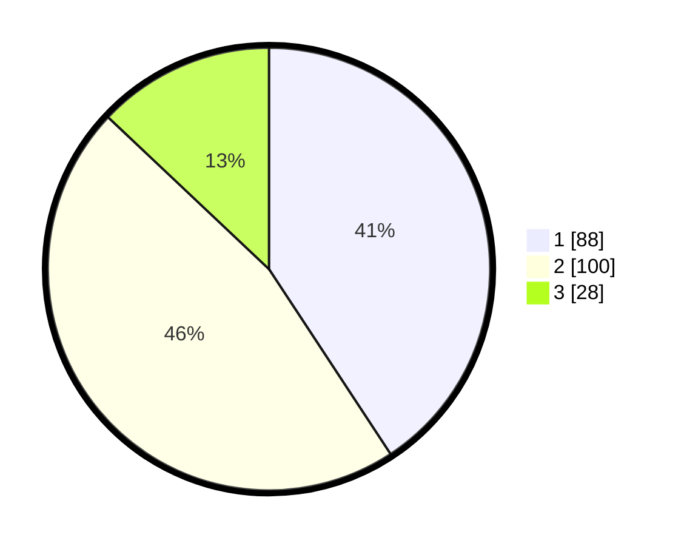

# Hasil

## Grafik

## Tabel

| No.    | Nama Paslon    | Suara | Suara (raw) | Persentase |
|:------ |:-------------- | -----:| -----------:| ----------:|
| 100025 | ANIES MUHAIMIN | 88    | [88][p-1]   | 40,74      |
| 100026 | PRABOWO GIBRAN | 100   | [100][p-2]  | 46,30      |
| 100027 | GANJAR MAHFUD  | 28    | [28][p-3]   | 12,96      |

[p-1]: https://github.com/gigit-pemilu/pemilu-2024/blob/main/pilpres/hitung-suara/sub/31-dki-jakarta/sub/72-jakarta-utara/sub/02-tanjung-priok/sub/1003-papanggo/sub/069-tps/sub/paslon-1.txt
[p-2]: https://github.com/gigit-pemilu/pemilu-2024/blob/main/pilpres/hitung-suara/sub/31-dki-jakarta/sub/72-jakarta-utara/sub/02-tanjung-priok/sub/1003-papanggo/sub/069-tps/sub/paslon-2.txt
[p-3]: https://github.com/gigit-pemilu/pemilu-2024/blob/main/pilpres/hitung-suara/sub/31-dki-jakarta/sub/72-jakarta-utara/sub/02-tanjung-priok/sub/1003-papanggo/sub/069-tps/sub/paslon-3.txt

## Foto C Plano

https://sirekap-obj-formc.kpu.go.id/1244/pemilu/ppwp/31/72/02/10/03/3172021003069-20240214-214803--3a8f71df-d058-4ebc-bbec-4250d7987ec3.jpg

https://sirekap-obj-formc.kpu.go.id/1244/pemilu/ppwp/31/72/02/10/03/3172021003069-20240214-215949--8d815072-e38c-47c6-8ef2-d2543f09814e.jpg

https://sirekap-obj-formc.kpu.go.id/1244/pemilu/ppwp/31/72/02/10/03/3172021003069-20240214-220130--b76ace75-8f98-4252-92df-6b43100c5825.jpg

## Metadata

| Key        | Value               |
| ---------- | ------------------- |
| Time Stamp | 2024-02-21 17:00:00 |

