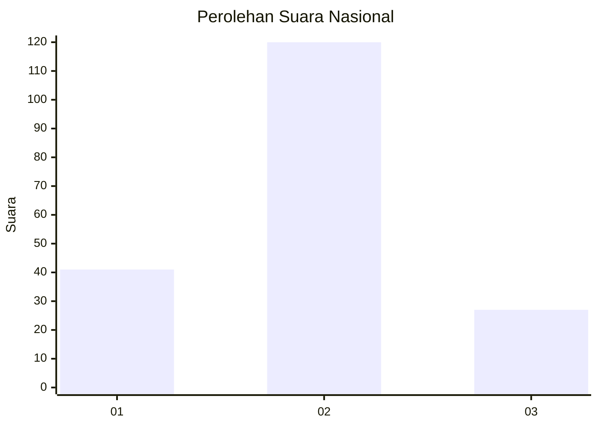
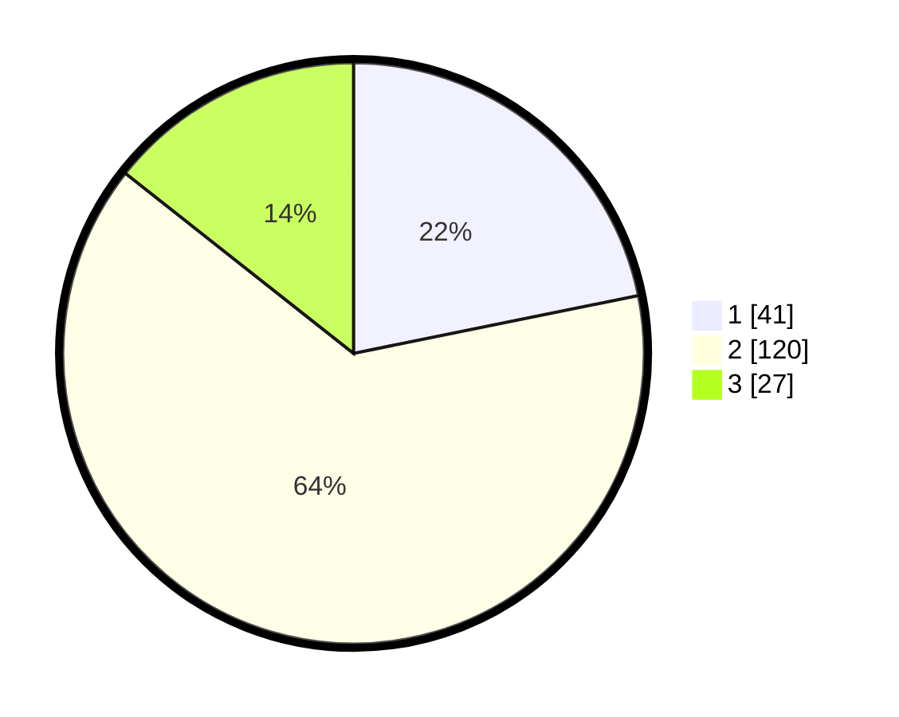

# Hasil

## Grafik

## Tabel

| No.    | Nama Paslon    | Suara | Suara (raw) | Persentase |
|:------ |:-------------- | -----:| -----------:| ----------:|
| 100025 | ANIES MUHAIMIN | 41    | [41][p-1]   | 21,81      |
| 100026 | PRABOWO GIBRAN | 120   | [120][p-2]  | 63,83      |
| 100027 | GANJAR MAHFUD  | 27    | [27][p-3]   | 14,36      |

[p-1]: https://github.com/gigit-pemilu/pemilu-2024/blob/main/pilpres/hitung-suara/sub/31-dki-jakarta/sub/72-jakarta-utara/sub/02-tanjung-priok/sub/1003-papanggo/sub/101-tps/sub/paslon-1.txt
[p-2]: https://github.com/gigit-pemilu/pemilu-2024/blob/main/pilpres/hitung-suara/sub/31-dki-jakarta/sub/72-jakarta-utara/sub/02-tanjung-priok/sub/1003-papanggo/sub/101-tps/sub/paslon-2.txt
[p-3]: https://github.com/gigit-pemilu/pemilu-2024/blob/main/pilpres/hitung-suara/sub/31-dki-jakarta/sub/72-jakarta-utara/sub/02-tanjung-priok/sub/1003-papanggo/sub/101-tps/sub/paslon-3.txt

## Foto C Plano

https://sirekap-obj-formc.kpu.go.id/a9b2/pemilu/ppwp/31/72/02/10/03/3172021003101-20240214-220822--d27d9506-1159-496f-b15b-eb7225a19476.jpg

https://sirekap-obj-formc.kpu.go.id/a9b2/pemilu/ppwp/31/72/02/10/03/3172021003101-20240214-220913--905eeac4-521f-4061-83ab-912826e88a02.jpg

https://sirekap-obj-formc.kpu.go.id/a9b2/pemilu/ppwp/31/72/02/10/03/3172021003101-20240214-220953--3cd3e92d-477a-46b1-989a-aa642327ad49.jpg

## Metadata

| Key        | Value               |
| ---------- | ------------------- |
| Time Stamp | 2024-02-21 12:00:00 |

