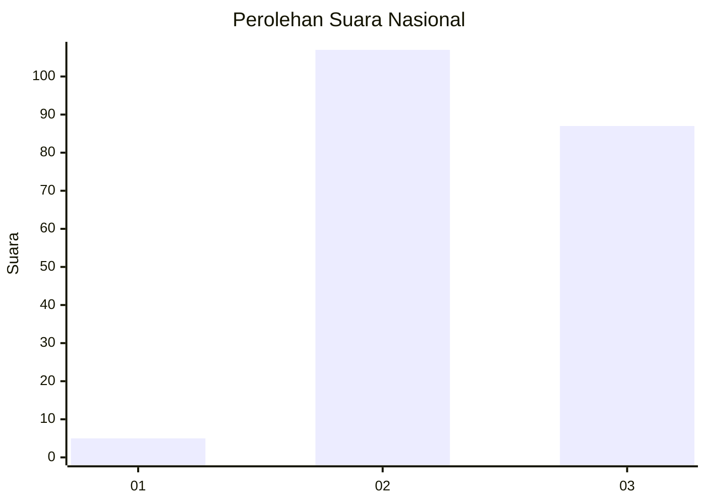
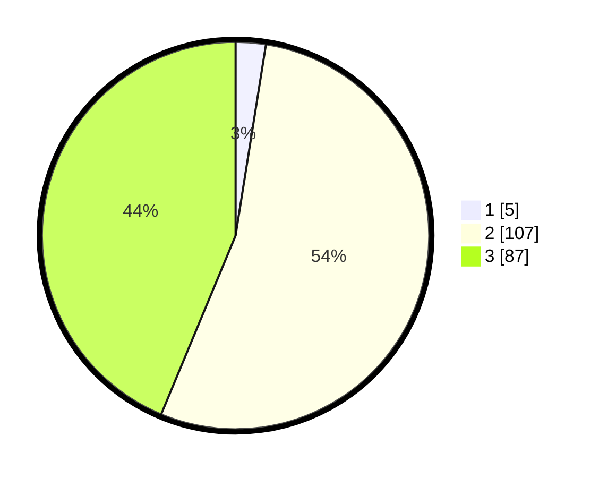

# Hasil

## Grafik

## Tabel

| No.    | Nama Paslon    | Suara | Suara (raw) | Persentase |
|:------ |:-------------- | -----:| -----------:| ----------:|
| 100025 | ANIES MUHAIMIN | 5     | [5][p-1]    | 2,51       |
| 100026 | PRABOWO GIBRAN | 107   | [107][p-2]  | 53,77      |
| 100027 | GANJAR MAHFUD  | 87    | [87][p-3]   | 43,72      |

[p-1]: https://github.com/gigit-pemilu/pemilu-2024/blob/main/pilpres/hitung-suara/sub/31-dki-jakarta/sub/72-jakarta-utara/sub/02-tanjung-priok/sub/1003-papanggo/sub/129-tps/sub/paslon-1.txt
[p-2]: https://github.com/gigit-pemilu/pemilu-2024/blob/main/pilpres/hitung-suara/sub/31-dki-jakarta/sub/72-jakarta-utara/sub/02-tanjung-priok/sub/1003-papanggo/sub/129-tps/sub/paslon-2.txt
[p-3]: https://github.com/gigit-pemilu/pemilu-2024/blob/main/pilpres/hitung-suara/sub/31-dki-jakarta/sub/72-jakarta-utara/sub/02-tanjung-priok/sub/1003-papanggo/sub/129-tps/sub/paslon-3.txt

## Foto C Plano

https://sirekap-obj-formc.kpu.go.id/514f/pemilu/ppwp/31/72/02/10/03/3172021003129-20240214-220020--ab316323-efa9-4c9a-bf28-8ef0a8dc0d5f.jpg

https://sirekap-obj-formc.kpu.go.id/514f/pemilu/ppwp/31/72/02/10/03/3172021003129-20240215-001103--1e4e315a-6beb-4873-98b6-2c2ed667365d.jpg

https://sirekap-obj-formc.kpu.go.id/514f/pemilu/ppwp/31/72/02/10/03/3172021003129-20240214-220343--88742ace-40cc-482e-b218-88327c652fee.jpg

## Metadata

| Key        | Value               |
| ---------- | ------------------- |
| Time Stamp | 2024-02-21 17:00:00 |

