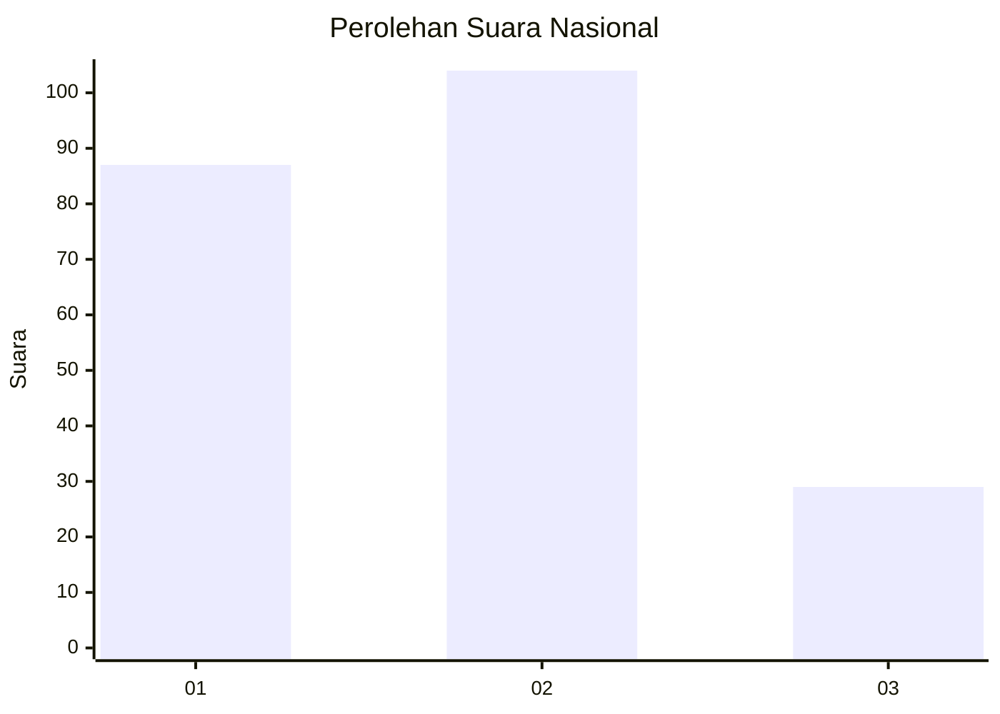
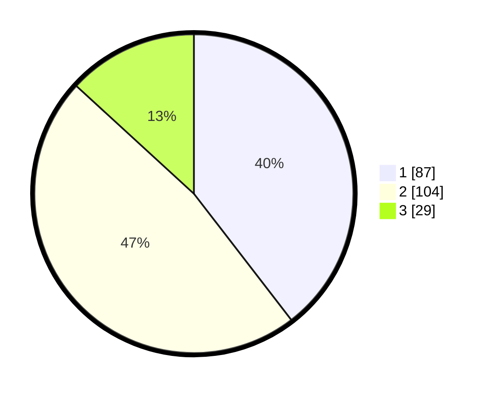

# Hasil

## Grafik

## Tabel

| No.    | Nama Paslon    | Suara | Suara (raw) | Persentase |
|:------ |:-------------- | -----:| -----------:| ----------:|
| 100025 | ANIES MUHAIMIN | 87    | [87][p-1]   | 39,55      |
| 100026 | PRABOWO GIBRAN | 104   | [104][p-2]  | 47,27      |
| 100027 | GANJAR MAHFUD  | 29    | [29][p-3]   | 13,18      |

[p-1]: https://github.com/gigit-pemilu/pemilu-2024/blob/main/pilpres/hitung-suara/sub/31-dki-jakarta/sub/72-jakarta-utara/sub/02-tanjung-priok/sub/1004-sungai-bambu/sub/004-tps/sub/paslon-1.txt
[p-2]: https://github.com/gigit-pemilu/pemilu-2024/blob/main/pilpres/hitung-suara/sub/31-dki-jakarta/sub/72-jakarta-utara/sub/02-tanjung-priok/sub/1004-sungai-bambu/sub/004-tps/sub/paslon-2.txt
[p-3]: https://github.com/gigit-pemilu/pemilu-2024/blob/main/pilpres/hitung-suara/sub/31-dki-jakarta/sub/72-jakarta-utara/sub/02-tanjung-priok/sub/1004-sungai-bambu/sub/004-tps/sub/paslon-3.txt

## Foto C Plano

https://sirekap-obj-formc.kpu.go.id/45b9/pemilu/ppwp/31/72/02/10/04/3172021004004-20240216-153151--5ced9065-b0f2-4951-a661-94e738799834.jpg

https://sirekap-obj-formc.kpu.go.id/45b9/pemilu/ppwp/31/72/02/10/04/3172021004004-20240216-155351--5fbc4883-0291-4ef9-880a-daf6b1341986.jpg

https://sirekap-obj-formc.kpu.go.id/45b9/pemilu/ppwp/31/72/02/10/04/3172021004004-20240216-154502--d719ec73-4f90-460d-954a-9e4d486c2f0f.jpg

## Metadata

| Key        | Value               |
| ---------- | ------------------- |
| Time Stamp | 2024-02-16 16:25:10 |

