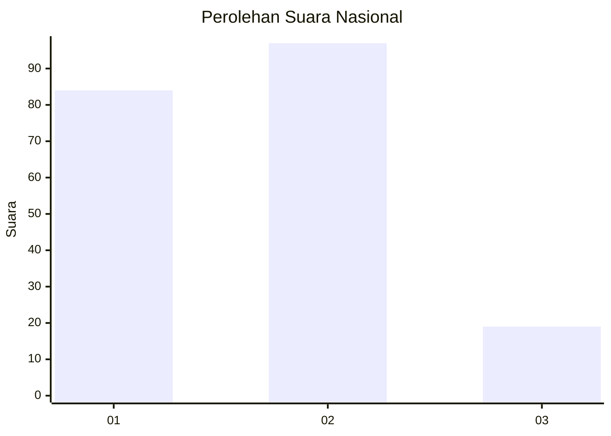
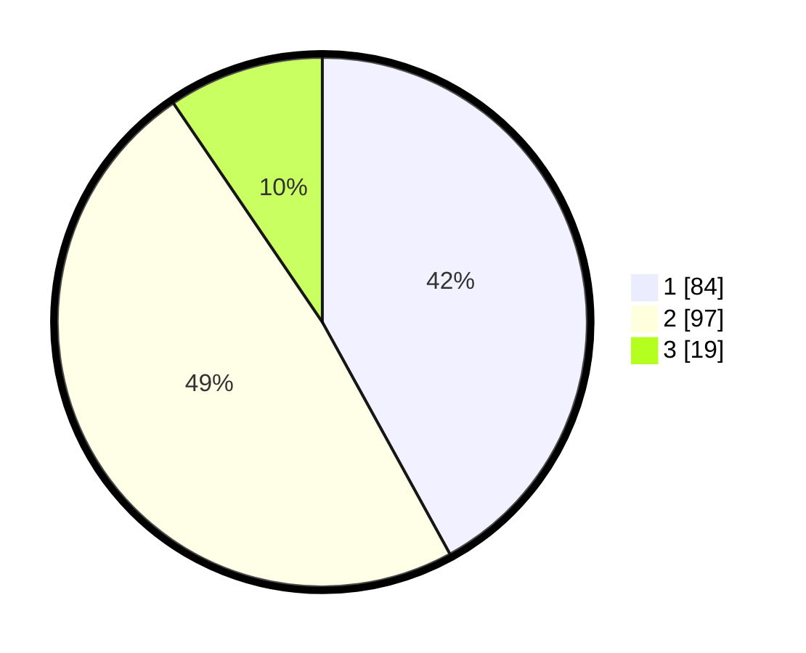

# Hasil

## Grafik

## Tabel

| No.    | Nama Paslon    | Suara | Suara (raw) | Persentase |
|:------ |:-------------- | -----:| -----------:| ----------:|
| 100025 | ANIES MUHAIMIN | 84    | [84][p-1]   | 42,00      |
| 100026 | PRABOWO GIBRAN | 97    | [97][p-2]   | 48,50      |
| 100027 | GANJAR MAHFUD  | 19    | [19][p-3]   | 9,50       |

[p-1]: https://github.com/gigit-pemilu/pemilu-2024/blob/main/pilpres/hitung-suara/sub/31-dki-jakarta/sub/72-jakarta-utara/sub/02-tanjung-priok/sub/1004-sungai-bambu/sub/011-tps/sub/paslon-1.txt
[p-2]: https://github.com/gigit-pemilu/pemilu-2024/blob/main/pilpres/hitung-suara/sub/31-dki-jakarta/sub/72-jakarta-utara/sub/02-tanjung-priok/sub/1004-sungai-bambu/sub/011-tps/sub/paslon-2.txt
[p-3]: https://github.com/gigit-pemilu/pemilu-2024/blob/main/pilpres/hitung-suara/sub/31-dki-jakarta/sub/72-jakarta-utara/sub/02-tanjung-priok/sub/1004-sungai-bambu/sub/011-tps/sub/paslon-3.txt

## Foto C Plano

https://sirekap-obj-formc.kpu.go.id/5eb3/pemilu/ppwp/31/72/02/10/04/3172021004011-20240215-105721--f7c7d5a1-1804-4863-a3eb-d9ab5603ac6b.jpg

https://sirekap-obj-formc.kpu.go.id/5eb3/pemilu/ppwp/31/72/02/10/04/3172021004011-20240215-105918--626d5d59-3068-4d5d-9856-3c13191c911b.jpg

https://sirekap-obj-formc.kpu.go.id/5eb3/pemilu/ppwp/31/72/02/10/04/3172021004011-20240215-110101--c0187ed5-2882-4d49-a065-8c05a79afc26.jpg

## Metadata

| Key        | Value               |
| ---------- | ------------------- |
| Time Stamp | 2024-02-22 11:00:00 |

