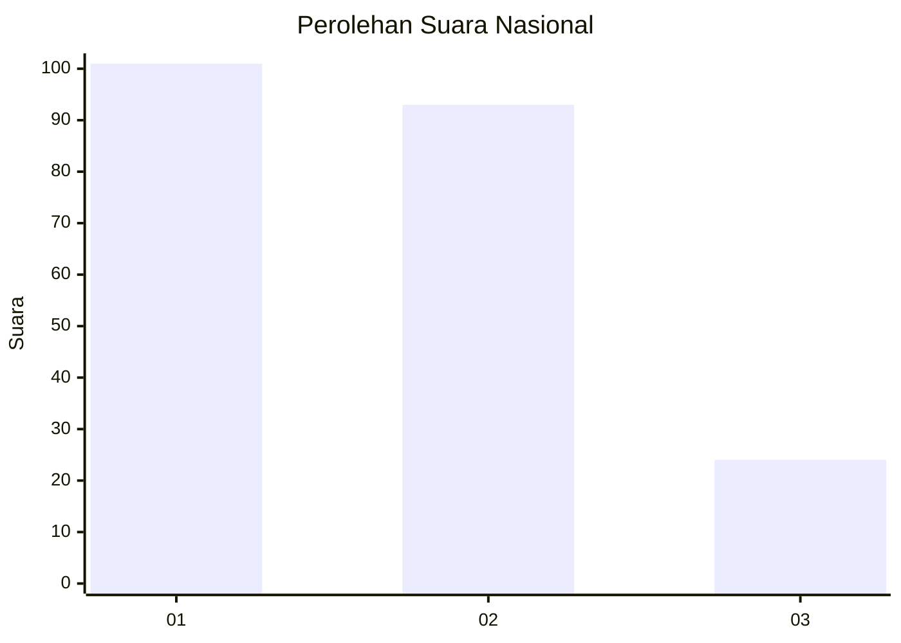
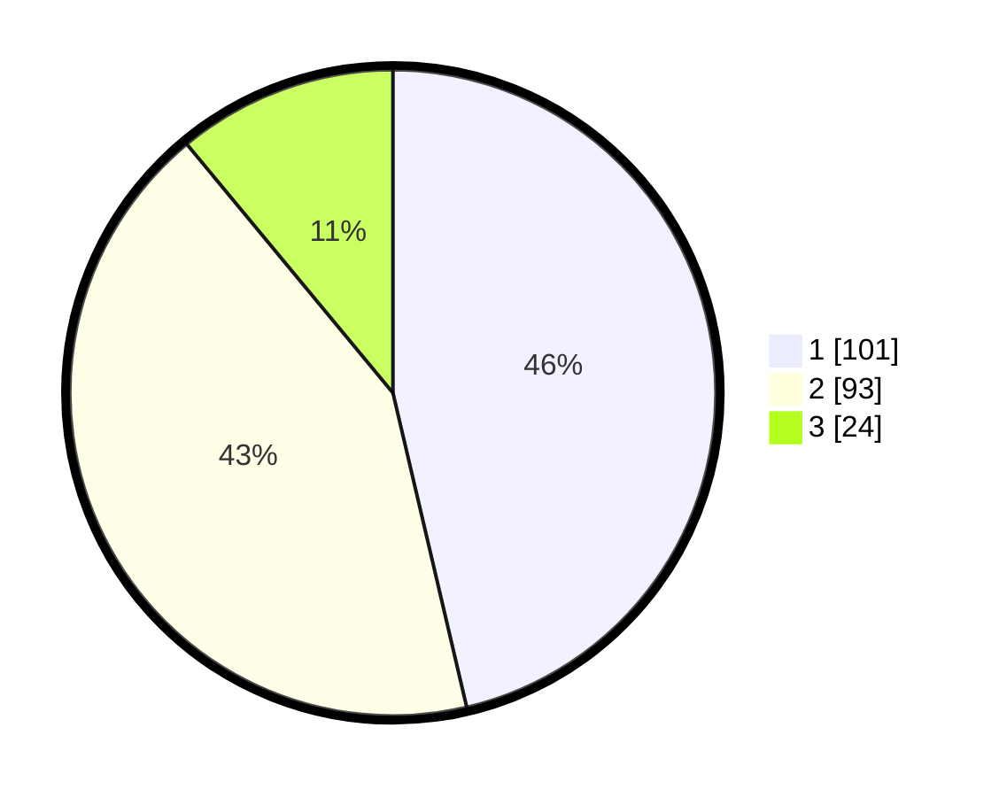

# Hasil

## Grafik

## Tabel

| No.    | Nama Paslon    | Suara | Suara (raw) | Persentase |
|:------ |:-------------- | -----:| -----------:| ----------:|
| 100025 | ANIES MUHAIMIN | 101   | [101][p-1]  | 46,33      |
| 100026 | PRABOWO GIBRAN | 93    | [93][p-2]   | 42,66      |
| 100027 | GANJAR MAHFUD  | 24    | [24][p-3]   | 11,01      |

[p-1]: https://github.com/gigit-pemilu/pemilu-2024/blob/main/pilpres/hitung-suara/sub/31-dki-jakarta/sub/72-jakarta-utara/sub/02-tanjung-priok/sub/1004-sungai-bambu/sub/031-tps/sub/paslon-1.txt
[p-2]: https://github.com/gigit-pemilu/pemilu-2024/blob/main/pilpres/hitung-suara/sub/31-dki-jakarta/sub/72-jakarta-utara/sub/02-tanjung-priok/sub/1004-sungai-bambu/sub/031-tps/sub/paslon-2.txt
[p-3]: https://github.com/gigit-pemilu/pemilu-2024/blob/main/pilpres/hitung-suara/sub/31-dki-jakarta/sub/72-jakarta-utara/sub/02-tanjung-priok/sub/1004-sungai-bambu/sub/031-tps/sub/paslon-3.txt

## Foto C Plano

https://sirekap-obj-formc.kpu.go.id/9b85/pemilu/ppwp/31/72/02/10/04/3172021004031-20240214-211329--71d381fc-c148-4b9f-9d68-9a110167d44e.jpg

https://sirekap-obj-formc.kpu.go.id/9b85/pemilu/ppwp/31/72/02/10/04/3172021004031-20240214-211017--75af32c4-0763-41ac-9fe6-c7daadd307b2.jpg

https://sirekap-obj-formc.kpu.go.id/9b85/pemilu/ppwp/31/72/02/10/04/3172021004031-20240214-203315--b4df7c6d-63d9-40b7-bb4f-3d3c59b9bc9c.jpg

## Metadata

| Key        | Value               |
| ---------- | ------------------- |
| Time Stamp | 2024-02-22 11:00:00 |

