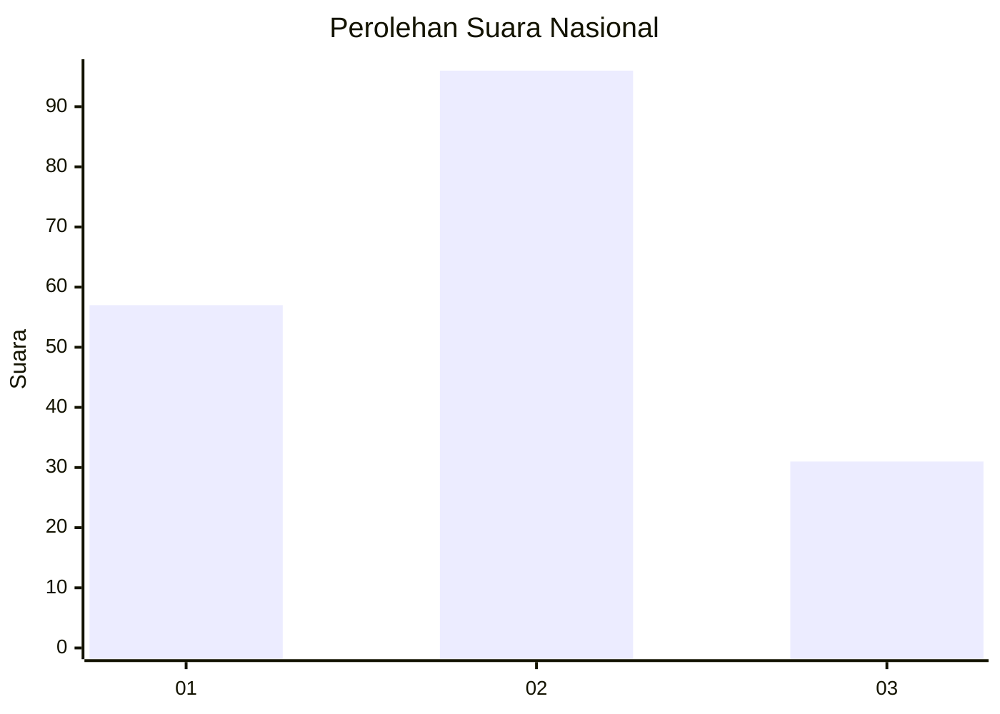
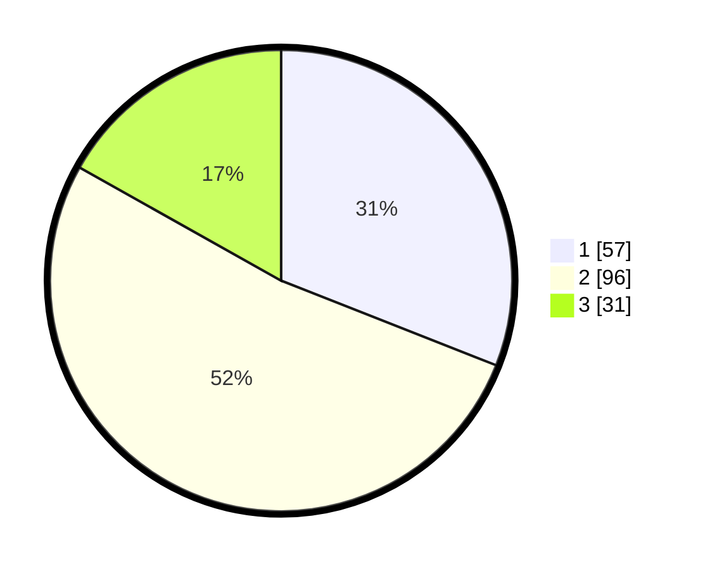

# Hasil

## Grafik

## Tabel

| No.    | Nama Paslon    | Suara | Suara (raw) | Persentase |
|:------ |:-------------- | -----:| -----------:| ----------:|
| 100025 | ANIES MUHAIMIN | 57    | [57][p-1]   | 30,98      |
| 100026 | PRABOWO GIBRAN | 96    | [96][p-2]   | 52,17      |
| 100027 | GANJAR MAHFUD  | 31    | [31][p-3]   | 16,85      |

[p-1]: https://github.com/gigit-pemilu/pemilu-2024/blob/main/pilpres/hitung-suara/sub/31-dki-jakarta/sub/72-jakarta-utara/sub/02-tanjung-priok/sub/1004-sungai-bambu/sub/036-tps/sub/paslon-1.txt
[p-2]: https://github.com/gigit-pemilu/pemilu-2024/blob/main/pilpres/hitung-suara/sub/31-dki-jakarta/sub/72-jakarta-utara/sub/02-tanjung-priok/sub/1004-sungai-bambu/sub/036-tps/sub/paslon-2.txt
[p-3]: https://github.com/gigit-pemilu/pemilu-2024/blob/main/pilpres/hitung-suara/sub/31-dki-jakarta/sub/72-jakarta-utara/sub/02-tanjung-priok/sub/1004-sungai-bambu/sub/036-tps/sub/paslon-3.txt

## Foto C Plano

https://sirekap-obj-formc.kpu.go.id/4041/pemilu/ppwp/31/72/02/10/04/3172021004036-20240215-100313--40c8d428-fa39-4b7e-a89a-c72714c8f4c9.jpg

https://sirekap-obj-formc.kpu.go.id/4041/pemilu/ppwp/31/72/02/10/04/3172021004036-20240215-100327--1dab2369-5afe-44f7-b817-adf07dc29914.jpg

https://sirekap-obj-formc.kpu.go.id/4041/pemilu/ppwp/31/72/02/10/04/3172021004036-20240214-155444--05e81bc7-b9ef-467a-ad5f-1b879380f430.jpg

## Metadata

| Key        | Value               |
| ---------- | ------------------- |
| Time Stamp | 2024-02-21 14:00:00 |

