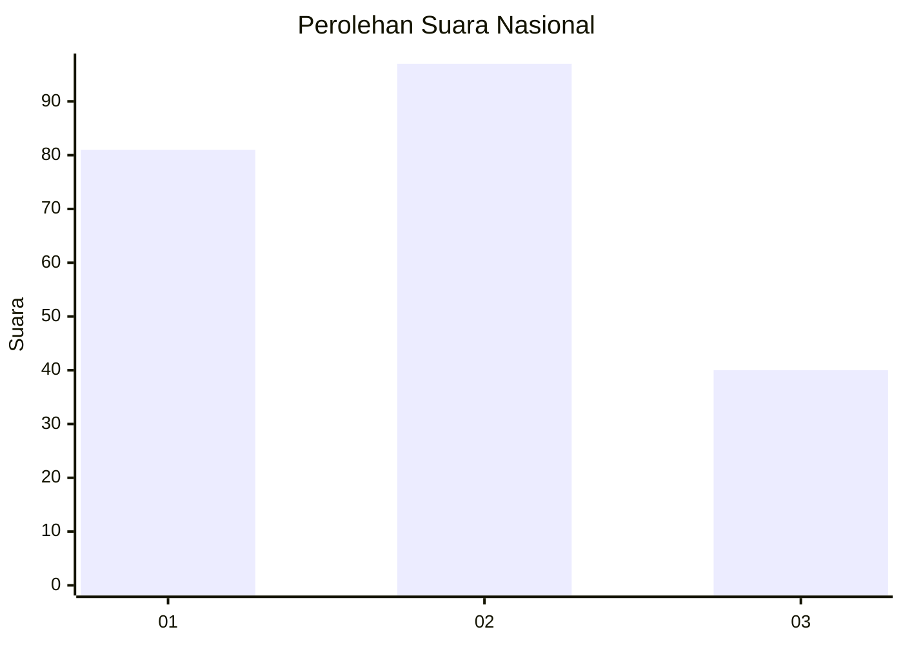
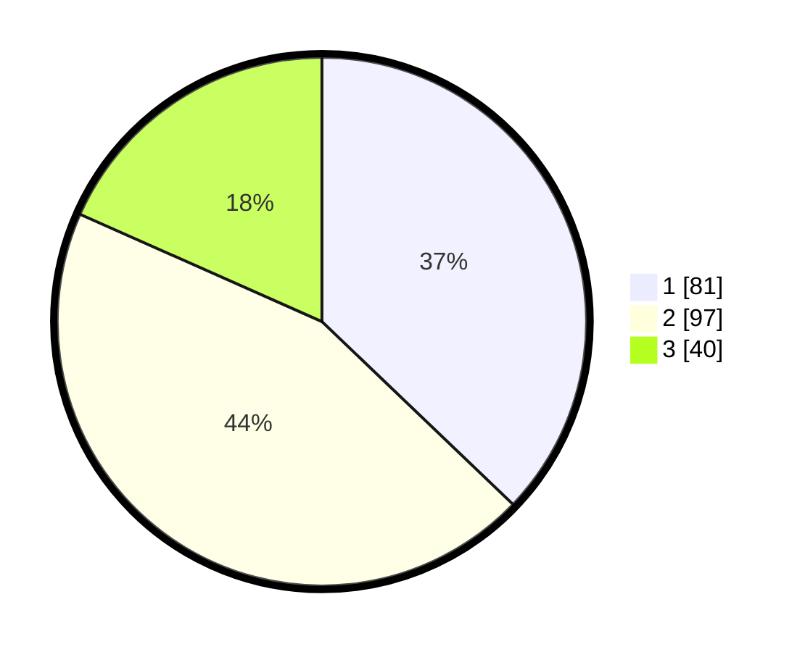

# Hasil

## Grafik

## Tabel

| No.    | Nama Paslon    | Suara | Suara (raw) | Persentase |
|:------ |:-------------- | -----:| -----------:| ----------:|
| 100025 | ANIES MUHAIMIN | 81    | [81][p-1]   | 37,16      |
| 100026 | PRABOWO GIBRAN | 97    | [97][p-2]   | 44,50      |
| 100027 | GANJAR MAHFUD  | 40    | [40][p-3]   | 18,35      |

[p-1]: https://github.com/gigit-pemilu/pemilu-2024/blob/main/pilpres/hitung-suara/sub/31-dki-jakarta/sub/72-jakarta-utara/sub/02-tanjung-priok/sub/1004-sungai-bambu/sub/040-tps/sub/paslon-1.txt
[p-2]: https://github.com/gigit-pemilu/pemilu-2024/blob/main/pilpres/hitung-suara/sub/31-dki-jakarta/sub/72-jakarta-utara/sub/02-tanjung-priok/sub/1004-sungai-bambu/sub/040-tps/sub/paslon-2.txt
[p-3]: https://github.com/gigit-pemilu/pemilu-2024/blob/main/pilpres/hitung-suara/sub/31-dki-jakarta/sub/72-jakarta-utara/sub/02-tanjung-priok/sub/1004-sungai-bambu/sub/040-tps/sub/paslon-3.txt

## Foto C Plano

https://sirekap-obj-formc.kpu.go.id/25b9/pemilu/ppwp/31/72/02/10/04/3172021004040-20240214-155845--560ec173-704b-41c0-975b-1bf1e247a126.jpg

https://sirekap-obj-formc.kpu.go.id/25b9/pemilu/ppwp/31/72/02/10/04/3172021004040-20240214-155629--954a4d51-3b99-4b2b-bc6f-5beb1386aa3e.jpg

https://sirekap-obj-formc.kpu.go.id/25b9/pemilu/ppwp/31/72/02/10/04/3172021004040-20240214-160112--744647b9-3de6-407d-8e53-22e18ba90512.jpg

## Metadata

| Key        | Value               |
| ---------- | ------------------- |
| Time Stamp | 2024-02-14 21:46:01 |

