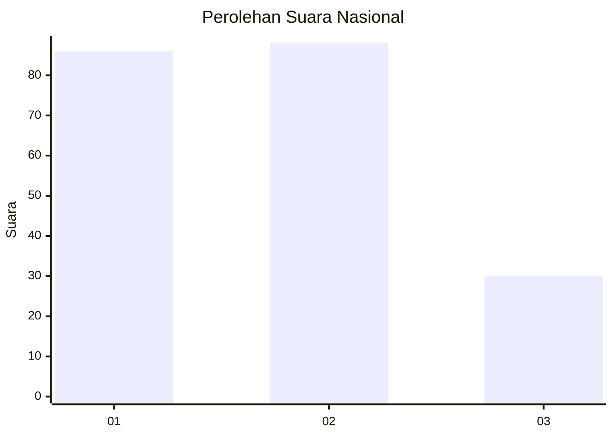
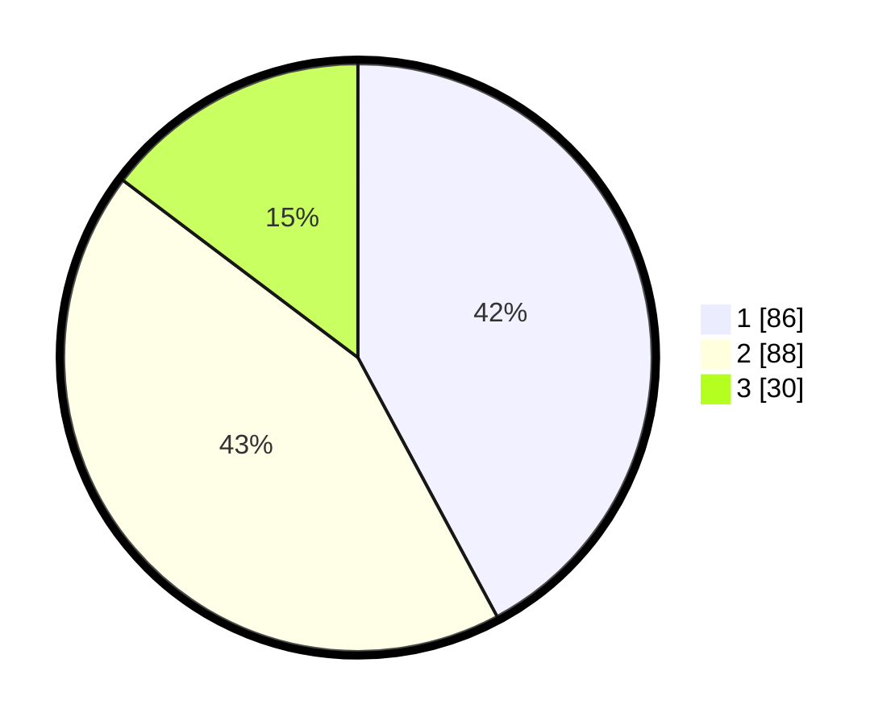

# Hasil

## Grafik

## Tabel

| No.    | Nama Paslon    | Suara | Suara (raw) | Persentase |
|:------ |:-------------- | -----:| -----------:| ----------:|
| 100025 | ANIES MUHAIMIN | 86    | [86][p-1]   | 42,16      |
| 100026 | PRABOWO GIBRAN | 88    | [88][p-2]   | 43,14      |
| 100027 | GANJAR MAHFUD  | 30    | [30][p-3]   | 14,71      |

[p-1]: https://github.com/gigit-pemilu/pemilu-2024/blob/main/pilpres/hitung-suara/sub/31-dki-jakarta/sub/72-jakarta-utara/sub/02-tanjung-priok/sub/1004-sungai-bambu/sub/051-tps/sub/paslon-1.txt
[p-2]: https://github.com/gigit-pemilu/pemilu-2024/blob/main/pilpres/hitung-suara/sub/31-dki-jakarta/sub/72-jakarta-utara/sub/02-tanjung-priok/sub/1004-sungai-bambu/sub/051-tps/sub/paslon-2.txt
[p-3]: https://github.com/gigit-pemilu/pemilu-2024/blob/main/pilpres/hitung-suara/sub/31-dki-jakarta/sub/72-jakarta-utara/sub/02-tanjung-priok/sub/1004-sungai-bambu/sub/051-tps/sub/paslon-3.txt

## Foto C Plano

https://sirekap-obj-formc.kpu.go.id/618a/pemilu/ppwp/31/72/02/10/04/3172021004051-20240214-222841--b2886f00-eeb1-42aa-9b54-7c6dae980cba.jpg

https://sirekap-obj-formc.kpu.go.id/618a/pemilu/ppwp/31/72/02/10/04/3172021004051-20240214-222957--2eeb385c-96f0-48b0-ae12-a4bb91b7cc2c.jpg

https://sirekap-obj-formc.kpu.go.id/618a/pemilu/ppwp/31/72/02/10/04/3172021004051-20240214-223051--fbe1fbbb-f47d-47dd-938b-cc53f02c2c2e.jpg

## Metadata

| Key        | Value               |
| ---------- | ------------------- |
| Time Stamp | 2024-02-22 11:00:00 |

