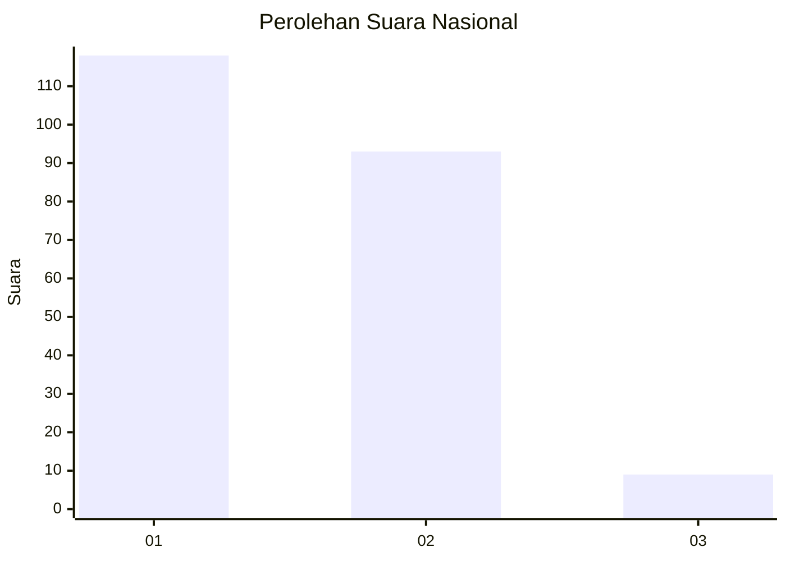
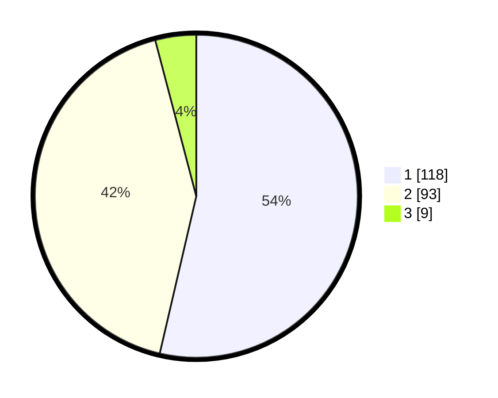

# Hasil

## Grafik

## Tabel

| No.    | Nama Paslon    | Suara | Suara (raw) | Persentase |
|:------ |:-------------- | -----:| -----------:| ----------:|
| 100025 | ANIES MUHAIMIN | 118   | [118][p-1]  | 53,64      |
| 100026 | PRABOWO GIBRAN | 93    | [93][p-2]   | 42,27      |
| 100027 | GANJAR MAHFUD  | 9     | [9][p-3]    | 4,09       |

[p-1]: https://github.com/gigit-pemilu/pemilu-2024/blob/main/pilpres/hitung-suara/sub/31-dki-jakarta/sub/72-jakarta-utara/sub/02-tanjung-priok/sub/1004-sungai-bambu/sub/055-tps/sub/paslon-1.txt
[p-2]: https://github.com/gigit-pemilu/pemilu-2024/blob/main/pilpres/hitung-suara/sub/31-dki-jakarta/sub/72-jakarta-utara/sub/02-tanjung-priok/sub/1004-sungai-bambu/sub/055-tps/sub/paslon-2.txt
[p-3]: https://github.com/gigit-pemilu/pemilu-2024/blob/main/pilpres/hitung-suara/sub/31-dki-jakarta/sub/72-jakarta-utara/sub/02-tanjung-priok/sub/1004-sungai-bambu/sub/055-tps/sub/paslon-3.txt

## Foto C Plano

https://sirekap-obj-formc.kpu.go.id/eeef/pemilu/ppwp/31/72/02/10/04/3172021004055-20240214-215539--6d36b770-2598-4c2f-bc07-d510451c5b7d.jpg

https://sirekap-obj-formc.kpu.go.id/eeef/pemilu/ppwp/31/72/02/10/04/3172021004055-20240214-215922--c9b2a879-7cbf-47ca-8bc1-a9fc291e93f0.jpg

https://sirekap-obj-formc.kpu.go.id/eeef/pemilu/ppwp/31/72/02/10/04/3172021004055-20240214-220123--44aa9d59-a0ca-429e-a4af-0123d1563913.jpg

## Metadata

| Key        | Value               |
| ---------- | ------------------- |
| Time Stamp | 2024-02-21 15:00:00 |

