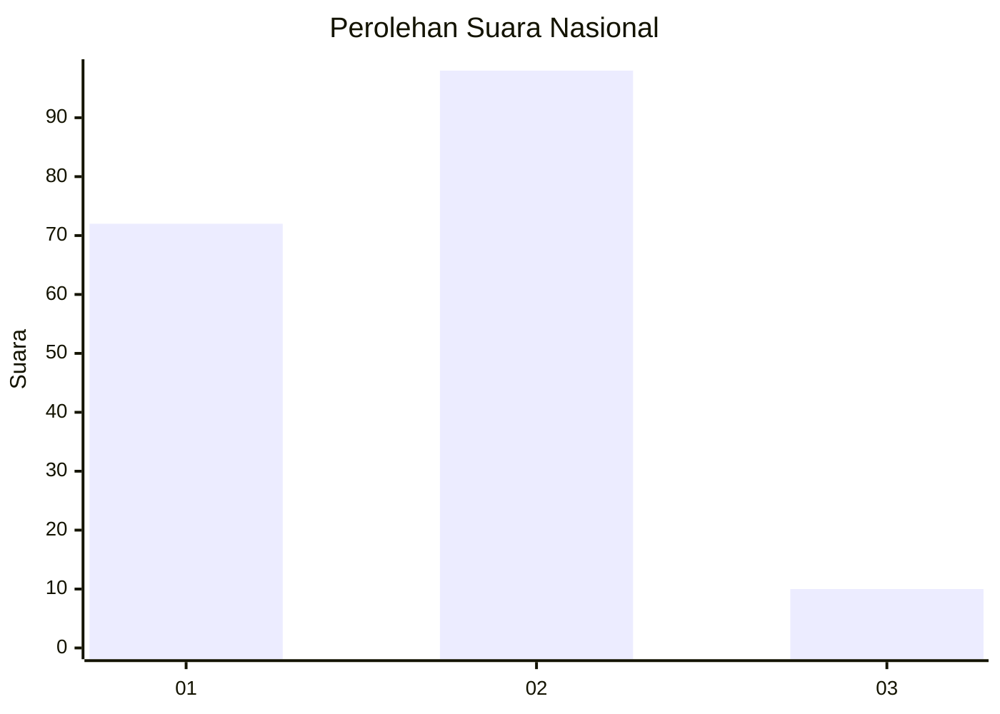
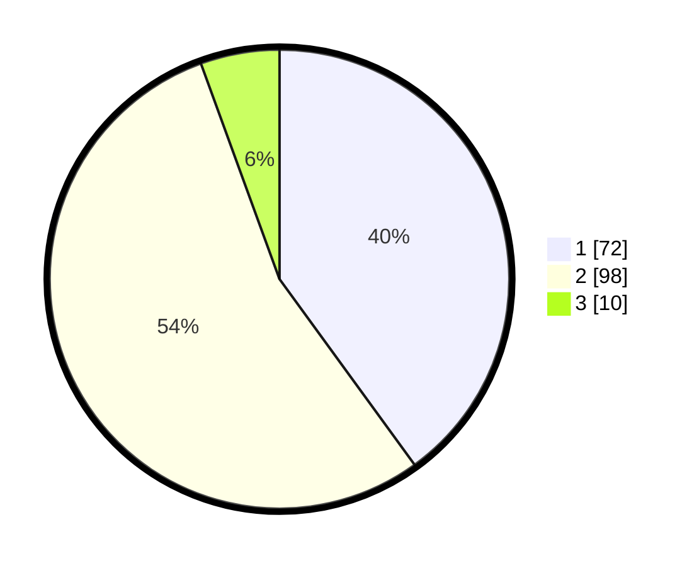

# Hasil

## Grafik

## Tabel

| No.    | Nama Paslon    | Suara | Suara (raw) | Persentase |
|:------ |:-------------- | -----:| -----------:| ----------:|
| 100025 | ANIES MUHAIMIN | 72    | [72][p-1]   | 40,00      |
| 100026 | PRABOWO GIBRAN | 98    | [98][p-2]   | 54,44      |
| 100027 | GANJAR MAHFUD  | 10    | [10][p-3]   | 5,56       |

[p-1]: https://github.com/gigit-pemilu/pemilu-2024/blob/main/pilpres/hitung-suara/sub/31-dki-jakarta/sub/72-jakarta-utara/sub/02-tanjung-priok/sub/1004-sungai-bambu/sub/059-tps/sub/paslon-1.txt
[p-2]: https://github.com/gigit-pemilu/pemilu-2024/blob/main/pilpres/hitung-suara/sub/31-dki-jakarta/sub/72-jakarta-utara/sub/02-tanjung-priok/sub/1004-sungai-bambu/sub/059-tps/sub/paslon-2.txt
[p-3]: https://github.com/gigit-pemilu/pemilu-2024/blob/main/pilpres/hitung-suara/sub/31-dki-jakarta/sub/72-jakarta-utara/sub/02-tanjung-priok/sub/1004-sungai-bambu/sub/059-tps/sub/paslon-3.txt

## Foto C Plano

https://sirekap-obj-formc.kpu.go.id/b1d8/pemilu/ppwp/31/72/02/10/04/3172021004059-20240215-002211--94804c4c-b846-4447-975c-b57acd5f1aa9.jpg

https://sirekap-obj-formc.kpu.go.id/b1d8/pemilu/ppwp/31/72/02/10/04/3172021004059-20240215-003109--455c8b85-3b45-4324-96fe-fc30a99bf14a.jpg

https://sirekap-obj-formc.kpu.go.id/b1d8/pemilu/ppwp/31/72/02/10/04/3172021004059-20240215-003332--d285a03e-75b9-4657-826e-26e8e31d94ce.jpg

## Metadata

| Key        | Value               |
| ---------- | ------------------- |
| Time Stamp | 2024-02-21 12:00:00 |

