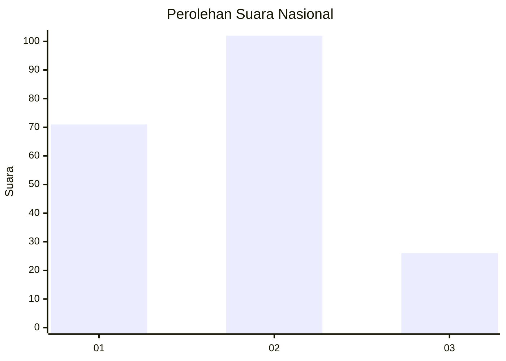
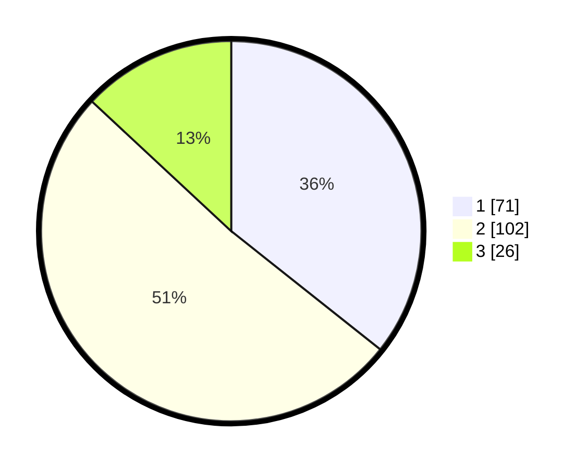

# Hasil

## Grafik

## Tabel

| No.    | Nama Paslon    | Suara | Suara (raw) | Persentase |
|:------ |:-------------- | -----:| -----------:| ----------:|
| 100025 | ANIES MUHAIMIN | 71    | [71][p-1]   | 35,68      |
| 100026 | PRABOWO GIBRAN | 102   | [102][p-2]  | 51,26      |
| 100027 | GANJAR MAHFUD  | 26    | [26][p-3]   | 13,07      |

[p-1]: https://github.com/gigit-pemilu/pemilu-2024/blob/main/pilpres/hitung-suara/sub/31-dki-jakarta/sub/72-jakarta-utara/sub/02-tanjung-priok/sub/1004-sungai-bambu/sub/086-tps/sub/paslon-1.txt
[p-2]: https://github.com/gigit-pemilu/pemilu-2024/blob/main/pilpres/hitung-suara/sub/31-dki-jakarta/sub/72-jakarta-utara/sub/02-tanjung-priok/sub/1004-sungai-bambu/sub/086-tps/sub/paslon-2.txt
[p-3]: https://github.com/gigit-pemilu/pemilu-2024/blob/main/pilpres/hitung-suara/sub/31-dki-jakarta/sub/72-jakarta-utara/sub/02-tanjung-priok/sub/1004-sungai-bambu/sub/086-tps/sub/paslon-3.txt

## Foto C Plano

https://sirekap-obj-formc.kpu.go.id/970e/pemilu/ppwp/31/72/02/10/04/3172021004086-20240214-215917--7cd18326-5929-47f1-99b3-0fcfe9a959c1.jpg

https://sirekap-obj-formc.kpu.go.id/970e/pemilu/ppwp/31/72/02/10/04/3172021004086-20240214-220017--5d8e9dde-171c-4275-aec2-f826654d1890.jpg

https://sirekap-obj-formc.kpu.go.id/970e/pemilu/ppwp/31/72/02/10/04/3172021004086-20240214-220147--d513619d-2abe-4cbe-b4d3-b3e5e69c1141.jpg

## Metadata

| Key        | Value               |
| ---------- | ------------------- |
| Time Stamp | 2024-02-21 14:00:00 |

