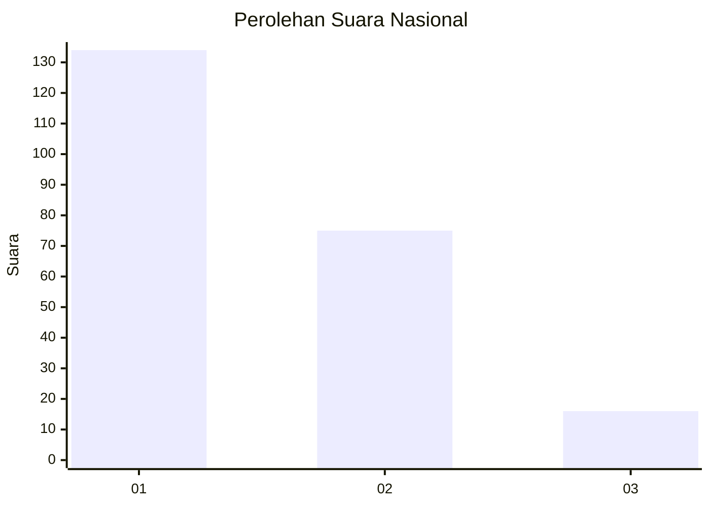
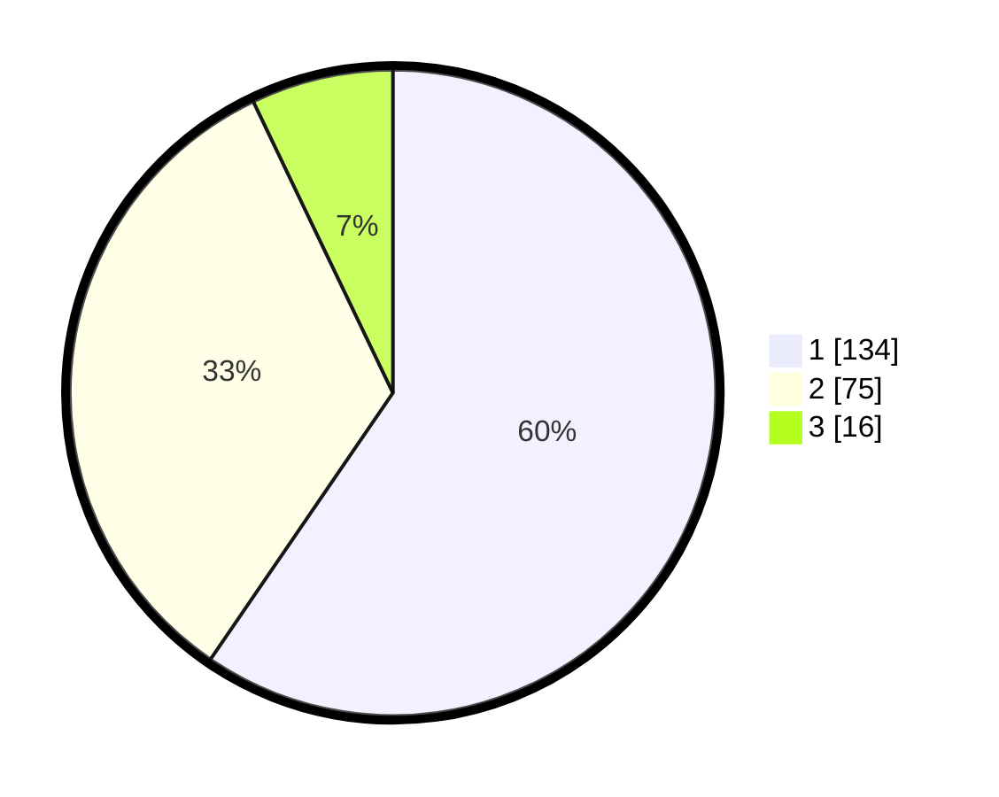

# Hasil

## Grafik

## Tabel

| No.    | Nama Paslon    | Suara | Suara (raw) | Persentase |
|:------ |:-------------- | -----:| -----------:| ----------:|
| 100025 | ANIES MUHAIMIN | 134   | [134][p-1]  | 59,56      |
| 100026 | PRABOWO GIBRAN | 75    | [75][p-2]   | 33,33      |
| 100027 | GANJAR MAHFUD  | 16    | [16][p-3]   | 7,11       |

[p-1]: https://github.com/gigit-pemilu/pemilu-2024/blob/main/pilpres/hitung-suara/sub/31-dki-jakarta/sub/72-jakarta-utara/sub/02-tanjung-priok/sub/1004-sungai-bambu/sub/087-tps/sub/paslon-1.txt
[p-2]: https://github.com/gigit-pemilu/pemilu-2024/blob/main/pilpres/hitung-suara/sub/31-dki-jakarta/sub/72-jakarta-utara/sub/02-tanjung-priok/sub/1004-sungai-bambu/sub/087-tps/sub/paslon-2.txt
[p-3]: https://github.com/gigit-pemilu/pemilu-2024/blob/main/pilpres/hitung-suara/sub/31-dki-jakarta/sub/72-jakarta-utara/sub/02-tanjung-priok/sub/1004-sungai-bambu/sub/087-tps/sub/paslon-3.txt

## Foto C Plano

https://sirekap-obj-formc.kpu.go.id/d55f/pemilu/ppwp/31/72/02/10/04/3172021004087-20240222-221601--d1c8ae57-3932-47ee-9304-02f4a0fbb303.jpg

https://sirekap-obj-formc.kpu.go.id/d55f/pemilu/ppwp/31/72/02/10/04/3172021004087-20240222-220842--b4a0a893-0fea-4293-8ba8-5bb260548e73.jpg

https://sirekap-obj-formc.kpu.go.id/d55f/pemilu/ppwp/31/72/02/10/04/3172021004087-20240222-221846--5d0f6635-0ac7-40a9-9fc7-335d33f5e5e6.jpg

## Metadata

| Key        | Value               |
| ---------- | ------------------- |
| Time Stamp | 2024-02-24 22:31:28 |

