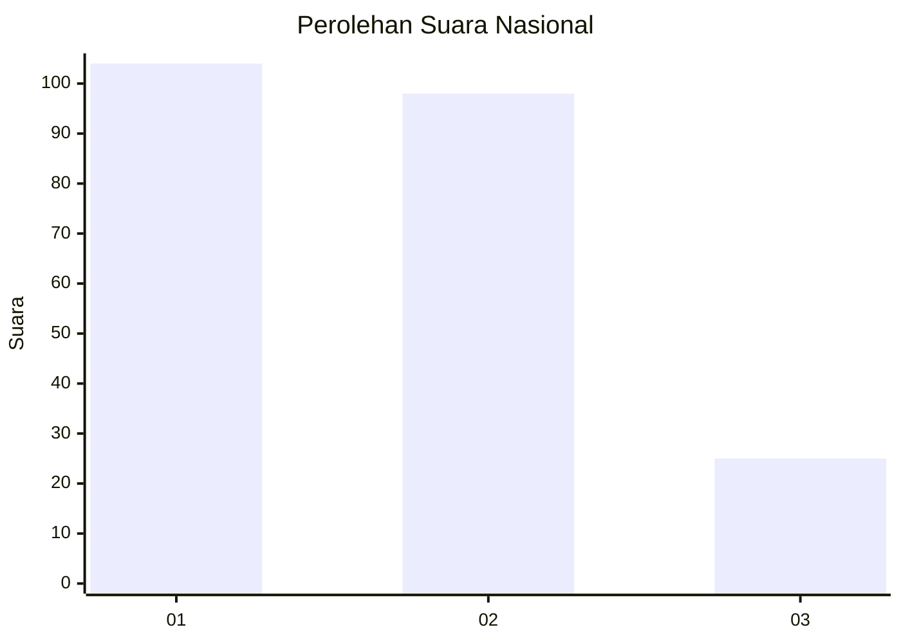
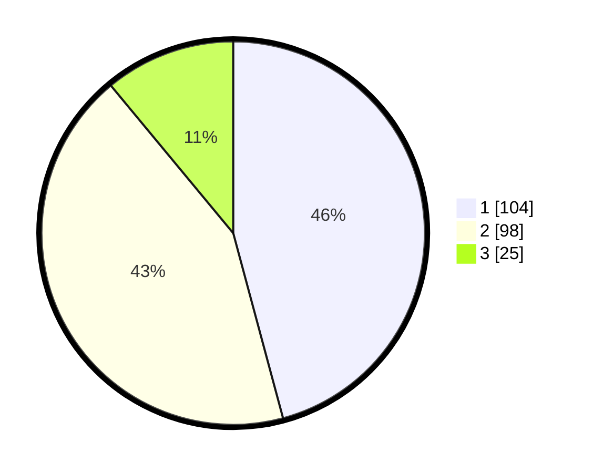

# Hasil

## Grafik

## Tabel

| No.    | Nama Paslon    | Suara | Suara (raw) | Persentase |
|:------ |:-------------- | -----:| -----------:| ----------:|
| 100025 | ANIES MUHAIMIN | 104   | [104][p-1]  | 45,81      |
| 100026 | PRABOWO GIBRAN | 98    | [98][p-2]   | 43,17      |
| 100027 | GANJAR MAHFUD  | 25    | [25][p-3]   | 11,01      |

[p-1]: https://github.com/gigit-pemilu/pemilu-2024/blob/main/pilpres/hitung-suara/sub/31-dki-jakarta/sub/72-jakarta-utara/sub/02-tanjung-priok/sub/1004-sungai-bambu/sub/092-tps/sub/paslon-1.txt
[p-2]: https://github.com/gigit-pemilu/pemilu-2024/blob/main/pilpres/hitung-suara/sub/31-dki-jakarta/sub/72-jakarta-utara/sub/02-tanjung-priok/sub/1004-sungai-bambu/sub/092-tps/sub/paslon-2.txt
[p-3]: https://github.com/gigit-pemilu/pemilu-2024/blob/main/pilpres/hitung-suara/sub/31-dki-jakarta/sub/72-jakarta-utara/sub/02-tanjung-priok/sub/1004-sungai-bambu/sub/092-tps/sub/paslon-3.txt

## Foto C Plano

https://sirekap-obj-formc.kpu.go.id/f82b/pemilu/ppwp/31/72/02/10/04/3172021004092-20240215-005142--4be71b04-56b4-4b4b-a14c-61c72b4768eb.jpg

https://sirekap-obj-formc.kpu.go.id/f82b/pemilu/ppwp/31/72/02/10/04/3172021004092-20240215-005245--20aa95c8-841c-4d3b-bef0-bb981a8270c3.jpg

https://sirekap-obj-formc.kpu.go.id/f82b/pemilu/ppwp/31/72/02/10/04/3172021004092-20240215-005758--ec0a36a0-3e58-42ff-8d00-4311602e7219.jpg

## Metadata

| Key        | Value               |
| ---------- | ------------------- |
| Time Stamp | 2024-02-20 15:00:00 |

